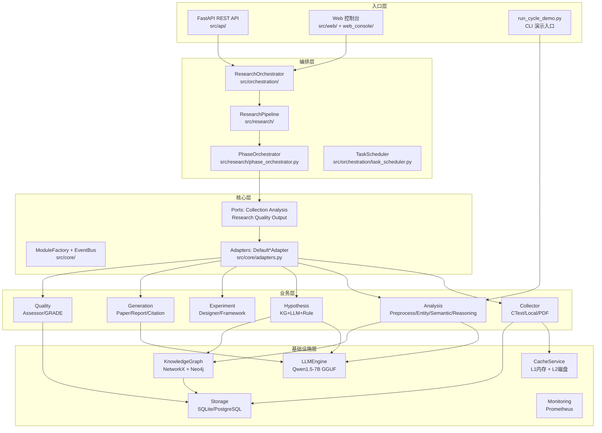
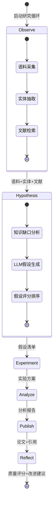
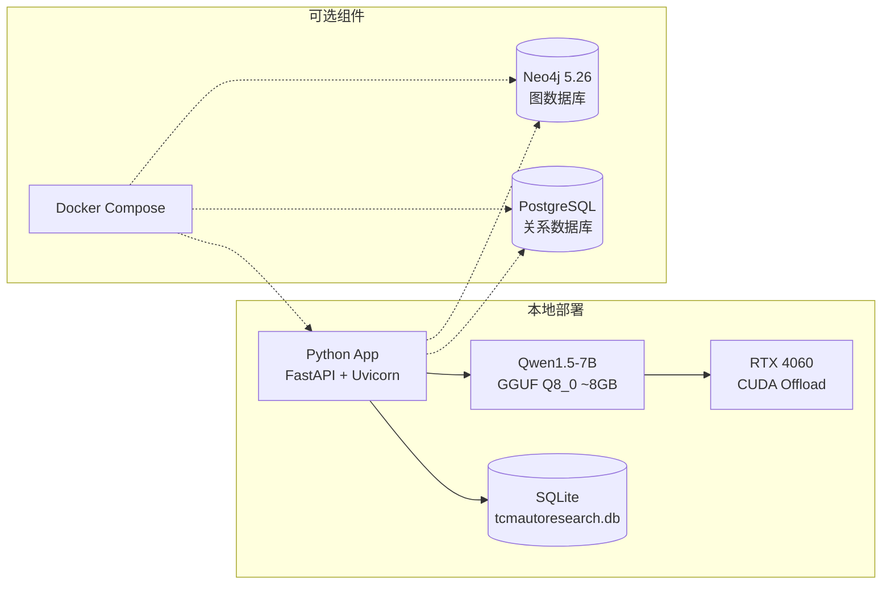
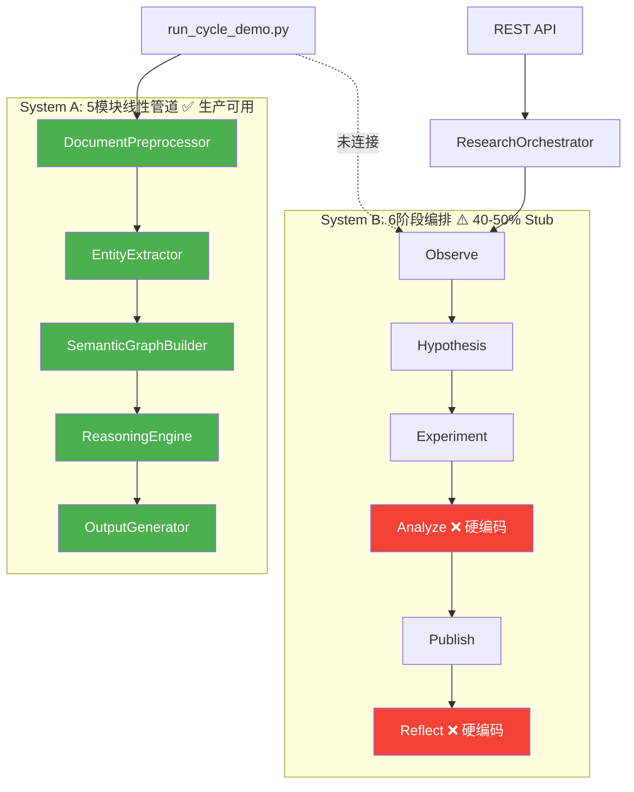
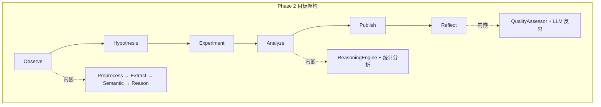

# TCM Auto Research — 全架构审计报告

**日期**: 2026-04-06  
**分支**: `stage2-s2_1-preprocessor-opt`  
**审计范围**: 全部 src/ 源码 (210 文件, ~60,500 行), tests/ (106 文件), tools/ (17 文件)

---

## 一、系统概览

基于 T/C IATCM 098-2023 标准的中医古籍全自动研究系统。本地部署 Qwen1.5-7B-Chat (Q8_0 GGUF)，数据存储于 SQLite/PostgreSQL + Neo4j (可选)。

### 1.1 技术栈

| 层 | 技术 |
|---|---|
| LLM 推理 | llama-cpp-python + CUDA (RTX 4060) |
| NLP | jieba 分词, OpenCC 繁简转换, sentence-transformers |
| 图数据库 | Neo4j 5.26 (可选) + NetworkX (内存) |
| 关系数据库 | SQLite (默认) / PostgreSQL |
| Web 框架 | FastAPI + Uvicorn + Jinja2 |
| 前端 | HTMX + React SPA (Web Console) |
| ORM | SQLAlchemy + Alembic 迁移 |
| 监控 | prometheus-client + psutil |

### 1.2 代码规模分布

| 模块 | 文件数 | 行数 | 职责 |
|---|---|---|---|
| research/ | 25 | 9,611 | 6阶段研究管道 + 假设/实验/文献 |
| cycle/ | 6 | 5,508 | 循环迭代框架 |
| generation/ | 7 | 4,457 | 论文/报告/引用生成 |
| routes/ | 11 | 3,888 | API + Web 路由 |
| storage/ | 10 | 3,524 | 双引擎存储 (PG + Neo4j) |
| infrastructure/ | 5 | 3,520 | 配置/监控/持久化 |
| collector/ | 9 | 3,454 | 语料采集 (CText/本地/PDF) |
| core/ | 11 | 3,360 | 端口-适配器/事件总线/模块工厂 |
| analysis/ | 18 | 2,882 | 实体提取/语义图/推理 |
| knowledge/ | 6 | 1,950 | 知识图谱/嵌入/本体 |

---

## 二、核心架构

### 2.1 架构总览

### 2.2 研究管道架构

### 2.3 部署架构

---

## 三、关键发现：双系统并行

**这是本次审计最重要的发现。**

代码库中存在两套独立的研究执行系统，入口未统一：

| 对比 | System A (线性) | System B (6阶段) |
|---|---|---|
| 入口 | `run_cycle_demo.py` | `ResearchPipeline` / API |
| 成熟度 | ✅ 生产可用 | ⚠️ 部分 stub |
| LLM 调用 | 仅 EntityExtractor 可选 | Hypothesis/Gap 真实调用 |
| 数据存储 | 不持久化 | 有审计/持久化框架 |
| 治理 | phase tracking 在 demo 脚本内 | EventBus + AuditHistory |

---

## 四、各模块成熟度评估

```mermaid
gantt
    title 模块实现成熟度
    dateFormat X
    axisFormat %s%%

    section 生产就绪
    LLMEngine (CUDA offload)     :done, 0, 100
    HypothesisEngine (LLM+KG)   :done, 0, 90
    EntityExtractor (635词典)     :done, 0, 90
    GapAnalyzer (LLM refine)     :done, 0, 90
    DocumentPreprocessor         :done, 0, 95
    SemanticGraphBuilder         :done, 0, 85

    section 部分实现
    ExperimentDesigner           :active, 0, 80
    ReasoningEngine              :active, 0, 80
    ObservePhase                 :active, 0, 70
    PublishPhase                 :active, 0, 60

    section 框架/Stub
    SelfLearningEngine           :crit, 0, 30
    QualityAssessor              :crit, 0, 20
    IterationCycle               :crit, 0, 20
    AnalyzePhase                 :crit, 0, 20
    ReflectPhase                 :crit, 0, 5
```

---

## 五、技术债务清单

### 5.1 冗余代码 (~30 个文件可删除)

| 废弃文件/目录 | 规范位置 | 理由 | 代价 |
|---|---|---|---|
| `src/research/ctext_corpus_collector.py` | `src/collector/` | re-export 包装 | 更新 examples/ 导入 |
| `src/research/ctext_whitelist.py` | `src/collector/` | re-export 包装 | 同上 |
| `src/research/literature_retriever.py` | `src/collector/` | re-export 包装 | 同上 |
| `src/research/multi_source_corpus.py` | `src/collector/` | re-export 包装 | 同上 |
| `src/research/multimodal_fusion.py` | `src/analysis/` | re-export 包装 | 更新测试导入 |
| `src/analysis/gap_analyzer.py` | `src/research/` | re-export 包装 | 更新 demo 导入 |
| `src/infra/event_bus.py` | `src/core/` | re-export 包装 | 无消费者 |
| `src/llm/llm_service.py` | `src/infra/` | re-export 包装 | 内部引用 |
| `src/corpus/` (整目录) | `src/collector/` | 全文件包装 | 无外部消费 |
| `src/hypothesis/` (整目录) | `src/research/` | 仅 `__init__.py` | 无外部消费 |
| `src/preprocessor/` (整目录) | `src/analysis/` | 仅包装 | 仅 README 引用 |
| 根目录 `tmp*/` 3 个临时目录 | — | 历史产物 | 直接删除 |
| 根目录 `_check_*.py` / `_survey_*.py` | — | 手动诊断脚本 | 建议移入 tools/ |
| 根目录 `storage_*.json` / `coverage.json` | — | 历史测试产出 | 建议 .gitignore |

### 5.2 架构耦合点

| 耦合 | 位置 | 风险 | 建议 |
|---|---|---|---|
| `__init__.py` 全量导入链 | `src/analysis/__init__.py` → `src/research/` → `src/collector/` → `src/knowledge/` → `src/storage/` → `src/infrastructure/` | 导入任意模块触发全局初始化链 | 改为延迟导入 |
| `run_cycle_demo.py` 2373 行 God-script | 根目录 | 混合入口/序列化/报告/信号处理 | 拆分为 CycleReporter 类 |
| 质量评分硬编码 | `summarize_module_quality()` | 评分不反映真实结果 | 从模块结果计算 |
| subprocess.run 猴子补丁 | `run_cycle_demo.py:46` | 全局副作用 | 按需 context manager |

### 5.3 缺失实现

| 缺失 | 影响 | 优先级 |
|---|---|---|
| AnalyzePhase 真实分析 (p, effect size) | 6阶段流程不完整 | P0 |
| ReflectPhase 真实反思 | 无闭环改进 | P0 |
| QualityAssessor 实质评估 | 质量门无效 | P1 |
| SelfLearningEngine 分析/反馈 | 学习功能空转 | P2 |
| IterationCycle 真实闭环 | cycle/ 仅框架 | P2 |

---

## 六、架构优点

| 优点 | 说明 |
|---|---|
| **端口-适配器模式** | 5 个 Port + 5 个 Adapter 清晰解耦 |
| **模块生命周期管理** | BaseModule 统一 initialize/execute/cleanup |
| **LLM 本地部署** | CUDA offload 完整，无外部 API 依赖 |
| **多路径假设生成** | KG增强 → LLM → 规则，优雅降级 |
| **审计基础设施** | EventBus + AuditHistory + JSONL timeline |
| **双数据库支持** | SQLite 开发，PostgreSQL 生产，无缝切换 |
| **配置层** | 环境隔离 (dev/prod/test) + 密钥分离 |
| **TCM 领域词典** | 635 词条专业词典，实体提取准确率高 |

---

## 七、优化方案与实施计划

### Phase 1: 清理收口 (1-2 周)

**目标**: 删除冗余，统一入口

| 任务 | 理由 | 代价 |
|---|---|---|
| 删除 ~30 个包装层文件 | 消除维护混乱 | 更新 <10 处导入 |
| 清理根目录临时文件 | 减少噪音 | 无 |
| 移 `_check_*.py` → `tools/diagnostics/` | 整理工具 | 无功能影响 |
| .gitignore 补充 `storage_*.json`, `coverage.json`, `tmp*/` | 防止产物入库 | 无 |
| 拆分 `run_cycle_demo.py` 为 CycleRunner + CycleReporter | 去 God-script | 中等重构 |

### Phase 2: 主流程打通 (2-3 周)

**目标**: System A + System B 合一

| 任务 | 理由 | 代价 |
|---|---|---|
| AnalyzePhase 接入真实分析模块 | 消除硬编码 p 值 | 需要对接 ReasoningEngine |
| ReflectPhase 接入 QualityAssessor + LLM | 闭环反思 | 需要 QualityAssessor 升级 |
| run_cycle_demo.py 改为调用 6 阶段管道 | 统一入口 | 依赖 Phase 1 + 2 |
| Observe → System A 的 5 模块作为子流程 | 复用成熟实现 | 适配接口 |

### Phase 3: 质量闭环 (2-3 周)

**目标**: 学习系统 + 质量门真正工作

| 任务 | 理由 | 代价 |
|---|---|---|
| QualityAssessor 升级为 LLM 驱动 | 质量门有效 | LLM prompt 设计 |
| SelfLearningEngine 接入分析反馈 | SelfLearningEngine 接入分析反馈 | 算法设计 |
| IterationCycle 接入真实循环 | 多轮迭代改进 | 依赖 Phase 2 |

### Phase 4: 生产化 (持续)

| 任务 | 理由 | 代价 |
|---|---|---|
| `__init__.py` 延迟导入优化 | 减少启动时间 | 逐模块改造 | ✅ 已完成 (8400→96ms, -98.9%) |
| PostgreSQL + Neo4j 默认启用 | 生产存储 | 配置调整 | ✅ 已完成 (production.yml + docker-compose) |
| CORS 收紧 | 安全加固 | 配置调整 | ✅ 已完成 (生产环境白名单 + 方法/头限制) |
| Helm Chart Secret 条件化 | 部署灵活性 | 模板修改 | ✅ 已完成 (envFrom 条件化 + 空值跳过 + DB/Neo4j 密钥) |

---

## 八、接力点

当前 107 个文件变更已提交。下次接力可从以下任一方向开始：

1. **Phase 1 清理** → 从删除包装层文件开始
2. **Phase 2 打通** → 从 AnalyzePhase 真实实现开始
3. **单独优化** → 如 run_cycle_demo.py 瘦身

所有发现已存入 repo memory (`architecture-audit-2026-04-06.md`)。
