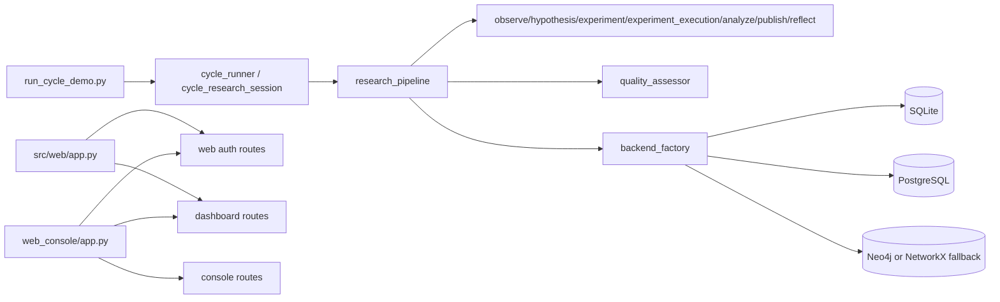
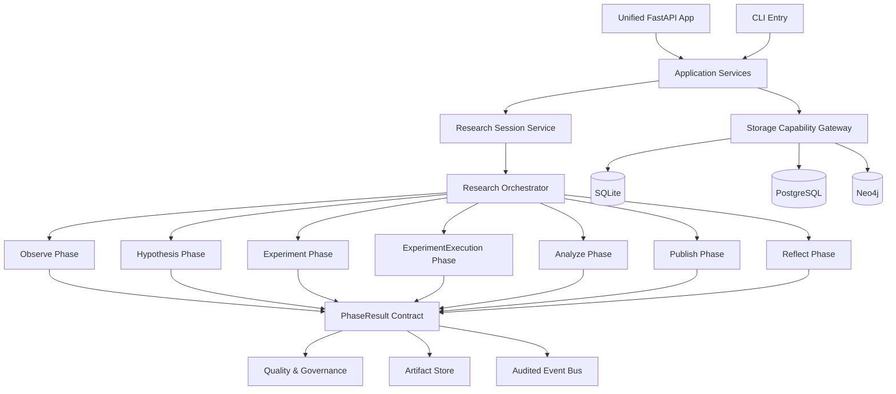
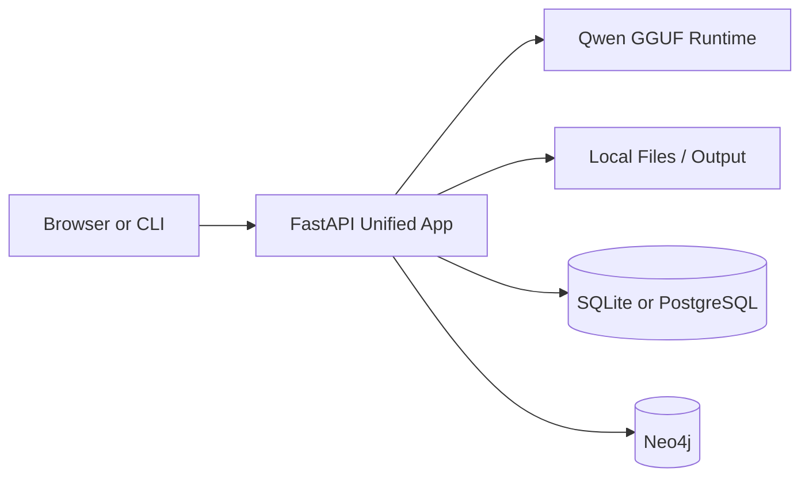

# TCMAutoResearch 架构评估与重构设计（2026-04-08）

## 1. 评估范围与证据来源

本次评估基于两类证据：

1. 静态代码遍历：重点阅读入口、编排、存储、Web、配置与质量评估模块。
2. 真实运行验证：使用本地 Qwen GGUF 模型执行一次当时的完整历史研究流程。

关键阅读入口：

- `run_cycle_demo.py`
- `src/cycle/cycle_runner.py`
- `src/cycle/cycle_research_session.py`
- `src/research/research_pipeline.py`
- `src/storage/backend_factory.py`
- `src/infrastructure/config_loader.py`
- `src/web/app.py`
- `web_console/app.py`
- `src/quality/quality_assessor.py`

真实运行命令：

```powershell
.\venv310\Scripts\python.exe run_cycle_demo.py --mode research --question "小柴胡汤治疗少阳证的核心配伍机理是什么" --research-phases observe,hypothesis,experiment,analyze,publish,reflect --export-report --report-format markdown
```

关键运行产物：

- `output/research_session_1775649228.json`
- `output/research_reports/cycle_1775649228_d5645170_imrd_report.md`

同步说明（2026-04-12）：

- 本文的真实运行证据来自 2026-04-08，当时主链尚未拆出 `experiment_execution`。
- 当前主链已经演进为 Observe → Hypothesis → Experiment → ExperimentExecution → Analyze → Publish → Reflect。
- 当前阶段边界应理解为：`experiment = protocol design`，`experiment_execution = external execution import`。
- 若按当前主链复跑研究流程，`--research-phases` 中应显式包含 `experiment_execution`。

## 2. 执行结论

结论先行：系统已经具备“可启动、可登录、可跑通、可出报告”的工程能力，但距离“真实科研闭环平台”还有明显差距。目前更准确的定位是：**一个具备多种科研能力原型的研究编排平台**，而不是已经完成收敛的统一科研操作系统。

### 当前系统的主要优点

1. 入口与能力已基本齐全。
   从 CLI、Web、存储、质量评估、报告生成到研究阶段模块，主干能力都已存在，不是空架子。

2. 配置分层做得较成熟。
   `config.yml`、环境覆盖、secret 分层和 root_path 解析已经形成体系，后续继续工程化成本较低。

3. 存储设计方向是对的。
   SQLite、PostgreSQL、Neo4j 的后端工厂和降级策略说明系统已经在向“多后端能力平台”演进，而不是把数据写死在单一实现中。

4. 研究流程已形成阶段化语义。
   历史基线已经形成不含 `experiment_execution` 的前置阶段边界；当前主链则进一步演进为 Observe、Hypothesis、Experiment、ExperimentExecution、Analyze、Publish、Reflect，其中 Experiment 负责方案设计，ExperimentExecution 负责外部执行结果导入。

5. 发布与报告产出能力可用。
   本次真实运行虽然科研证据薄弱，但仍成功产出 IMRD 报告与论文草稿，说明下游写作链路可复用。

### 当前系统的主要问题

1. 编排层重复，系统中心不唯一。
   `run_cycle_demo.py`、`src/cycle/cycle_runner.py`、`src/cycle/cycle_research_session.py`、`src/research/research_pipeline.py` 共同承担“流程编排”职责，存在多中心问题。

2. Web 入口分裂。
   `src/web/app.py` 与 `web_console/app.py` 同时存在且路由面不一致，导致 `/login`、`/dashboard`、`/console` 的部署语义不统一。

3. 研究域过宽。
   `src/research/` 目录同时放了阶段编排、论文辅助、翻译、Scholar/arXiv helper、插件脚本、理论框架等内容，边界已经失真。

4. 阶段输出契约不稳定。
   从 `src/quality/quality_assessor.py` 可见，质量评估期望结果包含 `status`、`phase`、`results`、`artifacts`、`metadata` 等字段；真实运行中多个阶段未稳定满足该契约，直接把 Reflect 拉低到 `overall_cycle_score = 0.334`。

5. “跑完”不等于“科研成立”。
   本次真实运行中 Observe 阶段收集到的文档数为 0，但流程仍继续生成假设、实验设计与论文文本，说明系统对“证据为空”的控制不足。

6. 事件总线存在空转。
   真实运行反复出现 dead-letter 警告，说明系统发出了生命周期/审计事件，但缺少有效订阅者，或者运行时未启用对应消费链。

## 3. 真实运行观察

### 3.1 实际跑通情况

本次历史基线运行完成了当时启用的 6 个阶段：

- observe
- hypothesis
- experiment
- analyze
- publish
- reflect

按当前主链语义，应将这组样本理解为“`experiment_execution` 尚未拆出前的历史运行基线”；当前默认主链已在 `experiment` 与 `analyze` 之间新增 `experiment_execution`。

同时生成了：

- 研究会话 JSON
- IMRD Markdown 报告
- 论文草稿目录

说明系统在工程层面已经具备端到端可执行性。

### 3.2 真实运行暴露的问题

1. Observe 阶段采集为空。
   `output/research_session_1775649228.json` 显示文档数与实体数均为 0，这意味着本次研究没有拿到足够的外部证据基础。

2. Hypothesis 阶段仍在生成结构化结论。
   系统在上游证据不足时继续生成规则型假设，容易产生“流程正确但证据空心”的结果。

3. Experiment 阶段模板化明显。
   生成了较完整的试验方案，但更多体现为模板复用，而不是从真实证据回推实验设计。

4. Analyze 阶段结构完成，但证据强度不足。
   分析阶段输出了结构化内容，但缺乏足够数据支撑，未形成强证据等级。

5. Publish 阶段能产文，但不代表科学有效。
   这说明写作链条强于证据链条，目前系统更擅长“生成研究文稿”，而不是“验证研究结论”。

6. Reflect 评分低不是偶然。
   `src/quality/quality_assessor.py` 中，完整性、状态一致性、证据字段齐备度共同决定阶段分数；多个阶段缺失 `status`、`results`、`artifacts` 等字段，因此低分是契约问题的直接结果，而不仅仅是模型质量问题。

## 4. 当前架构判断

### 4.1 现状架构图

> 历史基线图（2026-04-08）：以下 mermaid 图反映的是重构设计时观察到的系统快照，用于保留当时的问题上下文；当前实现状态应以较新的架构审计与真实运行/持久化回归为准。



### 4.2 核心判断

当前系统不是典型单体，也不是清晰的微服务，而是一个**模块很多、边界尚未完全收敛的模块化单体**。这类架构在迭代早期是合理的，但在当前规模下，如果不继续收口，后续会越来越难维护。

## 5. 模块级评估

### 5.1 应该保留并继续强化的部分

#### A. 配置与基础设施层

- `src/infrastructure/config_loader.py`
- `config.yml`
- `config/*.yml`

评价：这是当前仓库里相对成熟的一层，建议继续作为统一基础设施入口，而不是在各业务模块里重复解析配置。

#### B. 存储后端工厂

- `src/storage/backend_factory.py`

评价：方向正确，应继续强化为“能力声明 + 健康检查 + 降级决策”的统一入口。

#### C. 研究阶段对象本身

- `src/research/phases/*`

评价：阶段边界已经是最有价值的领域资产，后续重构应围绕它们收敛，而不是再发明新的流程容器。

#### D. 质量评估器

- `src/quality/quality_assessor.py`

评价：当前规则较粗，但它已经暴露出阶段契约问题，是后续建立治理闭环的抓手，不应删除，应升级。

### 5.2 应该收敛或合并的部分

#### A. 编排层

涉及文件：

- `run_cycle_demo.py`
- `src/cycle/cycle_runner.py`
- `src/cycle/cycle_research_session.py`
- `src/research/research_pipeline.py`

问题：同一件事存在多个控制中心，导致行为分散、排错困难、测试难以聚焦。

建议：

- `run_cycle_demo.py` 只保留 CLI 参数解析与调用。
- `src/research/research_pipeline.py` 成为唯一研究编排内核。
- `src/cycle/*` 收缩为应用服务层，负责“启动一个 session、记录进度、导出结果”，不再重复实现研究流程。

#### B. Web 入口

涉及文件：

- `src/web/app.py`
- `src/web/main.py`
- `web_console/app.py`

问题：两个 FastAPI 应用并存，路由入口不统一，部署和排错容易产生错觉。

建议：统一为一个应用装配入口，保留子路由分区即可。

#### C. 研究目录边界

涉及目录：

- `src/research/`

问题：科研编排、文献工具、翻译工具、外部 helper、理论框架、插件风格脚本混在一起。

建议：至少拆成四层：

1. `src/research/core/`：研究会话、阶段契约、编排器。
2. `src/research/phases/`：当前七阶段实现（含 `experiment_execution`）。
3. `src/research/connectors/`：Scholar、arXiv、外部 API 适配。
4. `src/research/tools/`：翻译、导出、论文辅助等工具。

### 5.3 已确认的历史残留区域

2026-04-12 的只读调用链审计已经确认，旧的 iteration/fixing/test-driven 子系统不在当前生产路径中，并已完成删除收口。

当前 `src/cycle/` 保留的有效职责主要是：

1. CLI 参数解析与命令路由。
2. 真实模块链执行与阶段桥接。
3. research session 执行、报告导出与存储落盘。

仍需持续关注的只剩 demo/plugin 类运行时封装是否还能进一步合并，而不是继续维护旧 iteration 子系统。

## 6. 关键耦合点与技术债

### 6.1 阶段结果契约耦合

问题：阶段模块、发布模块、反思模块、质量评估器之间通过“弱约定 dict”通信。

证据：

- `src/quality/quality_assessor.py` 期望字段：`status`、`phase`、`results`、`artifacts`、`metadata`、`error`
- 真实运行中多个阶段缺字段，导致反思评分系统性偏低

后果：

- 任一阶段可悄悄返回不完整结构
- 下游只能在运行时兜底
- 测试难以覆盖真实契约

建议：引入统一 `PhaseResult` dataclass 或 Pydantic 模型，所有阶段必须返回同一种结构。

### 6.2 编排与领域逻辑耦合

问题：流程控制、研究逻辑、导出、质量、日志在多个文件中交织。

后果：

- 无法快速判断某个行为属于“编排问题”还是“领域问题”
- 很难对研究流程做稳定回归测试

建议：将“阶段执行”和“阶段内容生成”拆开，前者归 orchestrator，后者归 phase service。

### 6.3 事件系统与运行时耦合失真

问题：事件已经发出，但消费链不完整。

后果：

- 运行日志噪声大
- 开发者误以为系统缺陷很多，但部分只是无效订阅配置
- 审计价值没有真正落地

建议：

1. 给每种事件增加 subscriber inventory。
2. 无订阅者的事件要么降级为 debug，要么在启动期显式禁用。
3. 只有治理链真的使用的事件才保留为 warning/error 级别。

### 6.4 Web 与核心能力边界不清

问题：Web 既承载认证，也承载 dashboard，又在另一套 app 中承载 console 和 API 装配。

后果：

- 路由可见性受启动方式影响
- 登录后用户对系统入口的认知不一致

建议：统一应用壳，按路由前缀划分子域：`/auth`、`/dashboard`、`/console`、`/api`。

## 7. 医工融合视角评估

从“医学工程教授”的标准看，当前系统最大的问题不是代码能不能跑，而是**科研证据链尚未成为一等公民**。

### 7.1 已有优势

1. 研究流程语义完整，符合科研项目的阶段思维。
2. 可以输出实验方案、分析文本和论文草稿，适合做研究辅助平台。
3. 质量评估和反思机制已经开始出现，具备走向闭环学习的基础。

### 7.2 关键短板

1. 证据采集为空时仍继续推进，这是科研系统的大忌。
2. 假设与实验设计对上游证据的依赖关系还不够硬。
3. 发布能力强于验证能力，容易把“生成流畅文本”误当成“得出可信结论”。
4. 目前更像“研究文本生成器 + 流程编排器”，还不是“证据驱动科研系统”。

### 7.3 医工系统应补的硬约束

建议后续把以下约束写入平台规则，而不是只靠文档提醒：

1. Observe 无有效文献/数据时，Hypothesis 默认不能进入正式模式。
2. Hypothesis 必须带证据引用列表和证据密度指标。
3. Experiment 必须声明其直接对应的 hypothesis ID，且默认只承担 protocol design。
4. ExperimentExecution 必须记录外部执行来源、采样事件与导入证据，不得伪装为系统内自动实证。
5. Analyze 必须输出证据等级、统计假设和失败原因。
6. Publish 必须区分“研究草稿”“工程草稿”“可发表结果”三种状态。

## 8. 目标架构

### 8.1 目标原则

1. 一个系统只有一个研究编排内核。
2. 阶段之间只通过强类型契约通信。
3. 采集、推理、写作、反思必须显式分层。
4. Web 只是入口壳，不应重新定义业务边界。
5. 存储层必须显式报告能力与降级状态。

### 8.2 目标架构图

> 历史设计目标图（2026-04-08）：以下 mermaid 图表达的是当时的目标收口方向，而不是当前默认实现完成度；其中阶段边界应结合最新口径理解为 experiment = protocol design、experiment_execution = external execution import。



### 8.3 部署视角图

> 历史设计目标图（2026-04-08）：以下 mermaid 图是当时的目标部署视角，用于说明设计意图，不应替代当前真实部署拓扑与接线状态。



## 9. 具体优化建议

### 9.1 建立统一 PhaseResult 契约

建议内容：

- 新增统一返回结构，例如：`status`、`phase`、`results`、`artifacts`、`metadata`、`error`、`metrics`
- 七个科研 phase 全部强制返回该结构
- `Publish` 与 `Reflect` 不再各自猜测上游字段

理由：这是当前最根本的问题，能一次性解决质量评估低分、下游兜底过多、测试不稳定三类问题。

代价：中等。需要逐步修改每个 phase 的返回值和相关测试。

### 9.2 收敛为单一研究编排内核

建议内容：

- `research_pipeline` 成为唯一编排器
- `cycle_*` 仅保留应用层语义
- `run_cycle_demo.py` 只负责 CLI 解析

理由：能直接降低维护复杂度和认知负担。

代价：中高。涉及调用链梳理与回归测试。

### 9.3 合并 Web 应用入口

建议内容：

- 统一到一个 FastAPI app factory
- `src/web/main.py` 作为唯一启动入口
- `web_console/app.py` 的能力迁回统一应用装配层

理由：能彻底消除“某些路由只在某个入口存在”的问题。

代价：中等。主要是装配调整，不是算法改造。

### 9.4 拆分 research 目录

建议内容：

- 把 helper、翻译、外部文献连接器从核心研究编排中剥离
- 核心研究目录只保留 session、orchestrator、phase、contract

理由：让研究域重新变得可理解、可测试、可扩展。

代价：中等。主要是搬迁与导入路径调整。

### 9.5 为 Observe 增加 fail-fast 与质量门

建议内容：

- 当 Observe 文档数、实体数、引用数低于阈值时，直接将 session 标记为 `degraded` 或 `insufficient_evidence`
- 禁止进入正式 publish

理由：这是医工场景最重要的科学性保护。

代价：低到中等。逻辑不复杂，但会改变现有流程行为。

### 9.6 清理无效事件与历史残留模块

建议内容：

- 审计 event topic 与 subscriber 对应关系
- 对无消费者事件降级
- 对 `src/cycle/` 中历史演化残留模块做删除候选清单

理由：能快速降低运行噪音并减少后续维护面。

代价：低。属于高收益清理项。

## 10. 分阶段实施计划

### Phase 1：契约收口

目标：先解决“能跑但结构不稳”的问题。

实施项：

1. 新增 `PhaseResult` 模型。
2. 七阶段统一返回结构。
3. 修正 `Reflect` 与 `QualityAssessor` 的字段读取逻辑。
4. 为每个阶段补契约级单元测试。

预估成本：1 到 2 天。

收益：高。立刻改善质量评分、回归稳定性和故障定位能力。

### Phase 2：编排收口

目标：把多中心流程控制压缩成单一内核。

实施项：

1. 确定 `research_pipeline` 为唯一 orchestrator。
2. 精简 `cycle_runner` 与 `cycle_research_session` 的职责。
3. 统一 CLI 到应用服务调用链。

预估成本：2 到 4 天。

收益：高。能显著降低复杂度与重复逻辑。

### Phase 3：Web 收口

目标：统一系统入口与部署方式。

实施项：

1. 合并 `src/web/app.py` 与 `web_console/app.py`。
2. 统一认证、dashboard、console、API 路由装配。
3. 补充登录后跳转与路由可达性测试。

预估成本：1 到 2 天。

收益：中高。减少运维和使用歧义。

### Phase 4：科研质量门建设

目标：让系统从“流程可运行”升级为“结果可约束”。

实施项：

1. Observe 证据不足 fail-fast。
2. Hypothesis 与 Experiment 建立显式引用关系，并让 ExperimentExecution 记录外部执行来源与导入证据。
3. Analyze 增加证据等级与统计约束。
4. Publish 引入结果状态分级。

预估成本：3 到 5 天。

收益：最高。这一步决定系统是否真的具备科研可信度。

### Phase 5：目录与历史模块清理

目标：压缩维护面，形成长期可持续结构。

实施项：

1. 清理 `src/cycle/` 历史残留模块。
2. 拆分 `src/research/`。
3. 审计事件系统与日志等级。

预估成本：2 到 3 天。

收益：中高。长期收益明显，短期风险可控。

## 11. 最终判断

这套系统现在最值得肯定的地方，是它已经不再是概念稿，而是一套能真实跑出研究会话、报告和论文草稿的工程原型。最需要警惕的地方，是它容易给人一种“已经完成科研闭环”的错觉。

更准确的判断应是：

- 在软件工程上，它已经进入“需要架构收口”的阶段。
- 在医学工程上，它仍处于“证据链尚弱、验证链不足、写作链偏强”的阶段。

因此后续不应继续横向加功能，而应优先做三件事：

1. 统一阶段契约。
2. 统一编排内核。
3. 为 Observe 到 Publish 建立硬质量门。

只要这三步做完，这个项目会从“能力很多的原型”明显跃迁为“可持续演进的科研平台”。
