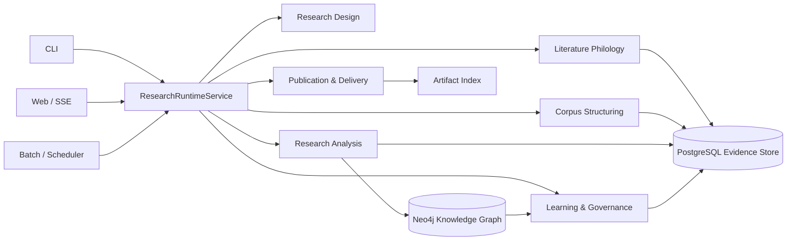
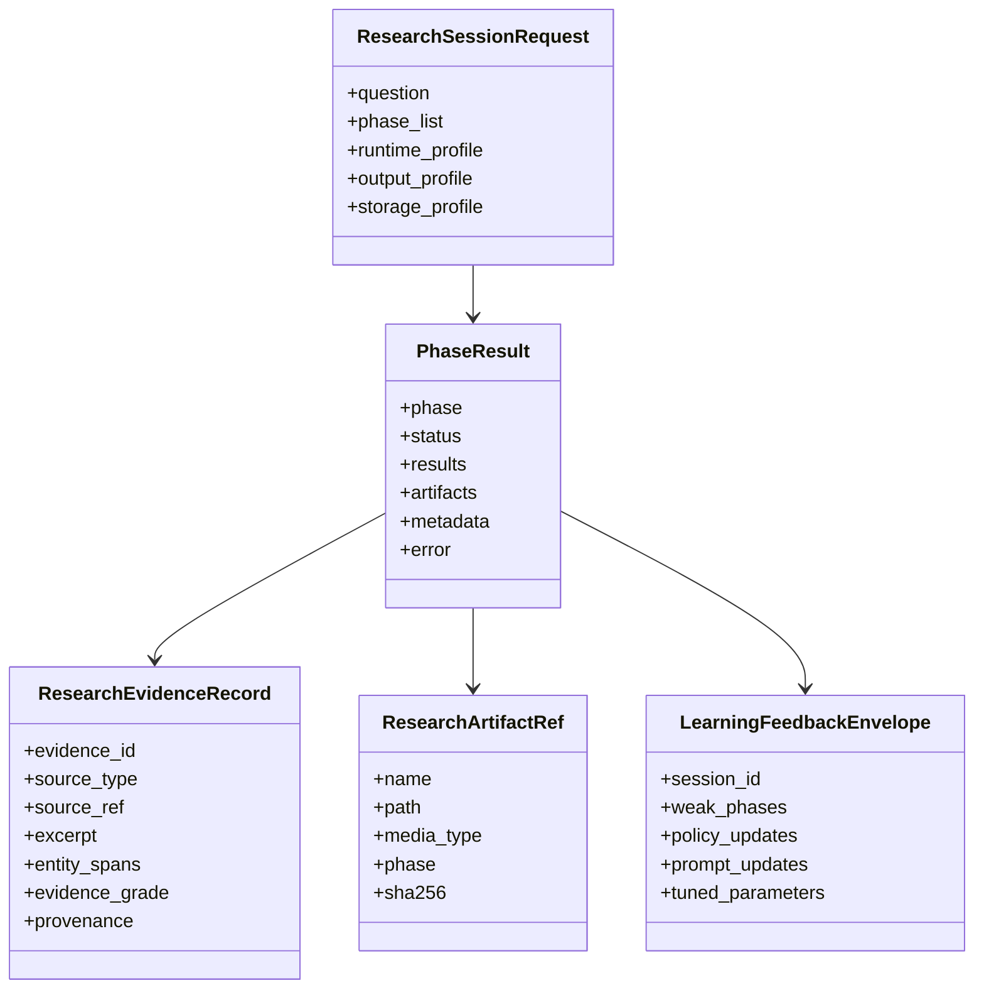
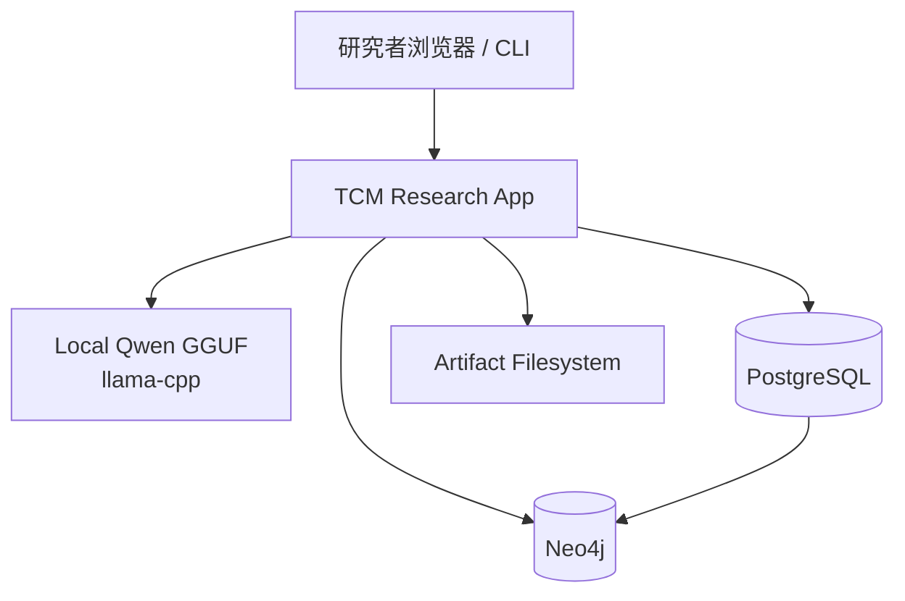

# 中医文献研究法软件架构评估与优化设计

日期：2026-04-12

范围：桌面资料《中医文献研究法》、仓库关键入口、核心科研主链、配置体系、本地 Qwen GGUF 集成、PostgreSQL / Neo4j 存储集成、Web 入口、自学习与质量闭环。

方法：静态代码审计 + 配置审阅 + 最近真实运行产物与真实持久化回归抽样。重点审阅了 run_cycle_demo.py、src/cycle、src/research、src/orchestration、src/web、src/llm、src/infra/llm_service.py、src/storage、config.yml、config/development.yml、config/production.yml，以及最近一次真实会话产物 output/research_session_1775971820.json、真实 PG / Neo4j 主链冒烟与 experiment_execution 持久化回归。

## 1. 执行摘要

当前系统已经不是纯演示代码，而是一个可运行的半自动中医科研助手。它已经具备以下能力：

- 以七阶段研究链运行 Observe → Hypothesis → Experiment → ExperimentExecution → Analyze → Publish → Reflect。
- 使用本地 GGUF 模型 qwen1_5-7b-chat-q8_0.gguf 承担部分科研文本生成任务。
- 生成论文草稿、IMRD 报告、引用格式化结果，并输出统一 PhaseResult 契约。
- 具备 Web 入口、任务编排、质量评估、反思阶段、大量诊断工具，以及 PostgreSQL / Neo4j 结构化持久化主链。

但如果以《中医文献研究法》的要求来衡量，它距离“可运行科研平台”还有明显差距，核心问题不在单个算法，而在系统收口：

- ResearchRuntimeService + RuntimeConfigAssembler 已完成 CLI / Web / demo 主研究路径的首轮收口，但兼容壳和历史直连路径仍需继续清理。
- PostgreSQL / Neo4j 已进入主科研链结构化持久化路径；当配置可用时会沉淀 session、phase execution、artifact 与图投影，但 Neo4j 未启用或初始化失败时仍允许仅 PG 运行，历史图投影与 Observe 结构化资产完整性也仍需依赖 writeback / backfill / health-check 工具链治理。
- Experiment 已明确收口为 protocol design，experiment_execution 独立承接外部实验执行、采样与结果导入；当前平台边界是"辅助设计 + 导入外部执行结果"，不是"在系统内自动开展真实实验"。截至 2026-04-17，UI、仪表板、API 枚举、配置常量与理论框架中的实验边界文案已全部统一（commit c679a59），experiment_execution 阶段入口已加入运行时边界守卫，会拒绝 `auto_execute` / `run_experiment` 等自动执行请求，并有 16 项边界契约测试保护。
- Reflect 已完成默认学习闭环首轮接线：ResearchPipeline 会按 `self_learning.enabled` 默认装配 SelfLearningEngine，reflect 结果会持久化学习快照并回写到下一轮 runtime context；当前剩余问题已转为阶段级策略消费仍偏轻。
- 本地 Qwen 接入存在多条旁路，缓存、参数、模型选择和成本控制没有统一治理。

结论：

- 如果定位是“本地部署的中医文献科研助手”，当前架构可继续演进。
- 如果定位是"可持续运行、可追溯、可积累资产的中医科研平台"，当前已经完成主入口统一、主链存储接线、实验语义拆分与 UI/配置/文案全链路边界统一、默认学习闭环首轮接线，并已把首批学习策略阈值接入 observe / hypothesis / analyze / experiment / experiment_execution / publish；文献学能力五块 backlog（目录学、训诂、辑佚、考据、工作台化）已全部完成首轮落地（commits b010e49 → 03100fd）；下一优先级应转向反馈资产治理与跨阶段一致性、LLM / 事务边界继续收敛、以及文献学深层能力的二期深化。

## 2. 用《中医文献研究法》看当前软件

桌面资料《中医文献研究法》把中医文献研究分成三层：

1. 文献学研究：校勘、辑佚、训诂、考据、版本与目录整理。
2. 类编研究：分类、分段、实体识别、关系抽取、编码、索引、知识整合。
3. 学术研究：假说、实验设计、证据整合、知识图谱、循证分析、论文表达。

本软件与这三层的映射如下。

| 方法论层级 | 当前对应模块 | 实现程度 | 评价 |
| --- | --- | ---: | --- |
| 文献学研究 | src/research/phases/observe_phase.py、src/analysis/philology_service.py、src/research/observe_philology.py、src/collector/*、src/analysis/preprocessor.py、src/research/exegesis_contract.py、src/research/fragment_contract.py、src/research/catalog_contract.py、src/analysis/textual_evidence_chain.py、文献检索与本地语料采集 | 88% | 已接入术语标准化、同题异文版本对勘、校勘条目与 annotation report；目录学字段合同、训诂释义与义项判别、辑佚候选识别与拼接、考据证据链已完成首轮落地；工作台化审核面已具备筛选、分页、复核状态与回写能力；后续可继续深化各子能力的精度与覆盖面 |
| 类编研究 | src/analysis/entity_extractor.py、src/analysis/semantic_graph.py、src/research/phases/analyze_phase.py、知识图谱相关结构 | 78% | 是当前最成熟的一层，已经有实体、关系、图谱、统计和部分推理 |
| 学术研究 | src/research/hypothesis_engine.py、src/research/phases/experiment_phase.py、src/research/phases/experiment_execution_phase.py、src/research/phases/publish_phase.py、src/research/phases/reflect_phase.py | 82% | 假说、方案设计、外部执行结果导入、写作、反思都能跑，默认学习闭环已完成首轮接线；实验边界已在代码、UI、配置、文案与 API 枚举中全部统一，运行时边界守卫已接入；真实实验仍依赖系统外部，主研究链阶段级策略消费已覆盖 protocol design、execution import、analyze 与 publish |

总体上，系统最强的是"类编研究"与"结构化持久化输出"，文献学能力已完成首轮补齐（目录学、训诂、辑佚、考据、工作台化），实验边界已统一，剩余短板转为学习策略消费深度、LLM / 事务边界收敛与文献学二期深化。

## 3. 关键架构模块与实现程度

| 模块 | 关键文件 | 实现程度 | 优点 | 不足 |
| --- | --- | ---: | --- | --- |
| 统一配置中心 | src/infrastructure/config_loader.py、src/infrastructure/runtime_config_assembler.py、config.yml、config/*.yml | 88% | 配置分环境、路径解析、secret 覆写能力较完整，且已注入 shared runtime path | 仍需持续清理绕开 assembler 的配置旁路 |
| CLI 应用壳 | run_cycle_demo.py、src/cycle/cycle_command_executor.py | 82% | 入口已经瘦身，research 路径已桥接 shared runtime service | 历史 demo / 兼容壳仍需继续压缩 |
| 研究会话封装 | src/cycle/cycle_research_session.py、src/orchestration/research_runtime_service.py | 83% | 能启动七阶段并落结构化 session 结果，demo / web 入口 profile 已由 RuntimeConfigAssembler 统一产出，旧 `session_result` DTO 与 demo profile 默认值都已并入 shared runtime contract | 外层 wrapper 已基本收口为消费装配结果与参数透传，后续重点是防止新的入口特例重新长回外壳 |
| 科研内核 | src/research/research_pipeline.py | 87% | 七阶段边界清晰，模块工厂、事件总线、PhaseResult 已成形 | 仍是中心枢纽，负担较重 |
| Observe | src/research/phases/observe_phase.py | 86% | 已能整合本地语料、文献检索、ingestion、种子观察，并输出文献学术语标准表、版本对勘条目与 annotation report；目录学字段合同、训诂释义、辑佚候选、考据证据链已接入，工作台化审核面已落地 | 后续可继续深化各子能力的精度与覆盖面 |
| Hypothesis | src/research/phases/hypothesis_phase.py、src/research/hypothesis_engine.py | 76% | 可以基于观察结果与知识图谱生成假说 | 质量依赖上游语料与图谱质量 |
| Experiment | src/research/phases/experiment_phase.py | 82% | 方案设计结构化程度高，已显式标注为 protocol design；边界已在 UI、配置、文案与 API 枚举中全部统一，工件类型已从 dataset 修正为 protocol | 不在系统内自动执行真实实验 |
| ExperimentExecution | src/research/phases/experiment_execution_phase.py | 78% | 已独立承接外部实验执行、采样与结果导入，状态可显式区分 skipped / completed；显示名已统一为"外部实验结果导入阶段"，运行时边界守卫会拒绝 auto_execute 等自动执行请求 | 当前只做外部结果导入与归档，不在平台内开展真实实验 |
| Analyze | src/research/phases/analyze_phase.py | 80% | 具备统计、推理、证据分级和回退机制 | 真实外部验证仍依赖系统外部，统一证据对象仍待收口 |
| Publish | src/research/phases/publish_phase.py、src/generation/* | 86% | 已能产出 paper draft、IMRD、引用、artifact | 导出路径多，外层汇总报告默认不总是开启 |
| Reflect + Quality | src/research/phases/reflect_phase.py、src/quality/quality_assessor.py | 83% | 能评估循环质量并输出改进建议，且默认可把学习快照回写到下一轮 runtime context | observe / hypothesis / analyze / experiment / experiment_execution / publish 已开始消费真实阈值与行为分支；后续重点转向反馈资产治理、策略可观测性与跨阶段一致性 |
| 本地 LLM 层 | src/llm/llm_engine.py、src/infra/llm_service.py | 74% | 本地 GGUF 路径清晰，支持缓存与 API/本地双模式 | 多个业务模块直接 new LLMEngine，治理不统一 |
| 存储层 | src/storage/backend_factory.py、src/storage/storage_driver.py、src/storage/transaction.py | 78% | PostgreSQL / Neo4j 结构化持久化已进入主科研链，session / phase / artifact 可回读并投影到图 | `sqlite_fallback` / 仅 PG 降级、历史图投影补齐与统一观测口径仍需继续收敛 |
| Web 层 | src/web/main.py、src/web/app.py、src/web/ops/job_manager.py | 74% | Web 与本地调试启动路径已桥接 shared runtime path，具备 Job/SSE、Dashboard | 历史接口与摘要口径仍需继续收口 |

## 4. 当前架构的优点

### 4.1 研究阶段边界已经是明确的领域资产

七阶段不是简单的脚本堆叠，而是相对稳定的领域分解。尤其在 experiment 与 experiment_execution 拆分后，研究方案设计和外部执行结果导入的边界已经明确，且已在 UI、仪表板、API 枚举、配置常量与理论框架中全部统一（commit c679a59），运行时边界守卫会拒绝系统内自动执行请求，16 项边界契约测试持续保护。这让后续重构可以继续围绕阶段边界收敛，而不需要再承受语义误导。

### 4.2 输出能力强，已经能形成学术交付物

Publish 阶段可以产出 Markdown / DOCX 论文稿、IMRD 报告、引文和 artifact，这说明系统已经跨过“只能做分析看板”的门槛，开始具备研究交付能力。

### 4.3 本地 LLM 部署方向正确

本地模型文件已经在 models/qwen1_5-7b-chat-q8_0.gguf，llama-cpp 路径和 GPU offload 逻辑也已经落在 src/llm/llm_engine.py。这非常适合中医文献这类高隐私、高专业术语的本地研究环境。

### 4.4 统一 PhaseResult 契约是当前最重要的正资产

src/research/phase_result.py 已经把 phase、status、results、artifacts、metadata、error 收敛成主合同。这让后续的 API、Web、报告、审计和学习模块有了统一事实源。

### 4.5 诊断与质量工具链丰富

仓库中已经有 quality_gate、real observe smoke、lexicon rebuild、transaction e2e 等大量治理资产，这说明工程治理意识是在线的，后续不是从 0 建平台，而是从“很多能力已存在但还没接好”继续往前推。

## 5. 真实科研流程运行情况评估

基于最近一次真实会话产物 output/research_session_1775971820.json、真实 PG / Neo4j 主链冒烟，以及 integration_tests/test_experiment_execution_persistence_e2e.py 的真实持久化回归，可以确认：

- 七阶段主链已经存在：observe、hypothesis、experiment、experiment_execution、analyze、publish、reflect。
- PostgreSQL / Neo4j 结构化持久化已经进入主流程，真实会话可沉淀 session、phase execution、artifact 与图投影，而不是只落文件。
- experiment_execution 在无外部输入时会合法持久化为 skipped；导入外部执行记录、采样或结果后会持久化为 completed。这说明平台已经明确区分“协议设计已完成”和“真实执行结果是否已经导入”。
- publish 阶段能够生成论文相关 artifact，analyze 阶段有真实 record_count 与推理结果，说明不是纯模板空跑。
- 历史基线样本 output/research_session_1775971820.json 中，reflect 阶段曾出现 learning_fed=false、llm_enhanced=false；截至 2026-04-15，ResearchPipeline 已默认装配 SelfLearningEngine，reflect 结果会持久化调参快照并回写到下一轮 runtime context。

这组证据说明当前系统已经跨过“能跑文件导出流程”的阶段，进入“能跑七阶段并沉淀结构化研究会话”的阶段，但还存在两个关键缺口：

1. 真正的实验执行仍依赖系统外部；平台当前负责 protocol design、外部结果导入和后续分析，不应被表述为系统内自动实证平台。
2. 默认学习闭环已完成首轮收口，但 session 顶层摘要与阶段级策略消费仍可继续治理，说明外层应用服务还有尾项。

### 5.1 优点

- 已经能把中医研究问题推进成七阶段产物链，并显式区分 protocol design 与 external execution import。
- 已经有结构化分析、知识图谱、论文生成和反思结果。
- 已经具备 PostgreSQL / Neo4j 结构化会话沉淀能力。
- 本地 Qwen 适合保密场景和术语一致性控制。

### 5.2 不足

- Observe 已从"采集 + ingestion"推进到带术语标准化、版本对勘、校勘条目输出的文献学入口，目录学、训诂、辑佚、考据、工作台化五块 backlog 已完成首轮落地；后续可继续深化各子能力的精度与覆盖面。
- Experiment / ExperimentExecution 已拆分且边界已在代码、UI、配置、文案中全部统一，运行时边界守卫已接入；但 execution 仍依赖外部输入，不是系统内实证执行器。
- Reflect 已从“总结器”推进到默认“学习器”首轮实现，但策略影响面仍偏窄。
- 结构化存储虽已成为主链基础设施，但降级态、历史补齐态和外层摘要治理尚未完全收口。

## 6. 技术债务与耦合点

### 6.1 P0 级

| 问题 | 说明 | 理由 | 代价 |
| --- | --- | --- | --- |
| 默认学习策略已覆盖主研究链，治理已收口 ✅ | ResearchPipeline 已默认创建 SelfLearningEngine，reflect 会持久化学习快照并回写下一轮 runtime context；observe / hypothesis / analyze / experiment / experiment_execution / publish / reflect 全 7 阶段已接入 StrategyApplicationTracker，每阶段 _resolve 方法记录 baseline/adjusted/reason 决策日志（commit ac59ecf）。**已解决缺口**: (1) 策略决策可追踪 — metadata.learning 包含 fingerprint + decisions; (2) 跨阶段策略清单 — pipeline.build_learning_application_summary() 汇总; (3) 跨阶段一致性 — freeze_learning_strategy_snapshot() 在 cycle 启动时冻结 fingerprint，summary.cross_phase_consistent 校验; (4) 反馈资产可审计 — reflect 阶段 before/after snapshot + build_strategy_diff(); (5) 标准元数据 — tracker.to_metadata() 统一输出 applied/strategy_fingerprint/strategy_version/decision_count/decisions。20 项治理契约测试保护 | 治理已收口，后续可选深化方向：策略版本历史持久化、决策日志 JSON 导出、跨 cycle 策略漂移检测 | 已完成 |
| 真实实验仍依赖系统外部 | experiment 已是 protocol design，experiment_execution 只负责外部执行、采样与结果导入；截至 2026-04-17，UI、仪表板、API 枚举、配置常量与理论框架中的实验边界文案已全部统一（commit c679a59），运行时边界守卫已接入，16 项边界契约测试保护 | 平台能力边界已在代码层明确表达，后续重点转向外部导入流程治理与导入数据质量校验 | 低，约 1-2 人日 |
| 文献学深层能力二期深化已完成 ✅ | 首轮已具备 PhilologyService、术语标准化、版本对勘与校勘条目产物；目录学字段合同（catalog_contract）、训诂释义与义项判别（exegesis_contract）、辑佚候选识别（fragment_contract）、考据证据链（textual_evidence_chain）、工作台化审核面均已完成首轮落地（commits b010e49 → 03100fd）。**二期深化（commit 492dc98）已完成**: (1) 朝代归一化 — catalog_contract.normalize_dynasty() 支持宽泛/精确两种模式，DYNASTY_SYNONYMS 覆盖先秦至民国全部常见异写; (2) 跨作品谱系一致性 — validate_lineage_consistency() 检测 dynasty/author 冲突与 lineage 跨作品共享; (3) 考据冲突精化 — detect_claim_conflicts() 增加 work_title 分组，消除跨作品伪冲突; (4) 训诂评分消歧 — disambiguate_polysemy() 从 first-match 升级为 source_rank/category/context_terms 加权评分; (5) 证据链朝代归一 — authorship claims 接入 normalize_dynasty()。57 项契约测试覆盖 5 个合同模块 | 后续可选深化方向：fragment scoring 可配置化、跨子能力一致性检查、批量回填自动化 | 已完成 |

#### 文献学深层能力 backlog（可执行拆解）

建议实施顺序：目录学基线 -> 训诂能力 -> 辑佚能力 -> 考据能力 -> 工作台化收口。原因是目录学与工作台字段先稳定后，训诂、辑佚、考据的产物才有统一落点与人工校核面。

> **状态更新（2026-04-17）：** 五块 backlog 已全部完成首轮落地。目录学字段合同（commit b010e49, `src/research/catalog_contract.py`）、训诂释义与义项判别（commit 516adee, `src/research/exegesis_contract.py`）、辑佚候选识别（commit a75a054, `src/research/fragment_contract.py`）、考据证据链（commit 25af47d, `src/analysis/textual_evidence_chain.py`）、工作台化审核面（commit 03100fd, dashboard review workbench + writeback）。阶段 C 交付口径已从"产出 philology notes"升级为"产出可审核、可持久化、可追溯的文献学工作台资产"。后续可继续深化各子能力的精度与覆盖面。

1. 训诂能力 backlog ✅ 已完成（commit 516adee）

- 目标：把当前“术语标准化”推进成“术语释义 + 义项判别 + 时代表达映射”，避免 PhilologyService 只停留在 canonical/variant 归并。
- 代码入口：`src/analysis/philology_service.py`、`src/data/tcm_lexicon.py`、`config/reference_constants.yml`、`src/research/exegesis_contract.py`。
- 首批任务：
- [x] 为术语标准表增加 `definition`、`semantic_scope`、`dynasty_usage`、`disambiguation_basis` 字段，并保持旧消费面兼容。
- [x] 在 PhilologyService 中新增"同词多义"判别流程，至少支持药名、证候、理论术语三类分流。
- [x] 引入可配置的训诂词条源，允许从配置或结构化词典注入义项、出处和时代标签。
- [x] 在 Observe 输出中新增 `exegesis_notes` 或等价字段，显式记录"为什么把术语解释成当前义项"。
- [x] 为 dashboard / API 摘要补一个最小训诂摘要卡，避免训诂结果只能埋在 artifact JSON 内部。
- 交付：术语标准表从“规范化表”升级为“术语规范化 + 释义表”；Observe 结果里可见术语解释依据。
- 验收：至少新增 unit tests 覆盖同词多义分流、时代标签映射、无词典回退；新增 integration tests 覆盖 Observe 最终结果和 dashboard payload 出现训诂摘要。
- 估时：中，约 1.5-2.5 人日。

2. 辑佚能力 backlog ✅ 已完成（commit a75a054）

- 目标：让系统能从多版本语料与引用片段中识别"疑似佚文 / 佚引 / 缺段补线索"，而不只是做同题异文对照。
- 代码入口：`src/analysis/philology_service.py`、`src/research/phases/observe_phase.py`、`src/research/observe_philology.py`、`src/research/fragment_contract.py`。
- 首批任务：
- [x] 在文献学输出中新增 `fragment_candidates`、`lost_text_candidates`、`citation_source_candidates` 等候选结构。
- [x] 基于现有 `parallel_versions` 与文献引用片段，增加"缺段/引文来源"候选生成规则，而不是只输出差异片段。
- [x] 为每条候选补 `source_refs`、`match_score`、`reconstruction_basis`、`needs_manual_review` 元数据。
- [x] 在 Observe artifact 中新增 `fragment_reconstruction_report` 或等价报告，便于持久化与人工复核。
- [x] 为 repository snapshot 与 dashboard 增加辑佚候选计数和待复核计数。
- 交付：系统可以输出可人工复核的辑佚候选清单，而不是只有版本差异表。
- 验收：新增 unit tests 覆盖缺段识别、来源候选排序和空候选回退；新增 integration tests 覆盖 artifact、snapshot、dashboard 中的辑佚字段连通。
- 估时：中，约 1.5-2.5 人日。

3. 目录学 backlog ✅ 已完成（commit b010e49）

- 目标：把现有 `catalog_id`、`work_title`、`fragment_title`、`version_lineage_key`、`witness_key` 等字段从"采集元数据"升级成稳定的目录学事实层。
- 代码入口：`src/collector/corpus_bundle.py`、`src/infrastructure/research_session_repo.py`、`src/research/observe_philology.py`、`src/web/routes/dashboard.py`、`src/research/catalog_contract.py`。
- 首批任务：
- [x] 统一目录学字段合同，明确作品、卷、篇、 fragment、版本谱系、见证本的最小必填字段与命名。
- [x] 在 Observe / repo snapshot / dashboard 之间统一目录学 DTO，避免各层各自拼 `work_title` 和 `fragment_title`。
- [x] 新增目录学 artifact 或 summary payload，至少可输出作品层、版本层、 fragment 层的计数与关联关系。
- [x] 为缺失目录学元数据的本地语料增加回填规则和待补录标记，而不是静默降级。
- [x] 在 dashboard 明确展示目录学过滤条件，如作品、版本谱系、见证本、片段来源。
- 交付：目录学成为 Observe 文献学主线的事实底座，后续训诂、辑佚、考据都复用同一套目录键。
- 验收：新增 unit tests 覆盖 metadata normalize / fallback；新增 integration tests 覆盖 snapshot 与 dashboard 对同一目录字段给出一致结果。
- 估时：中，约 1-2 人日。

4. 考据能力 backlog ✅ 已完成（commit 25af47d）

- 目标：让系统能给出"成书、作者、版本、术语归属、引文来源"的证据链判断，而不仅是展示差异和术语表。
- 代码入口：`src/analysis/philology_service.py`、`src/research/observe_philology.py`、`src/research/phases/analyze_phase.py`、`src/analysis/textual_evidence_chain.py`。
- 首批任务：
- [x] 为文献学资产新增 `evidence_chain`、`claim_type`、`confidence`、`counter_evidence` 结构，承载考据判断。
- [x] 支持至少三类考据 claim：作者归属、版本先后、引文来源。
- [x] 为 claim 计算可解释的 `confidence` 与 `basis_summary`，并显式区分"规则判断"和"人工待核"。
- [x] 把考据结果与 Analyze / Publish 的 evidence 语义打通，避免 philology judgment 和下游证据分级完全脱节。
- [x] 为冲突 claim 输出待复核清单，避免把不稳定推断直接包装成确定事实。
- 交付：系统可以输出带证据链和反证信息的考据 claim 列表，并在下游报告中被引用。
- 验收：新增 unit tests 覆盖 claim 生成、反证冲突和置信度回退；新增 integration tests 覆盖 Analyze / Publish 能消费考据摘要但不误判为确定事实。
- 估时：中高，约 1.5-2.5 人日。

5. 工作台化 backlog ✅ 已完成（commit 03100fd）

- 目标：把 philology 输出从"artifact JSON + dashboard 只读详情"升级成"可筛选、可审核、可回填、可追踪状态"的文献学工作台。
- 代码入口：`src/web/routes/dashboard.py`、`src/api/research_utils.py`、`src/api/schemas.py`、`src/infrastructure/research_session_repo.py`、相关 dashboard template / Web Console 面板。
- 首批任务：
- [x] 为术语标准表、校勘条目、辑佚候选、考据 claim 增加统一 review status，如 `pending`、`accepted`、`rejected`、`needs_source`。
- [x] 在 dashboard 增加按作品、版本、术语、review status 的筛选与分页，而不是只展示摘要计数。
- [x] 增加 fragment preview 与 philology 条目的双向跳转，保证人工校核能回到原文上下文。
- [x] 设计最小 writeback 流程，把人工确认结果写回 repository snapshot 或显式 review artifact，而不是只停留在前端操作态。
- [x] 为工作台增加操作审计字段，至少记录 reviewer、reviewed_at、decision_basis。
- 交付：形成最小可用的文献学审核工作台，支持“机器产出 -> 人工审核 -> 状态沉淀 -> 下游消费”。
- 验收：新增 route / service tests 覆盖筛选、分页、fragment preview、review status；至少一条 integration 流程覆盖人工确认后 snapshot 状态变化。
- 估时：中高，约 2-3 人日。

建议的完成定义如下：

- 每一块都必须同时落到三层：Observe/analysis 产物层、repository snapshot / artifact 持久化层、dashboard / API 消费层。
- 每一块都必须提供最少一条“空输入安全回退”和一条“人工待核状态”路径，避免把不充分证据包装成确定事实。
- ~~五块全部完成后，阶段 C 的交付口径应从"产出 philology notes"升级为"产出可审核、可持久化、可追溯的文献学工作台资产"。~~ ✅ 已完成：五块 backlog 均已落地（commits b010e49 → 03100fd），交付口径已升级。

### 6.2 P1 级

| 问题 | 说明 | 理由 | 代价 |
| --- | --- | --- | --- |
| 主入口兼容壳仍存在 ✅ | ResearchRuntimeService 已统一主研究路径，兼容壳已全面治理完成 | 调用方已可形成"ResearchRuntimeService 是唯一主链"的稳定认知；`run_research()` 已标记 DeprecationWarning，`__init__.py` 已区分推荐导出与兼容/内部导出，阶段 context 规范默认值（`CANONICAL_OBSERVE_DEFAULTS` / `CANONICAL_PUBLISH_DEFAULTS`）已从 API 层上收至 `research_runtime_service.py` 并嵌入所有 runtime profile，API 层仅追加 `local_data_dir` 环境路径；11 项入口合约测试保护 | 已完成 |
| 结构化存储事务边界仍可继续收敛 ✅ | `TransactionCoordinator` 主写路径已收口，`StorageConsistencyState` 一致性状态合同已建立 | 调用方现可通过 `factory.get_consistency_state()` 一眼区分 `dual_write` / `pg_only` / `sqlite_fallback` / `uninitialized` 四种运行模式；`TransactionResult` 增加 `storage_mode` 字段；`cycle.metadata.storage_persistence` 现嵌入完整 `consistency_state` 字典；`build_consistency_state()` 为唯一状态判定路径，monitoring / dashboard / 运维可共享一致结论；18 项契约测试保护 | 已完成 |
| Observe 反向依赖 cycle 层 ✅ | `observe_phase.py` → `cycle_runner` 和 `research_runtime_service.py` → `cycle_reporter` 两条反向依赖已消除 | 新增 `src/research/module_pipeline.py` 作为模块管线规范位置（`execute_real_module_pipeline`、`summarize_module_quality` 等）；`extract_research_phase_results` 迁入 `src/research/phase_result.py`；cycle 层保留兼容重导出（`cycle_runner`/`cycle_reporter` re-import）且 `assertIs` 测试确认同一对象；AST 扫描保护 research 层不再 import cycle；8 项层边界契约测试；回归 2362 pass | 已完成 |
| LLM 多条旁路 ✅ | 6 处直接 `LLMEngine()` 实例化已统一收口至 `get_llm_service(purpose)` 提供者 | 新增 `get_llm_service()` 于 `src/infra/llm_service.py`：按用途单例化（`"default"` / `"assistant"` / `"translation"` / `"paper_plugin"`），自动读取 `config.yml` 全局 `models.llm` 配置并叠加用途 profile 覆盖（temperature/max_tokens）；所有实例走 `CachedLLMService`（SQLite 磁盘缓存 + 统一参数）；`ai_assistant/*`、`markdown_translate`、`pdf_translation`、`paper_plugin` 全部迁移；AST 扫描保护 `src/` 下无直接 `LLMEngine` 导入；11 项合约测试；回归 2373 pass | 已完成 |

“主入口兼容壳仍存在”的当前实现状态如下：

1. Demo research 入口：`src/cycle/cycle_research_session.py`

- 该入口已经删除 `export_research_session_reports(...)`、`output/research_session_*.json` 直写和 `generated_by = run_cycle_demo.research_mode` 这类 demo 来源标记。
- 当前 publish report policy、`research_时间戳` 默认命名、旧 `session_result` DTO 与 demo research profile 默认值都已下沉到 shared runtime；同时 `RuntimeConfigAssembler` / `RuntimeAssembly` 现会按 `entrypoint=demo` 直接产出 `demo_research` profile，该入口当前只消费装配结果并做参数透传，已经是纯薄包装。

1. Legacy Web 兼容层：`src/web/ops/legacy_research_runtime.py`

- Web 路由读取面与执行面已经改走 `research_session_service.py`，旧的 `get_legacy_research_store()` 入口与 `LegacyResearchRuntimeStore` 适配层都已退出仓库代码。
- 这说明 legacy Web 壳已经从“活跃接线面”继续收缩到“已删除的历史兼容层”；当前不存在可供新功能继续挂接的 Python 兼容入口。

1. Web Job/SSE 入口：`src/web/ops/job_manager.py`

- 研究执行 runner 已拆到 `src/web/ops/research_job_runner.py`，`job_manager.py` 现在主要保留 job 队列、SSE 推送、持久化恢复与调度协调职责。
- 当前剩余的是异步 transport wrapper，而不是第二套会话事实源；因此这里的治理重点已从“拆主链”转成“维持 transport 边界不再反向扩张”。

“主入口兼容壳仍存在”的治理动作当前状态如下：

已完成：

- `RuntimeConfigAssembler` / `RuntimeAssembly` 现已直接为 CLI / demo research 入口产出 `demo_research` shared runtime profile；`src/cycle/cycle_research_session.py` 已删除超出入口职责的报告导出与会话文件直写逻辑，旧 `session_result` DTO 与 demo research profile 默认值现都并入 shared runtime contract，wrapper 当前只消费装配结果与参数透传。
- `RuntimeConfigAssembler` / `RuntimeAssembly` 现已直接为 Web 入口产出 `web_research` shared runtime profile；`src/web/ops/research_session_service.py` 与 `src/web/ops/job_manager.py` / `src/web/ops/research_job_runner.py` 不再各自在 wrapper 层补 Web 默认值语义。
- `src/web/routes/research.py`、`src/web/routes/dashboard.py`、`src/web/routes/analysis.py` 已不再依赖 `get_legacy_research_store()`；旧的 legacy Web 适配层文件也已随之删除，不再保留独立 store/adapter 接线面。
- `src/web/ops/job_manager.py` 已把研究执行 runner 与 contract 拼装职责拆出，当前只保留 job 生命周期、SSE 推送、恢复与调度相关能力。

剩余项：

> **状态更新：** 以下剩余项已全部通过代码治理落地：
> - `run_research()` 已加 `DeprecationWarning`，防止新代码经由此旁路绕过 RuntimeConfigAssembler。
> - `src/orchestration/__init__.py` 模块文档已将导出分为"推荐入口"（`ResearchRuntimeService` / `ResearchRuntimeResult`）与"兼容/内部"（`ResearchOrchestrator` / `run_research`）两层，认知边界明确。
> - 阶段 context 规范默认值（`CANONICAL_OBSERVE_DEFAULTS` / `CANONICAL_PUBLISH_DEFAULTS`）已定义在 `research_runtime_service.py` 并嵌入 `_SHARED_RUNTIME_PROFILES`（`demo_research` 与 `web_research`），所有入口路径共享同一基线；`src/api/research_utils.py` 已改为导入 canonical 基线后仅追加 `local_data_dir`。
> - `tests/unit/test_entry_point_contract.py` 包含 11 项入口合约测试，覆盖导出结构、deprecation 警告、canonical 默认值继承、API 超集一致性与 profile 解析。

- ~~继续防止旧 cycle API 外形经由新的 helper、route patch 或 transport 层重新回流；如果确实存在外部兼容诉求，应在边界层做显式 DTO 适配，而不是恢复独立 legacy store 文件。~~ ✅ 已通过 `test_architecture_regression_guard.py` 固化：AST 扫描保护 `src/web/routes/` 与 `src/web/ops/` 不导入 `src.cycle`；`get_legacy_research_store` / `LegacyResearchRuntimeStore` 符号禁止出现；`src/web/ops/` 下无 `legacy*` 文件。
- ~~继续防止 demo research wrapper 重新长回本地默认值、结果 DTO 组装或 output policy；新的 demo 特例若确有必要，应优先收进 RuntimeConfigAssembler 的 entrypoint/profile 映射与 shared runtime profile，而不是重新挂回入口函数。~~ ✅ 已通过 `test_architecture_regression_guard.py` 固化：`cycle_research_session.py` ≤60 行且仅导入 `ResearchRuntimeService`；禁止含文件直写/DTO 组装/来源标记模式；`research_utils.py` 只在 canonical 基线上追加路径键；所有 `_SHARED_RUNTIME_PROFILES` 嵌入 canonical 默认值。12 项防护测试；回归 2385 pass。
- ~~继续约束 `src/web/ops/job_manager.py` 与 `src/web/ops/research_job_runner.py` 的边界，确保新增功能只进入 runtime / repository contract，而不是重新长回 Web transport 层。~~ ✅ 已通过 `test_architecture_regression_guard.py` Guard #6 固化：`job_manager.py` ≤450 行且禁止导入 `src.research/cycle/storage/llm/knowledge`；`research_job_runner.py` ≤60 行且仅导入 `src.orchestration`；两者均禁止含 `CANONICAL_*`/`ResearchPipeline`/session_result DTO 组装模式。
- ~~继续防止 Web 入口的 `runtime_profile` 语义再次回到隐式默认或局部 helper；如果未来确有新的入口族群，应新增明确 profile 名称，而不是在 route / job wrapper 中散落默认值。~~ ✅ 已通过 `test_architecture_regression_guard.py` Guard #7 固化：`src/web/routes/` 和 `src/web/ops/` 全部 `.py` 文件禁止含 `CANONICAL_*_DEFAULTS`/`_SHARED_RUNTIME_PROFILES`/`default_observe_context`/`default_publish_context` 符号；route 层禁止直接导入 `ResearchPipeline`。共 21 项防护测试；回归 2394 pass。

后收什么：

- 保持 CLI / demo research 入口已收口到 `ResearchRuntimeService` + `ResearchRuntimeResult` 的状态，由 RuntimeConfigAssembler + shared runtime 共同决定 entrypoint profile、phase_context、report policy、artifact/output policy、`session_result` summary contract 与 demo profile 默认值；demo 壳后续只应保留消费装配结果与参数透传。
- 保持 Legacy Web 兼容层已删除状态；若未来确有外部兼容诉求，只允许在 route / DTO 边界做薄适配，不再恢复独立 store / adapter 文件。
- 把 Web 执行面继续收口为“job manager 负责任务生命周期，runtime service 负责研究执行，repository snapshot / result DTO 负责结果读取”；避免 job manager、legacy store、demo 壳分别维持自己的结果口径。

最后验什么：

- 验证 `run_cycle_demo` research 模式、Web 同步入口、Web 异步 job 入口三条路径，最终都落到同一份 runtime contract，且 phase list、status、artifacts、analysis summary、observe philology 等关键字段口径一致。
- 验证仓库代码中不再出现新的 `get_legacy_research_store()` 风格入口或新的路由级兼容绑定；兼容壳应保持在明确隔离区，而不是重新回流到活跃调用面。
- 验证 demo / Web 外壳中不再直接写 `output/research_session_*.json`、不再补旧 session 默认字段、也不再引入新的研究结果摘要口径；研究会话的事实源只剩 runtime result 与 repository snapshot。

“结构化存储事务边界仍可继续收敛”的当前实现状态如下：

1. 主写路径事务协调：`src/storage/backend_factory.py` + `src/storage/transaction.py`

- `ResearchPipeline` 当前的 structured persist 已统一经由 `StorageBackendFactory.transaction()` 进入 `TransactionCoordinator`，提交顺序是 PG flush → Neo4j execute → PG commit。
- `Neo4j` 执行失败时会回滚 PG；PG commit 失败时也会对已执行的 Neo4j 写操作做补偿。这说明主链已经不再是“各写各的”，而是有明确的跨库存储控制面。

1. 降级与 fallback 边界：`src/storage/backend_factory.py` + `src/research/phase_orchestrator.py`

- `StorageBackendFactory.initialize()` 在关系库存储不是 PostgreSQL 时仍会落到 `sqlite_fallback`；Neo4j 初始化失败时会显式降级为“仅 PG 模式”。
- 在 `factory.transaction()` 主写路径内，Neo4j 投影异常会直接中断事务，不会伪装成“PG 成功 + 图稍后再说”；但对于 Neo4j 未启用、初始化失败或历史数据未补齐的环境，系统当前仍允许“PG 已成立、图未接通或待回填”的运行态。

1. 回填与观测：`src/infrastructure/research_session_repo.py` + `tools/backfill_research_session_nodes.py` + `src/infrastructure/monitoring.py`

- 仓库已提供 `backfill_observe_document_version_metadata(...)`、`backfill_observe_philology_artifacts(...)` 与 `backfill_structured_research_graph(...)`，说明版本元数据、Observe 文献学资产与 Neo4j 图投影的历史补齐链已经存在。
- 运行期也已有 `cycle.metadata.storage_persistence`、数据库健康检查与 schema drift 诊断，但这些状态目前仍分散在 runtime metadata、monitoring summary、backfill/writeback 报告与日志里，还没有一个单一、稳定、对调用方友好的“结构化存储一致性状态合同”。

“结构化存储事务边界仍可继续收敛”的治理动作当前状态如下：

已完成：

- 主科研链的结构化持久化已经统一通过 `StorageBackendFactory.transaction()` + `TransactionCoordinator` 执行，而不是分别直写 PostgreSQL / Neo4j。
- Neo4j 写路径已经补上 split MATCH 与 driver 级回归，真实 PG / Neo4j 冒烟已验证主链可在无多余 cartesian-product 通知的前提下完成双写。
- Observe 版本元数据 writeback、Observe 文献学 artifact writeback、structured graph backfill、数据库 health check 与 schema drift 检查已经形成补偿和诊断工具链。

剩余项：

> **状态更新：** 以下核心剩余项已通过 `StorageConsistencyState` 合同治理落地：
> - `StorageConsistencyState` 数据结构定义在 `src/storage/consistency.py`，包含 `mode`（`dual_write` / `pg_only` / `sqlite_fallback` / `uninitialized`）、`pg_status`、`neo4j_status`、`neo4j_degradation_reason`、`schema_drift_detected`、`summary` 等字段。
> - `build_consistency_state()` 是唯一推荐的状态判定路径，所有消费方（factory、monitoring、runtime metadata）应通过此函数获取一致结论。
> - `StorageBackendFactory.get_consistency_state()` 已接入工厂，根据当前初始化状态实时生成一致性合同。
> - `TransactionResult` 增加 `storage_mode` 字段，事务完成后即可确认写入模式。
> - `_persist_result_structured()` 现将 `consistency_state.to_dict()` 嵌入 `cycle.metadata.storage_persistence`，runtime 调用方可通过 `storage_persistence.mode` 与 `storage_persistence.consistency_state` 一眼读取运行模式。
> - `tests/unit/test_storage_consistency_contract.py` 包含 18 项契约测试，覆盖 6 种后端组合、数据结构合同、模式常量稳定性与工厂集成。

- 后续可将 monitoring `_build_persistence_summary()` 中的 `structured_storage` 也改为直接嵌入 `get_consistency_state().to_dict()`，完成状态口径最后一公里统一。
- 继续把 `TransactionResult.compensations_applied`、图投影失败原因与补齐结果提升为稳定观测字段，而不是主要依赖日志和人工排障阅读。
- 继续减少“运行主链成功但历史增量仍需回填”的灰区路径；确需 eventual consistency 的场景，应显式标注边界，而不是让调用方面对隐式不一致窗口。

后收什么：

- 保持结构化主写路径继续收口到 `StorageBackendFactory` + `TransactionCoordinator`，由统一事务边界控制 PG / Neo4j 的写入顺序、失败处理与补偿语义。
- 把结构化持久化的事实状态继续收口为一套稳定合同，让 runtime result、repository snapshot、dashboard 与运维检查对同一会话给出一致结论，而不是各自拼接一套“是否写成功”的判断。
- 把历史补齐工具链继续定位为显式治理资产，而不是默认依赖的隐式主路径；凡是依赖 writeback / backfill 才完整的状态，都应能被一眼识别出来。

最后验什么：

- 验证 PostgreSQL + Neo4j 正常可用时，session、phase execution、artifact、observe version witness / lineage 与图投影在同一轮 structured persist 后即可一致读取。
- 验证 Neo4j 未启用、初始化失败或连接异常时，系统会明确暴露为 `neo4j_status != active` 或“仅 PG 模式”，而不会被 UI / 运维误判成完整双写成功。
- 验证补偿失败、graph backfill 待执行、schema drift 存在等异常态，在 runtime metadata、monitoring summary 与 backfill 报告里使用一致口径，而不是分散在日志里由人工拼接事实。

### 6.3 P2 级

| 问题 | 说明 | 理由 | 代价 |
| --- | --- | --- | --- |
| 顶层 session 汇总口径不稳 | phase 内产物和 session 顶层 reports 不总是对齐 | 影响外层 UI / API / 运维追踪 | 中低，约 1-2 人日 |
| 统一证据对象仍未完成 | 分析、引用、publish、dashboard 的证据语义尚未完全统一 | 影响跨模块复用、审计与长期演进 | 中，约 3-5 人日 |
| 自学习存储仍偏轻 | 以学习记录和日志为主，缺少可查询研究反馈库 | 无法做长期经验沉淀和策略回放 | 中，约 4-6 人日 |

## 7. 模块接线状态

| 模块 | 当前状态 | 判断 |
| --- | --- | --- |
| src/storage/backend_factory.py | 已成为 ResearchPipeline / ResearchRuntimeService 的结构化持久化主链入口；关系库存储可落 PostgreSQL，Neo4j 不可用时显式转为仅 PG 模式，非 PostgreSQL 环境仍可能出现 `sqlite_fallback` | active |
| src/storage/transaction.py | 已用于 PostgreSQL + Neo4j 协调写入与图关系投影，仍可继续强化事务观测与收敛 | active |
| src/storage/storage_driver.py | 主要在论文插件持久化路径使用 | 插件路径，不是科研会话默认路径 |
| src/learning/self_learning_engine.py | ResearchPipeline 会按 `self_learning.enabled` 默认装配并初始化，reflect 后会刷新学习快照与上一轮反馈 | active |
| src/infra/llm_service.py 统一工厂 | clinical gap / 部分支线与 shared runtime 可用 | 不是所有 LLM 路径的唯一入口 |
| cycle demo shared_modules | demo 中仍初始化，但 research 主链已桥接到 shared runtime service | 兼容壳，非默认主链 |

## 8. 目标架构建议

### 8.1 建议的边界上下文

1. Runtime Orchestration
职责：统一 CLI、Web、计划任务、批处理的运行入口。

2. Literature Philology
职责：校勘、版本比对、术语训诂、OCR 后处理、目录索引。

3. Corpus Structuring
职责：文本清洗、分段、实体识别、关系抽取、知识编码。

4. Research Design
职责：假说生成、研究设计、证据缺口识别、PICO / GRADE 模板化。

5. Research Analysis
职责：统计、推理、知识图谱分析、证据分级、结果解释。

6. Publication & Delivery
职责：论文初稿、IMRD、引用、图表、报告索引。

7. Learning & Governance
职责：质量评估、反思、策略学习、参数调整、运行治理。

8. Research Asset Storage
职责：PostgreSQL 结构化证据库、Neo4j 图资产、artifact 索引与审计。

### 8.2 建议的主流程



### 8.3 建议的核心契约



### 8.4 本地部署目标架构



## 9. 具体优化方案

下面的建议全部给出理由与代价。

| 建议 | 理由 | 代价 |
| --- | --- | --- |
| 1. 把 ResearchRuntimeService 固化为唯一 research mainline，并继续清理 direct pipeline shortcuts | 主入口统一已经完成首轮收口；现在要防止入口语义再次分叉 | 中，2-4 人日 |
| 2. 持续以 RuntimeConfigAssembler 收口剩余直连配置旁路 | 统一配置入口已经建立，但仍需把残余绕行点清掉，避免配置声明和运行行为再次脱节 | 中，1-3 人日 |
| 3. ✅ 已完成 Experiment / ExperimentExecution 语义拆分与全链路边界统一（commit c679a59）：UI、仪表板、API 枚举、配置常量、理论框架文案已全部对齐，运行时边界守卫已接入，16 项契约测试保护 | 边界统一已完成，后续重点转向外部导入流程治理与导入数据质量校验 | ✅ 已完成 |
| 4. 在已接入 PG / Neo4j 主链的基础上，继续收敛事务边界、降级状态观测与回填治理 | 研究资产默认沉淀已经成立；下一步是提升一致性、可观测性和运维可控性 | 中，3-5 人日 |
| 5. ✅ 已完成首轮文献学 backlog（目录学、训诂、辑佚、考据、工作台化，commits b010e49 → 03100fd）；后续继续深化各子能力精度与覆盖面 | 首轮文献学能力已补齐，下一步是各子能力的精度深化与跨子能力一致性 | 中，4-8 人日 |
| 6. 把所有 LLM 获取统一走 LLMGateway / CachedLLMService | 当前多处直接 new LLMEngine，导致缓存、参数、资源与模型切换失控 | 中，3-5 人日 |
| 7. 新增 ResearchDossierBuilder，构建长上下文研究 dossier | 本地 7B 模型上下文有限，需要先把语料、证据、图谱和术语解释压缩成可复用 dossier，才能稳定提高生成质量 | 中，3-4 人日 |
| 8. 新增 LearningLoopOrchestrator，把 Reflect 结果正式回写下一轮策略 | 当前 ResearchPipeline 已默认装配 SelfLearningEngine，reflect 结果会持久化学习快照并回写到下一轮 runtime context；各阶段已消费学习策略阈值，但独立 orchestrator 尚未抽取 | 中，3-4 人日 |
| 9. 新增 EvidenceContract v2，统一 evidence record / provenance / grade / citation | 现在分析、引用、publish、dashboard 都有证据语义，但没有一个真正的平台级统一证据对象 | 中，3-5 人日 |
| 10. 清理未真正接线的模块状态，在文档和代码里区分 active / optional / dormant | 现在最大认知成本来自“看起来有，但默认没接上”；明确状态能降低维护风险 | 低，1-2 人日 |

### 9.1 Neo4j 查询示例规范

这一节不是抽象建议，而是建议直接固化为仓库中的示例与排障模板约束。原因很简单：Neo4j 查询一旦在文档、README、诊断脚本里留下旧写法，后续人工排障时极容易把已经修掉的噪音模式重新抄回主链。

#### 读查询示例规范

1. 对可选关系类型的读取，优先使用一次 `OPTIONAL MATCH` 加 `type(r) IN [...]` 过滤，不要按关系类型拆成多段 `OPTIONAL MATCH`。
2. Neo4j 5 的子查询必须使用带作用域的 `CALL (var) { ... }`，不要继续使用裸 `CALL { WITH var ... }`。
3. 不要靠全局 suppress notification 隐藏读查询噪音，先修查询形状，只保留真正有意义的 warning。
4. 读查询示例应优先展示“可直接复用而不会产生无意义通知”的版本，而不是展示逻辑上能跑但会制造噪音的旧写法。

推荐示例：

```cypher
-- 方剂组成查询：使用单次 OPTIONAL MATCH 聚合，避免缺失关系类型告警
MATCH (f:Formula {name: $formula_name})
OPTIONAL MATCH (f)-[r]->(h:Herb)
WHERE type(r) IN ['SOVEREIGN', 'MINISTER', 'ASSISTANT', 'ENVOY']
WITH f, collect(DISTINCT {role: type(r), herb: h.name}) AS role_pairs
RETURN f,
       [pair IN role_pairs WHERE pair.role = 'SOVEREIGN' AND pair.herb IS NOT NULL | pair.herb] AS sovereign,
       [pair IN role_pairs WHERE pair.role = 'MINISTER' AND pair.herb IS NOT NULL | pair.herb] AS minister,
       [pair IN role_pairs WHERE pair.role = 'ASSISTANT' AND pair.herb IS NOT NULL | pair.herb] AS assistant,
       [pair IN role_pairs WHERE pair.role = 'ENVOY' AND pair.herb IS NOT NULL | pair.herb] AS envoy;

-- 子图读取：使用 scoped CALL，避免 Neo4j 5 deprecation warning
MATCH (start {id: $node_id})
CALL (start) {
  WITH start
  MATCH p = (start)-[*..2]-(neighbor)
  RETURN collect(DISTINCT nodes(p)) AS node_sets,
         collect(DISTINCT relationships(p)) AS edge_sets
}
RETURN node_sets, edge_sets;
```

#### 写查询示例规范

1. 创建关系时必须使用 split MATCH：先 `MATCH` 源节点，再单独 `MATCH` 目标节点，最后 `MERGE` 关系；不要写成 `MATCH (a ...), (b ...) MERGE ...`。
2. 批量写边时也遵循同一规则，即使在 `UNWIND` 中也保持 `MATCH ... MATCH ... MERGE ...`，不要为了省一行而回到逗号连接的断开模式。
3. 写查询示例应默认采用参数化 ID 和白名单化 label / relationship type 的安全模式，不把字符串拼接写法当成推荐模板。
4. 若查询样式会触发 planner/cartesian-product 信息级通知，则应视为示例不合格，即使语义结果正确也不应保留在文档中。

推荐示例：

```cypher
-- 单条关系写入：使用 split MATCH，避免 disconnected MATCH 模式
MATCH (source:ResearchSession {id: $source_id})
MATCH (target:ResearchPhaseExecution {id: $target_id})
MERGE (source)-[r:HAS_PHASE]->(target)
SET r += $properties
RETURN r;

-- 批量关系写入：UNWIND 后仍保持 split MATCH
UNWIND $rows AS row
MATCH (a:ResearchPhaseExecution {id: row.source_id})
MATCH (b:ResearchArtifact {id: row.target_id})
MERGE (a)-[r:GENERATED]->(b)
SET r += row.properties
RETURN count(r) AS written_count;
```

最低治理要求：

- 任何新文档、README、诊断脚本、运维手册中的 Neo4j 示例，提交前都应人工对照这两组规范。
- 如果真实代码因为 Neo4j 通知问题做过修复，文档示例必须同步更新，不能保留“旧代码已修、旧示例未修”的状态。
- 后续若引入新的 Neo4j 查询模式，应优先把“不会制造无意义通知”的写法沉淀到示例，再扩散到排障和运维文档。

## 10. 结合本地 Qwen 的优化建议

### 10.1 适合本地 Qwen1.5-7B-Chat-GGUF 的职责分配

- 适合：假说生成、研究问题重写、术语解释、结构化摘要、Discussion 初稿、Reflect 诊断。
- 谨慎使用：长文整篇直接生成、复杂图谱全量推理、无检索支撑的结论生成。
- 不建议单独承担：大规模证据整合、无中间结构的端到端科研判定。

### 10.2 工程建议

| 建议 | 理由 | 代价 |
| --- | --- | --- |
| 建立 Prompt Registry + JSON Schema 输出约束 | 7B 本地模型更怕自由发挥，结构化约束能显著降低幻觉 | 中，2-3 人日 |
| 为 Observe / Analyze / Publish 分别建立 dossier 压缩器 | 让小模型先读结构化证据，而不是直接读海量原文 | 中，2-4 人日 |
| 对同类任务做缓存分层：prompt cache、evidence cache、artifact cache | 既减少 GPU 占用，也提高同题复跑稳定性 | 中，2-3 人日 |
| 引入 token budget policy | 防止长问题或多篇文献把本地 7B 直接拖入不稳定区 | 低，1-2 人日 |

## 11. 结合近年 Google Research / NLP 方向的自学习增强建议

这里不建议盲目追求“大模型替代一切”，更适合把近年的三类方向工程化嫁接到中医文献系统。

### 11.1 长上下文研究卷宗

方向：参考近年 Google 在长上下文模型上的思路，用“研究卷宗”而不是“原始全文直喂模型”。

- 建议：为每个研究问题生成一份分层 dossier，包括术语解释、版本信息、证据矩阵、图谱摘要、争议点、假说历史。
- 理由：中医文献问题不是普通 QA，真实难点是上下文异质且术语跨时代；先压缩再生成，稳定性远高于原文直接输入。
- 代价：中，约 3-5 人日。

### 11.2 推理结构自发现

方向：参考近年 Google / DeepMind 在 Self-Discover 一类“先选推理结构，再执行生成”的路线。

- 建议：在 hypothesis、analyze、reflect 三个阶段引入 reasoning template selector，让系统先判断当前问题更适合走“方剂配伍”“病机证据”“版本考据”“循证综述”哪条推理框架。
- 理由：中医研究问题差异很大，同一个 prompt 模板打天下会导致结论飘忽。
- 代价：中，约 3-4 人日。

### 11.3 动态算力分配

方向：参考近年动态计算 / mixture-of-depths 一类思路，在应用层做轻量版成本控制。

- 建议：把任务分成 L1 规则层、L2 检索总结层、L3 LLM 深推理层。只有当规则与检索层无法给出足够证据时，才触发本地 Qwen 深推理。
- 理由：本地 7B 模型算力宝贵，很多中医文献任务先用规则、词典、图谱就能解决 60%-80%。
- 代价：中，约 2-4 人日。

## 12. 分阶段实施计划

### 阶段 A：继续收口主入口与配置

目标：在已完成首轮统一的基础上，继续清理所有直连 ResearchPipeline 的兼容壳和配置旁路。

- 动作：已引入 ResearchRuntimeService、RuntimeConfigAssembler，并贯通 CLI、Web、demo 与 Web 本地调试启动路径的主要 research 路径；旧的 legacy Web compatibility file 已删除，后续继续清理残余 demo / transport 包装。
- 交付：主入口唯一化进一步固化，运行结果口径持续保持一致。
- 理由：不先收口入口，后面的存储、学习和 LLM 优化都会继续分叉。
- 代价：中，约 2-4 人日。

### 阶段 B：继续把存储从“已接主链”升级成“强一致基础设施”

目标：在已默认落 PostgreSQL 证据库与 Neo4j 图谱库的基础上，继续强化事务边界、降级状态治理和运维观测。

- 动作：ResearchPipeline 已接入 StorageBackendFactory / ResearchSessionRepository；后续继续收敛 TransactionCoordinator、`sqlite_fallback` / 仅 PG 状态口径、以及 writeback / backfill 观测工具链。
- 交付：session、phase_result、artifact、graph 已可追溯，并继续提升跨库一致性与运维稳定性。
- 理由：没有统一资产沉淀，就不可能做真正的跨会话研究积累。
- 代价：中，约 3-5 人日。

### 阶段 C：补齐文献学能力 ✅ 首轮已完成

目标：从"文本处理系统"升级为"中医文献研究系统"。

- 动作：在已落地的 PhilologyService 基础上完成了目录学字段合同（`catalog_contract.py`）、训诂释义与义项判别（`exegesis_contract.py`）、辑佚候选识别（`fragment_contract.py`）、考据证据链（`textual_evidence_chain.py`）、工作台化审核面（dashboard review workbench + writeback）五块 backlog 首轮落地（commits b010e49 → 03100fd）。
- 交付：已形成可审核、可持久化、可追溯的 philology 资产链路。后续可继续深化各子能力的精度与覆盖面。
- 理由：这是与普通 RAG / NLP 系统最重要的差异化所在。
- 代价：~~高，6-12 人日~~ ✅ 已完成。

### 阶段 D：把 learning 闭环做真，并继续明确实验边界（边界部分已完成）

目标：在已完成 experiment / experiment_execution 语义拆分后，让系统从"给建议并接收外部执行结果"进一步升级为"能持续演进的研究平台"。

- 动作：已新增 ExperimentExecutionPhase；实验边界文案已在 UI、仪表板、API 枚举、配置常量与理论框架中全部统一（commit c679a59），运行时边界守卫已接入，16 项边界契约测试保护。后续重点转向 LearningLoopOrchestrator 抽取与外部导入数据质量校验。
- 交付：experiment=protocol design、experiment_execution=external execution import 的边界已在代码层稳定，同时让 reflect 输出能够调整下一轮策略、阈值、模板与 evidence policy。
- 理由：这是平台化和助手化的分水岭。
- 代价：边界统一 ✅ 已完成；LearningLoopOrchestrator 约 3-4 人日。

### 阶段 E：围绕本地 Qwen 做成本优化与能力增强

目标：让本地 7B 模型在可控成本下发挥最大科研效用。

- 动作：统一 LLMGateway、分层 dossier、推理模板选择器、动态调用策略。
- 交付：更稳定的假说、讨论和反思输出；更低的重复计算成本。
- 理由：本地模型不是问题，缺少的是围绕小模型的工程策略。
- 代价：中，4-6 人日。

## 13. 最终判断

这套软件当前最适合的准确定位是：

"具备七阶段科研工作流、结构化持久化主链、文献学工作台和本地大模型能力的中医文献半自动科研助手，正在向平台化研究系统过渡。"

它已经具备四个非常有价值的基础：

- 正确的阶段边界，且已在代码、UI、配置、文案中全链路统一，运行时守卫保护。
- 已经落地的结构化存储主链、本地 LLM 和学术输出链。
- 首轮文献学能力（目录学、训诂、辑佚、考据、工作台化）已落地，形成可审核、可持久化、可追溯的 philology 资产链路。
- 足够多的质量治理与诊断资产。

真正阻碍它成为"平台"的，不再是阶段命名、主链接线或文献学首轮能力，而是以下三点尚未彻底收口：

- 默认学习策略消费深度与 LearningLoopOrchestrator 抽取。
- LLM / 事务边界与结构化存储降级治理。
- 文献学各子能力的精度深化与跨子能力一致性（二期）。

只要这三点收住，当前仓库完全有机会从"能跑研究流程"升级为"能积累研究资产、支撑持续迭代的中医文献研究平台"。
