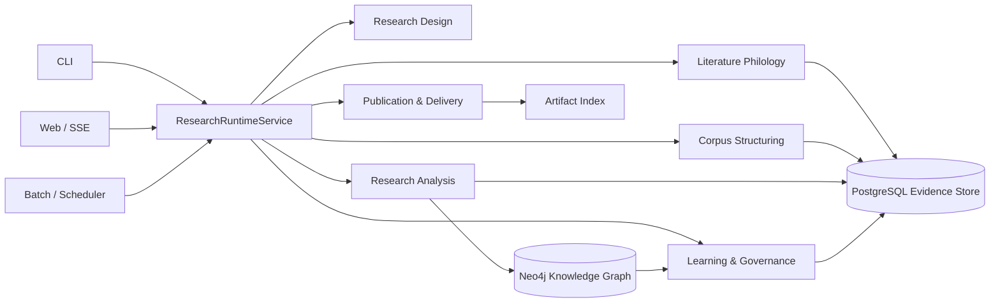
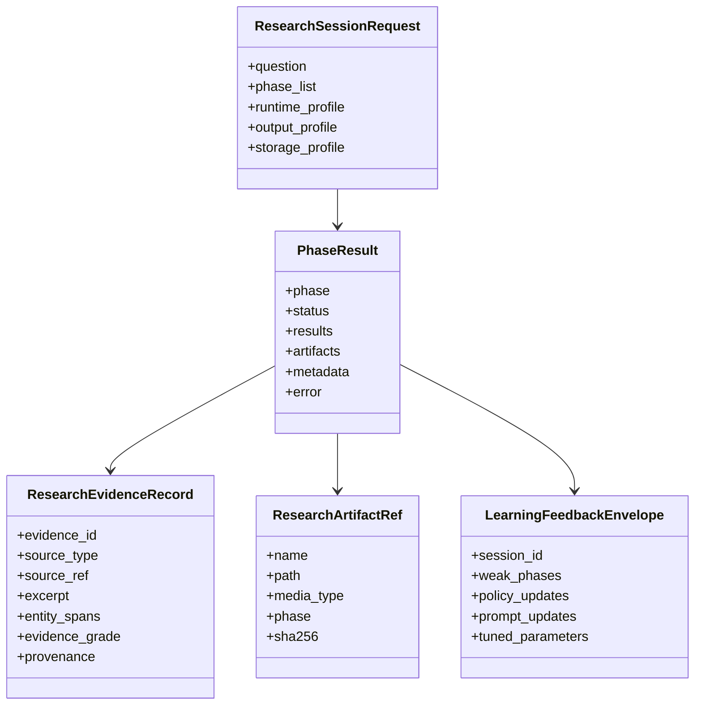
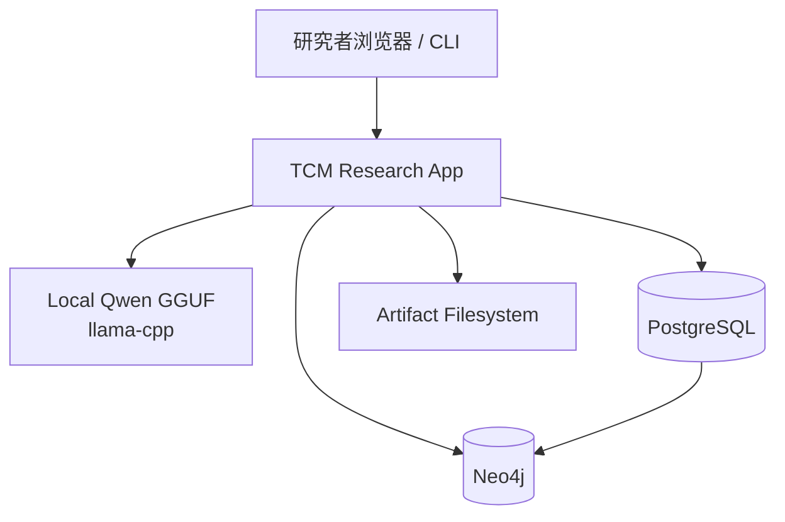

# 中医文献研究法软件架构评估与优化设计

日期：2026-04-12

范围：桌面资料《中医文献研究法》、仓库关键入口、核心科研主链、配置体系、本地 Qwen GGUF 集成、PostgreSQL / Neo4j 存储集成、Web 入口、自学习与质量闭环。

方法：静态代码审计 + 配置审阅 + 最近真实运行产物与真实持久化回归抽样。重点审阅了 run_cycle_demo.py、src/cycle、src/research、src/orchestration、src/web、src/llm、src/infra/llm_service.py、src/storage、config.yml、config/development.yml、config/production.yml，以及最近一次真实会话产物 output/research_session_1775971820.json、真实 PG / Neo4j 主链冒烟与 experiment_execution 持久化回归。

## 1. 执行摘要

当前系统已经不是纯演示代码，而是一个可运行的半自动中医科研助手。它已经具备以下能力：

- 以七阶段研究链运行 Observe → Hypothesis → Experiment → ExperimentExecution → Analyze → Publish → Reflect。
- 使用本地 GGUF 模型 qwen1_5-7b-chat-q8_0.gguf 承担部分科研文本生成任务。
- 生成论文草稿、IMRD 报告、引用格式化结果，并输出统一 PhaseResult 契约。
- 具备 Web 入口、任务编排、质量评估、反思阶段、大量诊断工具，以及 PostgreSQL / Neo4j 结构化持久化主链。

但如果以《中医文献研究法》的要求来衡量，它距离“可运行科研平台”还有明显差距，核心问题不在单个算法，而在系统收口：

- ResearchRuntimeService + RuntimeConfigAssembler 已完成 CLI / Web / demo 主研究路径的首轮收口，但兼容壳和历史直连路径仍需继续清理。
- PostgreSQL / Neo4j 已进入主科研链结构化持久化路径；当配置可用时会沉淀 session、phase execution、artifact 与图投影，但 legacy 文件导出与 fallback 仍然存在。
- Experiment 已明确收口为 protocol design，experiment_execution 独立承接外部实验执行、采样与结果导入；当前平台边界是“辅助设计 + 导入外部执行结果”，不是“在系统内自动开展真实实验”。
- Reflect 虽然能产出反思，但默认没有把学习反馈真正注入下一轮运行。
- 本地 Qwen 接入存在多条旁路，缓存、参数、模型选择和成本控制没有统一治理。

结论：

- 如果定位是“本地部署的中医文献科研助手”，当前架构可继续演进。
- 如果定位是“可持续运行、可追溯、可积累资产的中医科研平台”，当前已经完成主入口统一、主链存储接线、实验语义拆分三项首轮收口；下一优先级应转向文献学能力补齐、默认学习闭环激活、外部实验执行导入治理，以及 LLM / 事务边界继续收敛。

## 2. 用《中医文献研究法》看当前软件

桌面资料《中医文献研究法》把中医文献研究分成三层：

1. 文献学研究：校勘、辑佚、训诂、考据、版本与目录整理。
2. 类编研究：分类、分段、实体识别、关系抽取、编码、索引、知识整合。
3. 学术研究：假说、实验设计、证据整合、知识图谱、循证分析、论文表达。

本软件与这三层的映射如下。

| 方法论层级 | 当前对应模块 | 实现程度 | 评价 |
| --- | --- | ---: | --- |
| 文献学研究 | src/research/phases/observe_phase.py、src/collector/*、src/analysis/preprocessor.py、文献检索与本地语料采集 | 70% | 已有采集、清洗、OCR/格式处理方向，但缺少专门的校勘、版本对勘、训诂与术语演化服务 |
| 类编研究 | src/analysis/entity_extractor.py、src/analysis/semantic_graph.py、src/research/phases/analyze_phase.py、知识图谱相关结构 | 78% | 是当前最成熟的一层，已经有实体、关系、图谱、统计和部分推理 |
| 学术研究 | src/research/hypothesis_engine.py、src/research/phases/experiment_phase.py、src/research/phases/experiment_execution_phase.py、src/research/phases/publish_phase.py、src/research/phases/reflect_phase.py | 72% | 假说、方案设计、外部执行结果导入、写作、反思都能跑，但真实实验仍依赖系统外部，学习闭环未默认落成 |

总体上，系统最强的是“类编研究”与“结构化持久化输出”，最弱的是“文献学深加工”和“学术研究中的真实验证层”。

## 3. 关键架构模块与实现程度

| 模块 | 关键文件 | 实现程度 | 优点 | 不足 |
| --- | --- | ---: | --- | --- |
| 统一配置中心 | src/infrastructure/config_loader.py、src/infrastructure/runtime_config_assembler.py、config.yml、config/*.yml | 88% | 配置分环境、路径解析、secret 覆写能力较完整，且已注入 shared runtime path | 仍需持续清理绕开 assembler 的配置旁路 |
| CLI 应用壳 | run_cycle_demo.py、src/cycle/cycle_command_executor.py | 82% | 入口已经瘦身，research 路径已桥接 shared runtime service | 历史 demo / 兼容壳仍需继续压缩 |
| 研究会话封装 | src/cycle/cycle_research_session.py、src/orchestration/research_runtime_service.py | 80% | 能启动七阶段并落结构化 session 结果 | 仍保留兼容性的文件导出与 legacy 壳 |
| 科研内核 | src/research/research_pipeline.py | 87% | 七阶段边界清晰，模块工厂、事件总线、PhaseResult 已成形 | 仍是中心枢纽，负担较重 |
| Observe | src/research/phases/observe_phase.py | 75% | 已能整合本地语料、文献检索、ingestion、种子观察 | 还缺少校勘/训诂/版本对勘等真正文献学能力 |
| Hypothesis | src/research/phases/hypothesis_phase.py、src/research/hypothesis_engine.py | 76% | 可以基于观察结果与知识图谱生成假说 | 质量依赖上游语料与图谱质量 |
| Experiment | src/research/phases/experiment_phase.py | 74% | 方案设计结构化程度高，且已显式标注为 protocol design | 不在系统内自动执行真实实验 |
| ExperimentExecution | src/research/phases/experiment_execution_phase.py | 66% | 已独立承接外部实验执行、采样与结果导入，状态可显式区分 skipped / completed | 当前只做外部结果导入与归档，不在平台内开展真实实验 |
| Analyze | src/research/phases/analyze_phase.py | 80% | 具备统计、推理、证据分级和回退机制 | 真实外部验证仍依赖系统外部，统一证据对象仍待收口 |
| Publish | src/research/phases/publish_phase.py、src/generation/* | 86% | 已能产出 paper draft、IMRD、引用、artifact | 导出路径多，外层汇总报告默认不总是开启 |
| Reflect + Quality | src/research/phases/reflect_phase.py、src/quality/quality_assessor.py | 72% | 能评估循环质量并输出改进建议 | 默认没有触发真实自学习回写 |
| 本地 LLM 层 | src/llm/llm_engine.py、src/infra/llm_service.py | 74% | 本地 GGUF 路径清晰，支持缓存与 API/本地双模式 | 多个业务模块直接 new LLMEngine，治理不统一 |
| 存储层 | src/storage/backend_factory.py、src/storage/storage_driver.py、src/storage/transaction.py | 78% | PostgreSQL / Neo4j 结构化持久化已进入主科研链，session / phase / artifact 可回读并投影到图 | legacy fallback 与更强事务边界仍需继续收敛 |
| Web 层 | src/web/main.py、src/web/app.py、src/web/ops/job_manager.py | 74% | Web / legacy Web 已桥接 shared runtime path，具备 Job/SSE、Dashboard | 历史接口与摘要口径仍需继续收口 |

## 4. 当前架构的优点

### 4.1 研究阶段边界已经是明确的领域资产

七阶段不是简单的脚本堆叠，而是相对稳定的领域分解。尤其在 experiment 与 experiment_execution 拆分后，研究方案设计和外部执行结果导入的边界已经明确，这让后续重构可以继续围绕阶段边界收敛，而不需要再承受语义误导。

### 4.2 输出能力强，已经能形成学术交付物

Publish 阶段可以产出 Markdown / DOCX 论文稿、IMRD 报告、引文和 artifact，这说明系统已经跨过“只能做分析看板”的门槛，开始具备研究交付能力。

### 4.3 本地 LLM 部署方向正确

本地模型文件已经在 models/qwen1_5-7b-chat-q8_0.gguf，llama-cpp 路径和 GPU offload 逻辑也已经落在 src/llm/llm_engine.py。这非常适合中医文献这类高隐私、高专业术语的本地研究环境。

### 4.4 统一 PhaseResult 契约是当前最重要的正资产

src/research/phase_result.py 已经把 phase、status、results、artifacts、metadata、error 收敛成主合同。这让后续的 API、Web、报告、审计和学习模块有了统一事实源。

### 4.5 诊断与质量工具链丰富

仓库中已经有 quality_gate、real observe smoke、lexicon rebuild、transaction e2e 等大量治理资产，这说明工程治理意识是在线的，后续不是从 0 建平台，而是从“很多能力已存在但还没接好”继续往前推。

## 5. 真实科研流程运行情况评估

基于最近一次真实会话产物 output/research_session_1775971820.json、真实 PG / Neo4j 主链冒烟，以及 integration_tests/test_experiment_execution_persistence_e2e.py 的真实持久化回归，可以确认：

- 七阶段主链已经存在：observe、hypothesis、experiment、experiment_execution、analyze、publish、reflect。
- PostgreSQL / Neo4j 结构化持久化已经进入主流程，真实会话可沉淀 session、phase execution、artifact 与图投影，而不是只落文件。
- experiment_execution 在无外部输入时会合法持久化为 skipped；导入外部执行记录、采样或结果后会持久化为 completed。这说明平台已经明确区分“协议设计已完成”和“真实执行结果是否已经导入”。
- publish 阶段能够生成论文相关 artifact，analyze 阶段有真实 record_count 与推理结果，说明不是纯模板空跑。
- reflect 阶段仍可输出反思，但 learning_fed=false、llm_enhanced=false，说明默认学习闭环仍未打通。

这组证据说明当前系统已经跨过“能跑文件导出流程”的阶段，进入“能跑七阶段并沉淀结构化研究会话”的阶段，但还存在两个关键缺口：

1. 真正的实验执行仍依赖系统外部；平台当前负责 protocol design、外部结果导入和后续分析，不应被表述为系统内自动实证平台。
2. 默认学习闭环与部分 session 顶层摘要口径仍未完全收口，说明外层应用服务还有治理尾项。

### 5.1 优点

- 已经能把中医研究问题推进成七阶段产物链，并显式区分 protocol design 与 external execution import。
- 已经有结构化分析、知识图谱、论文生成和反思结果。
- 已经具备 PostgreSQL / Neo4j 结构化会话沉淀能力。
- 本地 Qwen 适合保密场景和术语一致性控制。

### 5.2 不足

- Observe 更像“采集 + ingestion”，不是严格的文献学研究。
- Experiment / ExperimentExecution 虽已拆分，但 execution 仍依赖外部输入，不是系统内实证执行器。
- Reflect 仍偏“总结器”，不是“学习器”。
- 结构化存储虽已成为主链基础设施，但兼容 fallback 和外层摘要治理尚未完全清理。

## 6. 技术债务与耦合点

### 6.1 P0 级

| 问题 | 说明 | 理由 | 代价 |
| --- | --- | --- | --- |
| 默认学习闭环未激活 | SelfLearningEngine 仍以注入模式为主，默认运行不会回写下一轮策略 | 系统会总结但不会默认学习，是平台化闭环的核心缺口 | 中，约 3-4 人日 |
| 真实实验仍依赖系统外部 | experiment 已是 protocol design，experiment_execution 只负责外部执行、采样与结果导入 | 平台能力边界必须清楚，否则容易高估“自动科研验证”能力 | 中高，约 4-7 人日 |
| 文献学能力偏浅 | 缺少校勘、训诂、版本对勘、术语标准化服务 | 与《中医文献研究法》基础层仍有本质差距 | 中高，约 6-12 人日 |

### 6.2 P1 级

| 问题 | 说明 | 理由 | 代价 |
| --- | --- | --- | --- |
| 主入口兼容壳仍存在 | ResearchRuntimeService 已统一主研究路径，但 legacy demo / Web 壳与少量直连路径仍保留 | 继续存在认知成本和回漂风险 | 中，约 2-4 人日 |
| 结构化存储事务边界仍可继续收敛 | PostgreSQL / Neo4j 主链已接线，但 fallback、跨库一致性与可观测性仍需治理 | 影响一致性与故障排查 | 中，约 3-5 人日 |
| Observe 反向依赖 cycle 层 | research phase 调 cycle runner | 形成跨层耦合，后续难以做干净边界 | 中，约 2-4 人日 |
| LLM 多条旁路 | paper_plugin、翻译、助手等直接 new LLMEngine | 模型参数、缓存、GPU 使用和成本控制无法统一 | 中，约 3-5 人日 |

### 6.3 P2 级

| 问题 | 说明 | 理由 | 代价 |
| --- | --- | --- | --- |
| 顶层 session 汇总口径不稳 | phase 内产物和 session 顶层 reports 不总是对齐 | 影响外层 UI / API / 运维追踪 | 中低，约 1-2 人日 |
| 统一证据对象仍未完成 | 分析、引用、publish、dashboard 的证据语义尚未完全统一 | 影响跨模块复用、审计与长期演进 | 中，约 3-5 人日 |
| 自学习存储仍偏轻 | 以学习记录和日志为主，缺少可查询研究反馈库 | 无法做长期经验沉淀和策略回放 | 中，约 4-6 人日 |

## 7. 模块接线状态

| 模块 | 当前状态 | 判断 |
| --- | --- | --- |
| src/storage/backend_factory.py | 已成为 ResearchPipeline / ResearchRuntimeService 的结构化持久化主链入口；不可用时回退 legacy 路径 | active |
| src/storage/transaction.py | 已用于 PostgreSQL + Neo4j 协调写入与图关系投影，仍可继续强化事务观测与收敛 | active |
| src/storage/storage_driver.py | 主要在论文插件持久化路径使用 | 插件路径，不是科研会话默认路径 |
| src/learning/self_learning_engine.py | Reflect 支持注入，但默认运行未启用 | 休眠扩展能力 |
| src/infra/llm_service.py 统一工厂 | clinical gap / 部分支线与 shared runtime 可用 | 不是所有 LLM 路径的唯一入口 |
| cycle demo shared_modules | demo 中仍初始化，但 research 主链已桥接到 shared runtime service | 兼容壳，非默认主链 |

## 8. 目标架构建议

### 8.1 建议的边界上下文

1. Runtime Orchestration
职责：统一 CLI、Web、计划任务、批处理的运行入口。

2. Literature Philology
职责：校勘、版本比对、术语训诂、OCR 后处理、目录索引。

3. Corpus Structuring
职责：文本清洗、分段、实体识别、关系抽取、知识编码。

4. Research Design
职责：假说生成、研究设计、证据缺口识别、PICO / GRADE 模板化。

5. Research Analysis
职责：统计、推理、知识图谱分析、证据分级、结果解释。

6. Publication & Delivery
职责：论文初稿、IMRD、引用、图表、报告索引。

7. Learning & Governance
职责：质量评估、反思、策略学习、参数调整、运行治理。

8. Research Asset Storage
职责：PostgreSQL 结构化证据库、Neo4j 图资产、artifact 索引与审计。

### 8.2 建议的主流程



### 8.3 建议的核心契约



### 8.4 本地部署目标架构



## 9. 具体优化方案

下面的建议全部给出理由与代价。

| 建议 | 理由 | 代价 |
| --- | --- | --- |
| 1. 把 ResearchRuntimeService 固化为唯一 research mainline，并继续清理 direct pipeline shortcuts | 主入口统一已经完成首轮收口；现在要防止入口语义再次分叉 | 中，2-4 人日 |
| 2. 持续以 RuntimeConfigAssembler 收口剩余直连配置旁路 | 统一配置入口已经建立，但仍需把残余绕行点清掉，避免配置声明和运行行为再次脱节 | 中，1-3 人日 |
| 3. 已完成 Experiment / ExperimentExecution 语义拆分；继续统一 UI、文档、报告和提示词边界 | 现在的重点不再是拆阶段，而是防止用户可见文案回到“experiment=真实实验执行”的误导表述 | 中，1-2 人日 |
| 4. 在已接入 PG / Neo4j 主链的基础上，继续收敛事务边界、fallback 观测与回填治理 | 研究资产默认沉淀已经成立；下一步是提升一致性、可观测性和运维可控性 | 中，3-5 人日 |
| 5. 新增 PhilologyService，专做校勘、训诂、术语标准化和版本比对 | 《中医文献研究法》的基础层目前覆盖不足；这是与一般 NLP 文本系统最关键的区别 | 高，6-12 人日 |
| 6. 把所有 LLM 获取统一走 LLMGateway / CachedLLMService | 当前多处直接 new LLMEngine，导致缓存、参数、资源与模型切换失控 | 中，3-5 人日 |
| 7. 新增 ResearchDossierBuilder，构建长上下文研究 dossier | 本地 7B 模型上下文有限，需要先把语料、证据、图谱和术语解释压缩成可复用 dossier，才能稳定提高生成质量 | 中，3-4 人日 |
| 8. 新增 LearningLoopOrchestrator，把 Reflect 结果正式回写下一轮策略 | 当前 reflect_learning_fed=false 是硬证据；如果不回写，系统永远只是“会总结”，不会“会学习” | 中，3-4 人日 |
| 9. 新增 EvidenceContract v2，统一 evidence record / provenance / grade / citation | 现在分析、引用、publish、dashboard 都有证据语义，但没有一个真正的平台级统一证据对象 | 中，3-5 人日 |
| 10. 清理未真正接线的模块状态，在文档和代码里区分 active / optional / dormant | 现在最大认知成本来自“看起来有，但默认没接上”；明确状态能降低维护风险 | 低，1-2 人日 |

### 9.1 Neo4j 查询示例规范

这一节不是抽象建议，而是建议直接固化为仓库中的示例与排障模板约束。原因很简单：Neo4j 查询一旦在文档、README、诊断脚本里留下旧写法，后续人工排障时极容易把已经修掉的噪音模式重新抄回主链。

#### 读查询示例规范

1. 对可选关系类型的读取，优先使用一次 `OPTIONAL MATCH` 加 `type(r) IN [...]` 过滤，不要按关系类型拆成多段 `OPTIONAL MATCH`。
2. Neo4j 5 的子查询必须使用带作用域的 `CALL (var) { ... }`，不要继续使用裸 `CALL { WITH var ... }`。
3. 不要靠全局 suppress notification 隐藏读查询噪音，先修查询形状，只保留真正有意义的 warning。
4. 读查询示例应优先展示“可直接复用而不会产生无意义通知”的版本，而不是展示逻辑上能跑但会制造噪音的旧写法。

推荐示例：

```cypher
-- 方剂组成查询：使用单次 OPTIONAL MATCH 聚合，避免缺失关系类型告警
MATCH (f:Formula {name: $formula_name})
OPTIONAL MATCH (f)-[r]->(h:Herb)
WHERE type(r) IN ['SOVEREIGN', 'MINISTER', 'ASSISTANT', 'ENVOY']
WITH f, collect(DISTINCT {role: type(r), herb: h.name}) AS role_pairs
RETURN f,
       [pair IN role_pairs WHERE pair.role = 'SOVEREIGN' AND pair.herb IS NOT NULL | pair.herb] AS sovereign,
       [pair IN role_pairs WHERE pair.role = 'MINISTER' AND pair.herb IS NOT NULL | pair.herb] AS minister,
       [pair IN role_pairs WHERE pair.role = 'ASSISTANT' AND pair.herb IS NOT NULL | pair.herb] AS assistant,
       [pair IN role_pairs WHERE pair.role = 'ENVOY' AND pair.herb IS NOT NULL | pair.herb] AS envoy;

-- 子图读取：使用 scoped CALL，避免 Neo4j 5 deprecation warning
MATCH (start {id: $node_id})
CALL (start) {
  WITH start
  MATCH p = (start)-[*..2]-(neighbor)
  RETURN collect(DISTINCT nodes(p)) AS node_sets,
         collect(DISTINCT relationships(p)) AS edge_sets
}
RETURN node_sets, edge_sets;
```

#### 写查询示例规范

1. 创建关系时必须使用 split MATCH：先 `MATCH` 源节点，再单独 `MATCH` 目标节点，最后 `MERGE` 关系；不要写成 `MATCH (a ...), (b ...) MERGE ...`。
2. 批量写边时也遵循同一规则，即使在 `UNWIND` 中也保持 `MATCH ... MATCH ... MERGE ...`，不要为了省一行而回到逗号连接的断开模式。
3. 写查询示例应默认采用参数化 ID 和白名单化 label / relationship type 的安全模式，不把字符串拼接写法当成推荐模板。
4. 若查询样式会触发 planner/cartesian-product 信息级通知，则应视为示例不合格，即使语义结果正确也不应保留在文档中。

推荐示例：

```cypher
-- 单条关系写入：使用 split MATCH，避免 disconnected MATCH 模式
MATCH (source:ResearchSession {id: $source_id})
MATCH (target:ResearchPhaseExecution {id: $target_id})
MERGE (source)-[r:HAS_PHASE]->(target)
SET r += $properties
RETURN r;

-- 批量关系写入：UNWIND 后仍保持 split MATCH
UNWIND $rows AS row
MATCH (a:ResearchPhaseExecution {id: row.source_id})
MATCH (b:ResearchArtifact {id: row.target_id})
MERGE (a)-[r:GENERATED]->(b)
SET r += row.properties
RETURN count(r) AS written_count;
```

最低治理要求：

- 任何新文档、README、诊断脚本、运维手册中的 Neo4j 示例，提交前都应人工对照这两组规范。
- 如果真实代码因为 Neo4j 通知问题做过修复，文档示例必须同步更新，不能保留“旧代码已修、旧示例未修”的状态。
- 后续若引入新的 Neo4j 查询模式，应优先把“不会制造无意义通知”的写法沉淀到示例，再扩散到排障和运维文档。

## 10. 结合本地 Qwen 的优化建议

### 10.1 适合本地 Qwen1.5-7B-Chat-GGUF 的职责分配

- 适合：假说生成、研究问题重写、术语解释、结构化摘要、Discussion 初稿、Reflect 诊断。
- 谨慎使用：长文整篇直接生成、复杂图谱全量推理、无检索支撑的结论生成。
- 不建议单独承担：大规模证据整合、无中间结构的端到端科研判定。

### 10.2 工程建议

| 建议 | 理由 | 代价 |
| --- | --- | --- |
| 建立 Prompt Registry + JSON Schema 输出约束 | 7B 本地模型更怕自由发挥，结构化约束能显著降低幻觉 | 中，2-3 人日 |
| 为 Observe / Analyze / Publish 分别建立 dossier 压缩器 | 让小模型先读结构化证据，而不是直接读海量原文 | 中，2-4 人日 |
| 对同类任务做缓存分层：prompt cache、evidence cache、artifact cache | 既减少 GPU 占用，也提高同题复跑稳定性 | 中，2-3 人日 |
| 引入 token budget policy | 防止长问题或多篇文献把本地 7B 直接拖入不稳定区 | 低，1-2 人日 |

## 11. 结合近年 Google Research / NLP 方向的自学习增强建议

这里不建议盲目追求“大模型替代一切”，更适合把近年的三类方向工程化嫁接到中医文献系统。

### 11.1 长上下文研究卷宗

方向：参考近年 Google 在长上下文模型上的思路，用“研究卷宗”而不是“原始全文直喂模型”。

- 建议：为每个研究问题生成一份分层 dossier，包括术语解释、版本信息、证据矩阵、图谱摘要、争议点、假说历史。
- 理由：中医文献问题不是普通 QA，真实难点是上下文异质且术语跨时代；先压缩再生成，稳定性远高于原文直接输入。
- 代价：中，约 3-5 人日。

### 11.2 推理结构自发现

方向：参考近年 Google / DeepMind 在 Self-Discover 一类“先选推理结构，再执行生成”的路线。

- 建议：在 hypothesis、analyze、reflect 三个阶段引入 reasoning template selector，让系统先判断当前问题更适合走“方剂配伍”“病机证据”“版本考据”“循证综述”哪条推理框架。
- 理由：中医研究问题差异很大，同一个 prompt 模板打天下会导致结论飘忽。
- 代价：中，约 3-4 人日。

### 11.3 动态算力分配

方向：参考近年动态计算 / mixture-of-depths 一类思路，在应用层做轻量版成本控制。

- 建议：把任务分成 L1 规则层、L2 检索总结层、L3 LLM 深推理层。只有当规则与检索层无法给出足够证据时，才触发本地 Qwen 深推理。
- 理由：本地 7B 模型算力宝贵，很多中医文献任务先用规则、词典、图谱就能解决 60%-80%。
- 代价：中，约 2-4 人日。

## 12. 分阶段实施计划

### 阶段 A：继续收口主入口与配置

目标：在已完成首轮统一的基础上，继续清理所有直连 ResearchPipeline 的兼容壳和配置旁路。

- 动作：已引入 ResearchRuntimeService、RuntimeConfigAssembler，并贯通 CLI、Web、demo、legacy Web 的主要 research 路径；后续继续清理残余兼容层。
- 交付：主入口唯一化进一步固化，运行结果口径持续保持一致。
- 理由：不先收口入口，后面的存储、学习和 LLM 优化都会继续分叉。
- 代价：中，约 2-4 人日。

### 阶段 B：继续把存储从“已接主链”升级成“强一致基础设施”

目标：在已默认落 PostgreSQL 证据库与 Neo4j 图谱库的基础上，继续强化事务边界、fallback 治理和运维观测。

- 动作：ResearchPipeline 已接入 StorageBackendFactory / ResearchSessionRepository；后续继续收敛 TransactionCoordinator、fallback 观测与回填工具链。
- 交付：session、phase_result、artifact、graph 已可追溯，并继续提升跨库一致性与运维稳定性。
- 理由：没有统一资产沉淀，就不可能做真正的跨会话研究积累。
- 代价：中，约 3-5 人日。

### 阶段 C：补齐文献学能力

目标：从“文本处理系统”升级为“中医文献研究系统”。

- 动作：新增 PhilologyService，补校勘、训诂、版本对勘、术语标准化。
- 交付：Observe 前增加 philology preprocessing，产出 philology notes。
- 理由：这是与普通 RAG / NLP 系统最重要的差异化所在。
- 代价：高，6-12 人日。

### 阶段 D：把 learning 闭环做真，并继续明确实验边界

目标：在已完成 experiment / experiment_execution 语义拆分后，让系统从“给建议并接收外部执行结果”进一步升级为“能持续演进的研究平台”。

- 动作：已新增 ExperimentExecutionPhase；后续接入 LearningLoopOrchestrator，并持续统一 experiment 边界文案与导入治理。
- 交付：experiment=protocol design、experiment_execution=external execution import 的边界保持稳定，同时让 reflect 输出能够调整下一轮策略、阈值、模板与 evidence policy。
- 理由：这是平台化和助手化的分水岭。
- 代价：中，约 3-4 人日。

### 阶段 E：围绕本地 Qwen 做成本优化与能力增强

目标：让本地 7B 模型在可控成本下发挥最大科研效用。

- 动作：统一 LLMGateway、分层 dossier、推理模板选择器、动态调用策略。
- 交付：更稳定的假说、讨论和反思输出；更低的重复计算成本。
- 理由：本地模型不是问题，缺少的是围绕小模型的工程策略。
- 代价：中，4-6 人日。

## 13. 最终判断

这套软件当前最适合的准确定位是：

“具备七阶段科研工作流、结构化持久化主链和本地大模型能力的中医文献半自动科研助手，正在向平台化研究系统过渡。”

它已经具备三个非常有价值的基础：

- 正确的阶段边界。
- 已经落地的结构化存储主链、本地 LLM 和学术输出链。
- 足够多的质量治理与诊断资产。

真正阻碍它成为“平台”的，不再是阶段命名或主链是否接线，而是以下四点尚未彻底收口：

- 文献学基础能力。
- 真实实验仍依赖系统外部。
- 默认学习闭环。
- LLM / 事务边界与兼容回退治理。

只要这四点收住，当前仓库完全有机会从“能跑研究流程”升级为“能积累研究资产、支撑持续迭代的中医文献研究平台”。
