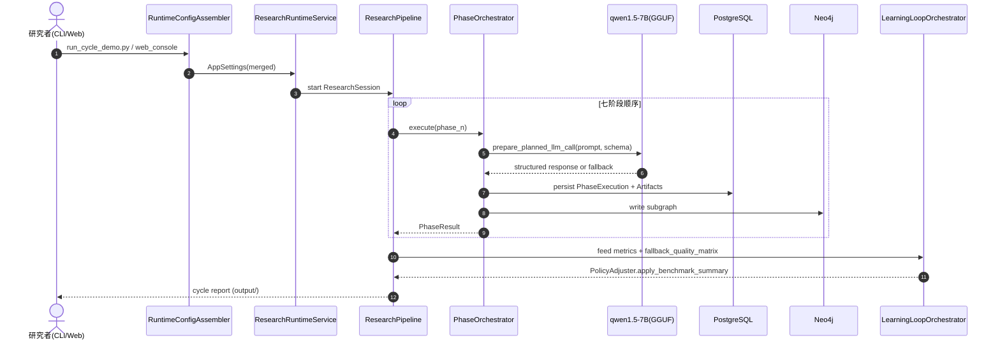
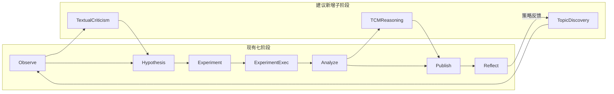
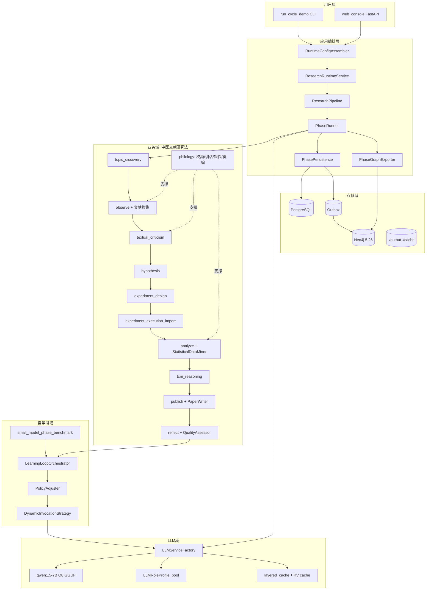
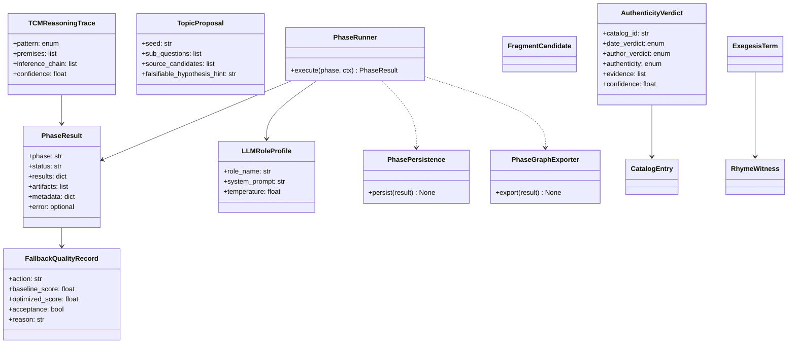
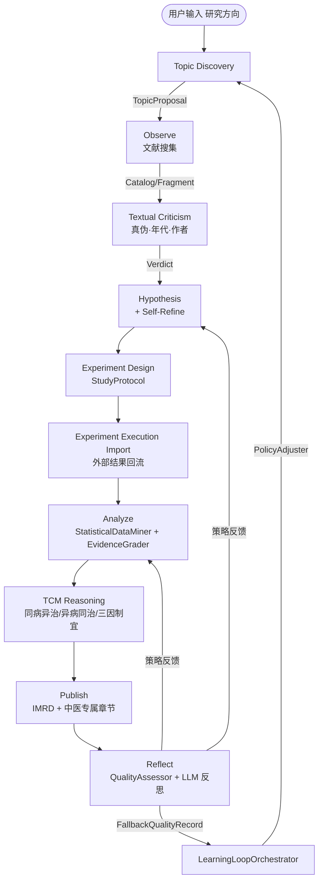
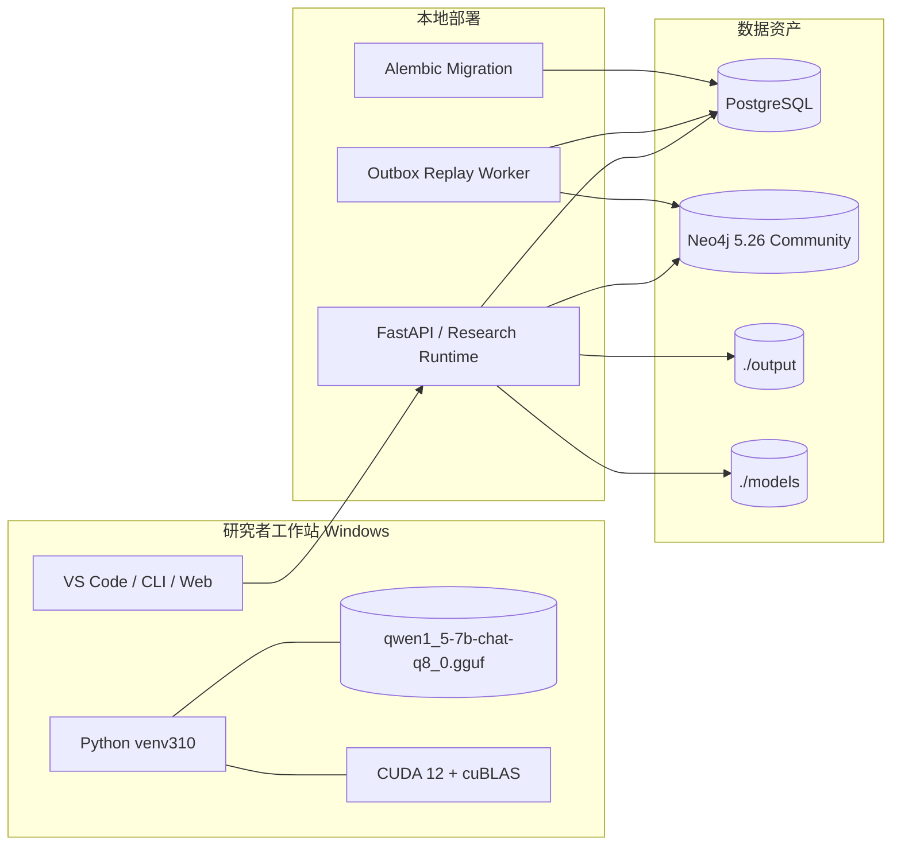
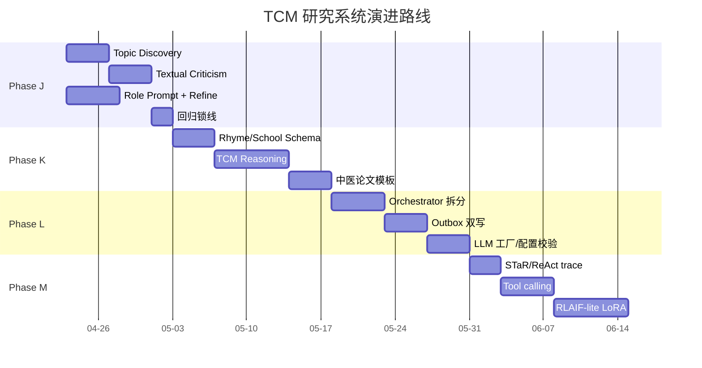

# 中医文献自动化研究系统 · 架构评估与优化方案

> 评估日期：2026-04-22  
> 本地大模型：`./models/qwen1_5-7b-chat-q8_0.gguf`（llama-cpp-python 加载）  
> 知识资产：Neo4j 5.26 Community（图谱）+ PostgreSQL（关系/会话/产物）  
> 当前主分支：`stage2-s2_1-preprocessor-opt`，最新审计文件 [ARCHITECTURE_TCM_RESEARCH_METHOD_AUDIT_2026_04_20.md](ARCHITECTURE_TCM_RESEARCH_METHOD_AUDIT_2026_04_20.md)

## 文档导航

- 对应审计稿：[ARCHITECTURE_TCM_RESEARCH_METHOD_AUDIT_2026_04_20.md](ARCHITECTURE_TCM_RESEARCH_METHOD_AUDIT_2026_04_20.md)

### 本文索引

- 中医文献研究法（方法论摘要）
- 现状映射：方法论 → 模块实现度
- 优缺点、技术债、耦合点
- 真实科研流程运行评估
- 优化方案
- 架构设计图
- 分阶段实施计划
- 风险与回滚
- 总结

---

## 0. 中医文献研究法（方法论摘要）

依据《中医文献学》《中医药学文献研究方法》及 T/C IATCM 098-2023，文献研究法核心可拆解为 6 个研究环节 + 3 类专项方法学：

| 环节 | 核心动作 | 产物 |
| --- | --- | --- |
| ① 选题与文献综述 | 确定问题、源流梳理、现状综述 | 综述提纲、问题清单 |
| ② 文献搜集（普查／专题） | 目录学溯源、版本学比对、辑佚 | 文献目录、版本谱、佚文卡片 |
| ③ 文献鉴别与考证 | 真伪、年代、作者、版本鉴定（考据学） | 考证报告 |
| ④ 文献整理 | 校勘、训诂（音义、词义、名物）、注释、辑佚、类编 | 校勘记、训诂表、类编卡 |
| ⑤ 文献分析与综合 | 概念演化、学术流派、方证规律、同病异治 | 假说、证据链、统计表 |
| ⑥ 文献研究成果发表 | 论文（IMRD）、专著、数据集、电子化资源 | 论文/报告/数据集 |

| 专项方法学 | 在研究中的位置 |
| --- | --- |
| 目录学 / 版本学 / 校勘学 | 环节 ②③④ |
| 训诂学 / 音韵学 / 名物学 | 环节 ④⑤ |
| 类编学 / 主题分析 / 计量文献学 | 环节 ④⑤ |

下面用此 6 + 3 框架对照本仓库代码。

---

## 1. 现状映射：方法论 → 模块实现度

实现度评分标准：⭕未实现（0%） · 🟡部分（30-60%） · 🟢基本（60-85%） · ✅成熟（>85%）

| 研究环节 | 主实现模块（仓库路径） | 关键类/函数 | 实现度 | 主要缺口 |
| --- | --- | --- | --- | --- |
| ① 选题/综述 | [src/research/research_pipeline.py](src/research/research_pipeline.py) · [src/research/phases/observe_phase.py](src/research/phases/observe_phase.py) | `ObservePhaseMixin.execute_observe_phase` | 🟡 50% | 没有显式“选题（topic discovery）”独立阶段；综述结构由 observe 隐式承担 |
| ② 文献搜集 | [src/cycle/cycle_plugin_workflows.py](src/cycle/cycle_plugin_workflows.py) · [src/research/observe_philology.py](src/research/observe_philology.py) · [src/research/catalog_contract.py](src/research/catalog_contract.py) | `run_arxiv_quick_helper_workflow` · `run_google_scholar_helper_workflow` · `CatalogEntry` | 🟢 75% | arxiv/谷歌学术偏现代文献；古籍来源仍以 `data/` 本地静态资产为主，缺国内古籍数据库适配器 |
| ② 版本/辑佚 | [src/research/fragment_contract.py](src/research/fragment_contract.py) · [src/research/observe_philology.py](src/research/observe_philology.py) | `FragmentCandidate`, `VersionLineage`, `VersionWitness` | ✅ 90% | 已建模佚文、见证本，缺批量校勘工作台 UI |
| ③ 鉴别考证 | [src/quality/quality_assessor.py](src/quality/quality_assessor.py) · [src/research/exegesis_contract.py](src/research/exegesis_contract.py) | `assess_quality`, `ExegesisTerm` | 🟡 40% | 没有“考据学”专门子流程：年代/作者/真伪裁定缺独立 contract 与判定 prompt |
| ④a 校勘 | `philology_service` + collation 子能力 | `philology_service.py` 主协调 | 🟢 80% | 有阶段边界守门，但人工裁定回写循环薄弱 |
| ④b 训诂 | [src/research/exegesis_contract.py](src/research/exegesis_contract.py) | `ExegesisTerm` | 🟡 55% | 缺音韵层，未建 `RhymeWitness` 节点；qwen1.5-7B 也未加载古汉语词典 prompt |
| ④c 类编 | [src/knowledge/tcm_knowledge_graph.py](src/knowledge/tcm_knowledge_graph.py) · [src/research/graph_assets.py](src/research/graph_assets.py) | `TCMKnowledgeGraph`, `build_phase_subgraph` | 🟢 84% | 类编维度（病/证/方/药/医家/学派）已落，缺 `School` 与 `MENTORSHIP` 关系 |
| ⑤ 分析综合 | [src/research/phases/analyze_phase.py](src/research/phases/analyze_phase.py) · [src/research/phases/hypothesis_phase.py](src/research/phases/hypothesis_phase.py) | `StatisticalDataMiner`, `EvidenceGrader`, `execute_hypothesis_phase` | 🟢 78% | “同病异治/异病同治”等中医专属推理范式没有专门规则集 |
| ⑥ 发表 | [src/research/phases/publish_phase.py](src/research/phases/publish_phase.py) · [src/generation/paper_writer.py](src/generation/paper_writer.py) | `_PublishPlannerPreviewLLM`, `PaperWriter` | 🟢 82% | IMRD 已可生成；缺面向期刊的引用样式适配器 |
| 自学习闭环 | [src/research/learning_loop_orchestrator.py](src/research/learning_loop_orchestrator.py) · [src/infra/dynamic_invocation_strategy.py](src/infra/dynamic_invocation_strategy.py) · [tools/small_model_phase_benchmark.py](tools/small_model_phase_benchmark.py) | `LearningLoopOrchestrator`, `record_completion`, `run_phase_benchmark` | 🟢 80% | 已具备 fallback 质量矩阵与基线回归；尚未引入论文级反馈（如 Self-Refine / STaR / ReAct / 偏好学习） |
| 本地 LLM | [src/llm/llm_engine.py](src/llm/llm_engine.py) · [src/infra/llm_service.py](src/infra/llm_service.py) | `LLMEngine`, `prepare_planned_llm_call` | 🟢 78% | qwen1.5-7B 仅 4K 上下文，长古文需要分块；缺中医角色化模板池 |
| 持久化 | [src/infrastructure/persistence.py](src/infrastructure/persistence.py) · [src/storage/neo4j_driver.py](src/storage/neo4j_driver.py) · [alembic/versions/](alembic/versions/) | ORM + Cypher 双写 | ✅ 88% | 双写一致性仍靠最终一致，无显式 outbox |
| Web/Console | [web_console/app.py](web_console/app.py) · [src/api/](src/api/) | FastAPI | 🟡 60% | 单机 workbench 可用；多研究员协同与审稿流尚未完全平台化 |

---

## 2. 优缺点、技术债、耦合点

### 2.1 优点

1. **统一七阶段契约**：`ResearchRuntimeService → ResearchPipeline → PhaseOrchestrator` 强制 7 阶段顺序与 `PhaseResult` 输出，可观测性强。
2. **文献学一等公民**：`catalog_contract` / `fragment_contract` / `exegesis_contract` 已将目录、辑佚、训诂建模为独立 contract，比一般综述系统更贴近中医文献研究法。
3. **小模型自学习闭环**：`dynamic_invocation_strategy` + `small_model_phase_benchmark` + `PolicyAdjuster` + fallback 质量矩阵，已经把“调用 → 评分 → 回写策略”闭环跑通。
4. **质量与回归基线较强**：`tests/unit/test_architecture_regression_guard.py` 作为架构守门，核心回归基线清晰。
5. **配置中心规范**：`config/{env}.yml` + `secrets.yml` + `TCM__*` 环境变量覆盖，支持开发/测试/生产隔离。

### 2.2 技术债 / 耦合点

| # | 位置 | 问题 | 严重度 | 现象 |
| --- | --- | --- | --- | --- |
| D1 | [src/research/phase_orchestrator.py](src/research/phase_orchestrator.py) | 单类承担 7 phase × 持久化 × 图谱导出 × 元数据装配 | 高 | 改一相位容易连带多处测试失败，耦合 fan-out 大 |
| D2 | [src/llm/llm_engine.py](src/llm/llm_engine.py) | `Llama()` 初始化与 CUDA DLL 处理耦合在实现层 | 高 | 跨平台与测试替身成本高 |
| D3 | [src/research/phases/experiment_phase.py](src/research/phases/experiment_phase.py) | 实验设计与实验执行边界主要靠 guard 与约定维护 | 中 | 一旦新增能力越界，只有守门测试兜底 |
| D4 | [src/storage/neo4j_driver.py](src/storage/neo4j_driver.py) | 图谱 schema 缺显式版本治理 | 中 | 多人并行开发时容易产生约束漂移 |
| D5 | `web_console/*shim*` 与 [src/web/](src/web/) | 存在兼容包装与旧入口并存 | 低 | 增加新同事阅读成本 |
| D6 | PostgreSQL ↔ Neo4j 双写路径 | 无 outbox / saga | 中 | 图库短暂掉线会导致两库语义不一致 |
| D7 | [config.yml](config.yml) 与各环境配置 | 阈值、temperature、quality threshold 分散 | 中 | 调参困难，缺集中配置 schema |
| D8 | [src/cycle/](src/cycle/) 与 [src/research/](src/research/) | demo 工作流与正式 pipeline 有并行装配逻辑 | 中 | 相位契约调整时要双更 |
| D9 | Prompt 组织方式 | prompt registry 与相位内 prompt 混用 | 低 | 角色模板难复用，难做 A/B 评测 |

### 2.3 半挂起 / 可收敛模块

| 模块 | 状态 | 建议 |
| --- | --- | --- |
| [src/ai_assistant/](src/ai_assistant/) | 历史聊天门面 | 收敛进 API 层或移除 |
| [src/web/main.py](src/web/main.py) | legacy 门户 | 合并到 `web_console/` |
| `web_console/job_manager.py` 等 shim | 兼容层 | 在调用方迁移后清理 |
| [src/learning/](src/learning/) | 与 `src/research/learning_*` 概念重叠 | 统一命名空间 |
| [src/visualization/](src/visualization/) | 偏 demo | 若不进主流程则降级到 `tools/` |
| [src/semantic_modeling/](src/semantic_modeling/) | 与 `src/analysis/semantic_graph.py` 功能交叠 | 选一为正本，另一个废弃 |

---

## 3. 真实科研流程运行评估

把“启动一次研究 → 七阶段 → 产出论文/报告”沿真实代码路径抽象如下：

### 3.1 优势

- **顺序与契约清晰**：每个 phase 有统一 `PhaseResult` 输出，业务语义稳定。
- **回归保护强**：核心子集回归与架构守门测试可以防止重构走偏。
- **本地小模型可跑通主链路**：qwen1.5-7B 在 hypothesis / publish / reflect 等结构化文本任务上可用。
- **图谱可解释**：phase 结果可以被写入 Neo4j，用于追踪“结论来自哪类证据”。

### 3.2 不足

| # | 现象 | 根因 | 影响 |
| --- | --- | --- | --- |
| F1 | “选题”被并入 observe，无独立问题驱动阶段 | 七阶段更偏工程编排，不完全等同文献研究法 | 无法自然支持“先帮我立题、拆题、评估可行性” |
| F2 | qwen1.5-7B 上下文有限 | 古籍文本长，章节层级复杂 | 摘要化后容易丢失引文位置与前后语义 |
| F3 | 没有“考据学”独立阶段 | 用 quality_assessor 部分覆盖 | 真伪/年代/作者裁定不可审计 |
| F4 | 训诂只到字词级 | 缺音韵学/名物学图层 | 古义、通假、反切、古今异名处理能力不足 |
| F5 | 中医专属推理规则薄弱 | 现有规则偏通用研究引擎 | “同病异治/异病同治/三因制宜”等难以显式建模 |
| F6 | 学派/师承缺图层 | KG 未建 `School` 与 `MENTORSHIP` | 学术流派演化不可计算 |
| F7 | 论文模板偏通用 IMRD | 发表模块偏现代科研模板 | 中医论文中的“方义阐释/证治分析/按语”不够原生 |
| F8 | 双写一致性靠最终一致 | 无 outbox | Neo4j 故障窗口内可能丢失图谱写入 |
| F9 | 反馈闭环仍偏“调用质量” | reflect 结果未充分回流到研究方法策略 | 系统有反思，但不会自动优化下一轮选题/检索策略 |
| F10 | 缺中医角色化 prompt 池 | prompt 组织仍偏任务导向 | 模型容易给出通用而非中医研究语境答案 |

---

## 4. 优化方案

每条建议都包含**理由**与**代价**。代价等级：S（<1 天单人）/ M（1-3 天单人）/ L（>3 天或跨模块）。

### 4.1 新增模块与边界上下文

#### O1. 新增 `src/research/topic_discovery/` 选题域

- **理由**：补齐环节①；用户输入研究方向后，由 LLM + KG 给出 3-5 个可执行子题与优先级。
- **代价**：M。可复用现有 prompt registry 与学习策略框架，新建 `TopicProposal` contract 即可起步。

#### O2. 新增 `src/research/textual_criticism/`（考据学子域）

- **理由**：把“真伪/年代/作者”判断从隐式评估变成显式裁定记录。
- **代价**：M。建议作为 observe 与 hypothesis 之间的子阶段，不直接破坏现有七阶段账本。

#### O3. 新增 `RhymeWitness` 与音韵学图层

- **理由**：训诂要真正走深，必须能表达反切、中古音、音近假借等证据。
- **代价**：M。需要 Neo4j schema 扩展与 alembic 同步。

#### O4. 新增 `School` / `MENTORSHIP` 图层

- **理由**：让“学派演化、师承关系、理论沿革”成为可查询对象。
- **代价**：S。Schema 与最小迁移即可起步。

#### O5. 新增 `src/research/tcm_reasoning/` 中医专属推理规则集

- **理由**：把“同病异治/异病同治/因时因地因人制宜”等中医核心方法转为规则资产。
- **代价**：L。需要中医专家参与规则整理，但这是系统差异化价值最高的部分。

#### O6. 新增 `src/storage/outbox/` 双写 outbox

- **理由**：解决 PostgreSQL 与 Neo4j 双写一致性问题。
- **代价**：M。增加 outbox 表、后台 worker 与重放测试。

### 4.2 建议新增/固化的接口契约

| 契约 | 建议位置 | 作用 |
| --- | --- | --- |
| `TopicProposal` | `src/research/topic_discovery/contract.py` | 选题输出结构 |
| `AuthenticityVerdict` | `src/research/textual_criticism/verdict_contract.py` | 真伪/年代/作者裁定 |
| `TCMReasoningTrace` | `src/research/tcm_reasoning/trace_contract.py` | 中医推理链条可审计 |
| `LLMRoleProfile` | `src/research/llm_role_profile.py` | 中医角色 system prompt 池 |
| `OutboxEvent` | `src/storage/outbox/event.py` | 双写事件格式 |
| `FallbackQualityRecord` | `src/quality/fallback_contract.py` | fallback 质量记录对外标准化 |

### 4.3 不破坏七阶段的扩展策略

- **理由**：不改七阶段总账本，减少对现有回归与运维脚本的扰动。
- **代价**：S-M。前提是为 orchestrator 增加子阶段注册机制。

### 4.4 结合 qwen1.5-7B 的能力放大方案

| 方案 | 理由 | 代价 |
| --- | --- | --- |
| Q1. 角色化 system prompt 池：医经家/经方家/温病家/校勘家/训诂家 | 小模型通用对齐较弱，角色化能显著提升中医语境一致性 | S |
| Q2. 长文处理从“平铺分块”升级到“节→章→卷”分层摘要 | 解决 4K 上下文限制，减少引用错位 | M |
| Q3. 在 hypothesis / publish 引入 Self-Refine 双轮自修订 | 当前架构已有质量评分，适合套入自批改循环 | S |
| Q4. 基于 Neo4j 子图的 RAG 上下文序列化 | 图谱资产已在，缺的是统一 prompt 适配器 | S |
| Q5. 基于 fallback quality 记录做 RLAIF-lite / 偏好学习 | I-4 已沉淀偏好信号，可反向作用于模型 | M |
| Q6. 引入 STaR / ReAct 风格 trace | 便于训练与离线评估“推理路径是否合乎中医逻辑” | S |
| Q7. 工具调用化：查图谱/查目录/查训诂作为函数工具 | 减少超长 prompt 拼接，提高可控性 | M |
| Q8. llama.cpp prompt/KV cache 持久化 | 减少首 token 延迟，提高本地体验 | S |

### 4.5 简化与去耦动作

| # | 动作 | 理由 | 代价 |
| --- | --- | --- | --- |
| S1 | 拆分 `PhaseOrchestrator` 为 `PhaseRunner` + `PhasePersistence` + `PhaseGraphExporter` | 降低巨石类复杂度 | M |
| S2 | 删除 web shim，统一到 `web_console/` | 收敛入口，减少误导 | S |
| S3 | 统一 `src/learning/` 与 `src/research/learning_*` 命名空间 | 降低认知负担 | S |
| S4 | 所有 LLM 实例化收口到 `LLMServiceFactory` | 避免业务层直接构造底层模型 | S |
| S5 | 引入配置 schema（pydantic v2） | 启动期 fail-fast，减少隐性坏配置 | M |
| S6 | Neo4j schema version 节点 + 启动校验 | 防止图谱结构漂移 | S |

---

## 5. 架构设计图

### 5.1 目标态分层

### 5.2 核心类图

### 5.3 七 + 三阶段研究主流程

### 5.4 部署图

---

## 6. 分阶段实施计划

### Phase J（建议下一阶段，约 2 周）—— 方法论补全 v1

| Card | 动作 | Done 定义 | 理由 | 代价 |
| --- | --- | --- | --- | --- |
| J-1 | 新增 `topic_discovery` 子阶段 + `TopicProposal` contract | 可从用户 seed 生成 3-5 个候选课题并带证据来源 | 补齐文献研究法环节① | M |
| J-2 | 新增 `textual_criticism` 子阶段 + `AuthenticityVerdict` | 每条 catalog 资产可落真伪/年代/作者裁定 | 让考据可审计 | M |
| J-3 | qwen 角色 prompt 池 + KV cache | `prepare_planned_llm_call(role=...)` 落地 | 提升中医语境一致性与本地性能 | S |
| J-4 | hypothesis / publish 接入 Self-Refine | 增加自修订轮次与质量 delta 指标 | 提升小模型结构化产出质量 | S |
| J-5 | 回归与锁线 | 核心回归稳定，新增 Guard | 保障迭代质量 | S |

#### Phase J 进度（2026-04-22）

- ✅ J-1 已完成：新增 [src/research/topic_discovery/](src/research/topic_discovery/)（`contract.py` + `topic_discovery_service.py`），落 `TopicProposal` / `TopicSourceCandidate` / `propose_topics`；新增 [tests/unit/test_topic_discovery.py](tests/unit/test_topic_discovery.py) 16 通过；核心子集 1641 通过 / 0 失败 / 1 xfailed / 14 subtests 通过（基线 1625 + 16）。详见审计稿 [Card J-1](ARCHITECTURE_TCM_RESEARCH_METHOD_AUDIT_2026_04_20.md#card-j-1)。
- ✅ J-2 已完成：新增 [src/research/textual_criticism/](src/research/textual_criticism/)（`verdict_contract.py` + `textual_criticism_service.py`），落 `AuthenticityVerdict` / `VerdictEvidence` / `assess_catalog_authenticity` / `assess_catalog_batch` / `build_textual_criticism_summary`；新增 [tests/unit/test_textual_criticism.py](tests/unit/test_textual_criticism.py) 17 通过。详见审计稿 [Card J-2](ARCHITECTURE_TCM_RESEARCH_METHOD_AUDIT_2026_04_20.md#card-j-2)。
- ✅ J-3 已完成：新增 [src/research/llm_role_profile.py](src/research/llm_role_profile.py)，落 `LLMRoleProfile` 池（医经家 / 经方家 / 温病家 / 校勘家 / 训诂家）+ `KVCacheDescriptor` / `KVCacheStore`；扩展 [src/infra/llm_service.py](src/infra/llm_service.py) `prepare_planned_llm_call(role=..., kv_cache_descriptor=...)` 与 `PlannedLLMCall.role_profile` / `build_prompt` / `to_metadata`；新增 [tests/unit/test_llm_role_profile.py](tests/unit/test_llm_role_profile.py) 15 通过；核心子集 1673 通过 / 0 失败 / 1 xfailed / 14 subtests 通过（基线 1641 + 17 J-2 + 15 J-3）。详见审计稿 [Card J-3](ARCHITECTURE_TCM_RESEARCH_METHOD_AUDIT_2026_04_20.md#card-j-3)。
- ⏳ J-4 / J-5 待开工；J-2 / J-3 编排器 wiring 推迟到后续卡片。

### Phase K（约 2-3 周）—— 图谱深化与中医推理

| Card | 动作 | Done 定义 | 理由 | 代价 |
| --- | --- | --- | --- | --- |
| K-1 | 新增 `RhymeWitness`、`School`、`MENTORSHIP` | Neo4j schema 与查询模板齐备 | 深化训诂与学派研究能力 | M |
| K-2 | `tcm_reasoning` 子阶段 + 5 条核心规则 | 输出 `TCMReasoningTrace` 可被 reflect 打分 | 形成中医专属推理引擎 | L |
| K-3 | 中医论文模板（方义阐释/证治分析/按语） | publish 模块可切换模板 | 贴近真实中医科研表达 | M |
| K-4 | Graph schema version 治理 | 启动期强校验 | 防漂移 | S |

### Phase L（约 2 周）—— 可靠性与去耦

| Card | 动作 | Done 定义 | 理由 | 代价 |
| --- | --- | --- | --- | --- |
| L-1 | 拆分 `PhaseOrchestrator` | 保持 API 不变但降低内部耦合 | 解巨石类问题 | M |
| L-2 | 上 outbox 模式 | Neo4j 暂时不可用时业务不丢失 | 解双写一致性 | M |
| L-3 | LLM 工厂统一 + 清理 web shim | 仓库零直接 `Llama(` 调用 | 收敛基础设施入口 | S |
| L-4 | 配置 schema fail-fast | 坏配置在启动期即报错 | 降低隐性运行时错误 | M |

### Phase M（持续）—— 自学习升级

| Card | 动作 | Done 定义 | 理由 | 代价 |
| --- | --- | --- | --- | --- |
| M-1 | STaR / ReAct 风格 trace | hypothesis 输出可用于离线评测 | 对齐最新 NLP 工程实践 | S |
| M-2 | Tool calling 化 | LLM 可调用 query_neo4j / query_catalog / query_exegesis 等工具 | 减少超长 prompt | M |
| M-3 | RLAIF-lite / LoRA | 基于 fallback quality 数据做离线微调 | 让自学习真正回到模型 | M |
| M-4 | reflect 结果回流策略层 | 下一轮研究自动消费上轮策略建议 | 从“指标级优化”升级到“方法级优化” | M |

---

## 7. 风险与回滚

| 风险 | 缓解 |
| --- | --- |
| qwen1.5-7B 在长古文场景幻觉偏高 | 角色化 prompt + Self-Refine + RAG + fallback rules 四重约束 |
| 图谱 schema 变更引入回归 | 用 schema version + 回归 Guard 锁线 |
| Orchestrator 拆分破坏现有基线 | 采用并行新旧实现灰度切换 |
| 偏好学习过拟合 | 预留评测集 + 小流量 A/B 验证 |

---

## 8. 总结

当前系统已经把“七阶段 LLM 流水线 + 文献学一等公民 + 小模型自学习”做到了较高成熟度；下一步真正的差异化，不在于再加一个通用 AI 能力，而在于把**中医文献研究方法学本身**显式建模：从选题、考据、训诂音韵、类编，到中医专属推理与中医论文体例，再通过 qwen1.5-7B 的角色化 prompt、Self-Refine、Tool calling 与偏好学习，把“自我学习”从工程指标级推进到研究方法级。
