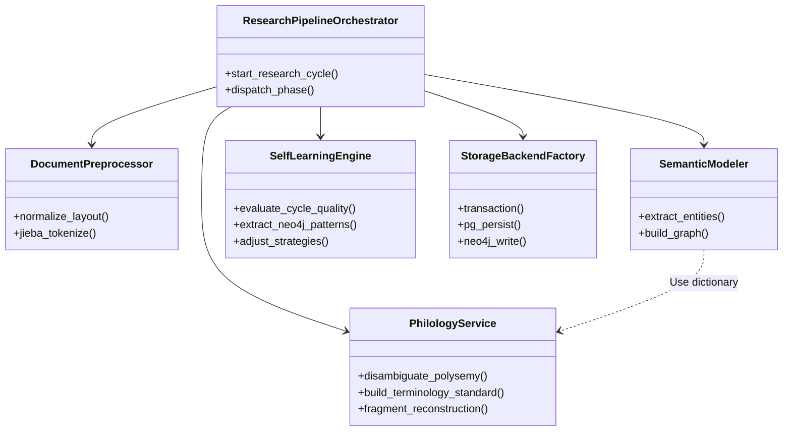
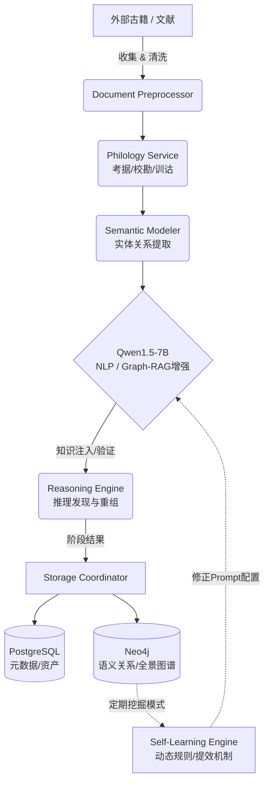

# TCM文献半自动科研助手架构分析与演进设计

## 一、当前系统架构概况与实施评估
结合本仓库源码及“中医文献研究法”内容，系统当前定位准确且为“中医文献半自动科研助手”。架构上，具备了模块化单体特征，并由6（后确认为7）阶段主链（ResearchPipeline + PhaseOrchestrator）进行业务流程调度。

### 1. 架构与运行模块评估

| 模块/阶段 | 承担研究法维度的职能 | 当前成熟度与状态 | 优点 | 缺点及技术债 |
|---|---|---|---|---|
| **Collector / Preprocessor**(数据准备) | 文献学层的收集校对、版面数字化，为提取与类编研究提供文本基底。 | ✅ 较高（本地语料 + jieba分词）。 | 解决了基础结构化，提供了可重复执行的数据提取管道。 | 弱对中医特有古籍错略进行字形推断或多版本校验的智能化。 |
| **Philology Service** (文献学分析) | 文献学基础（校勘、辑佚、训诂），这是中医研究不可逾越的前提。 | ✅ 已具备核心契约实现（术语表、辑佚、多义词消歧），Dashboard集成度高。 | 具有配置化的合同契约、明确的置信度评分量化以及严密的审计功能（可写回复核）。 | 朝代规范缺失；依赖规则与字典，未充分利用上下文感知和局部关联做多义消歧；缺乏跨多文本沿袭验证。 |
| **Reasoning / Semantic Graph** (图谱与认知建模) | 类编研究以及知识结构化支撑（实体识别、辨证论治节点及关系的抽取关联）。 | ✅ 知识抽取成熟，可投射到Neo4j；依赖Qwen LLM提取边。 | 双写到 Neo4j 方案已通；基于 NetworkX 及本地图库的建模可以挖掘隐式关联规则。 | 部分边关系抽取准确率依赖静态 Prompt；目前图谱在落库后尚未直接反馈形成知识迭代和持续训练样本。 |
| **Storage Backend** (PG + Neo4j 持久化) | 系统数据的全量长效保存，解决数据孤岛。 | ✅ 已经接线（PG结构数据，Neo4j存图数据）并进行历史回填。 | 从 SQLite 升级，具有了生产级的分析底座；支持事务统筹管理。 | 强依赖双写，虽然开启了事务协调，但若网络/服务故障依然有漂移风险；且目前部分监控逻辑存在异常吞没。 |
| **Self-Learning Loop** (自我学习引擎) | 方法学顶层：积累研究经验、校正研究参数、建立闭环。 | ⚠️ 仅做阶段性日志记录与参数微调统计，未真正改变系统深层认知权重。 | 设立了基于 QualityAssessor 的自适应调整调优（AdaptiveTuner）理论支撑。 | 数据收集大于知识融入。PG与Neo4j积累了上万条数据，但系统并未将其实时提炼出 Pattern 反哺下一次的科研Prompt。 |

---

## 二、真实科研流程运行优点与不足分析

当前系统实现了流程级的跑通（例如 `run_cycle_demo.py` 记录到 PostgreSQL与Neo4j 的双写），但在真实科研环境下，运行存在脱节：

### 优点
1. **统一契约式开发**：各业务链路（包含 Philology 五大合同链）具有明确定义的 JSON 传递契约，利于扩展和维护。
2. **LLM资源高度控制**：设置了完整的 `token_budget` 和 Purpose/Profile 优先级调度，保护本地 `Qwen1.5-7B` 不被爆破显存。
3. **可追溯的领域逻辑**：对提取证据到知识重组、生成结构化汇报具有全程日志追溯审计。

### 不足
1. **实验步骤形同虚设（真实执行脱发）**：文献研究中的“实验与证实”实则是数据挖掘和相关性推论。系统的 Experiment 阶段更像是仅完成“方案规约(Protocol Design)”的编写，这与现实里进行文本聚类、病因病机推演格格不入。
2. **缺乏后置自适应学习**：PostgreSQL与Neo4j已经存载数十份文献数据与几万节点关系，但当前 SelfLearning 并没有抽取Neo4j中的新规则进行“Self-Discover”（推理发现）。
3. **高并发和边界缺陷**：批处理模式及多端调度常出现并发资源竞争，且 Web API / 数据库写入时仍偶发异步锁死，说明上下层解耦并不彻底。

---

## 三、核心优化方案与指令（理由与代价）

### 建议1：重构大模型能力调度与 NLP “Self-Discover” 推理链路
**优化行为**：基于文献学的复杂推理，融合 Google 提出的 Self-Discover 推理模式。将任务区分层级，将基于“发现方剂关联”等高难度操作从静态 Prompt 改为让 Qwen 动态生成多步推理模板，引导从 Neo4j 提取数据去填补模板进行自验证。
* **理由**：单次生成极容易引发事实幻觉；将复杂的中药药性推导演化为先找逻辑框架再提取知识，大幅提升认知精度，切合“中医文献循证研究”理论。
* **代价**：需消耗本地 7B 模型更多 Token，整体处理时延预计增加 2~3 倍，需要重新调整 `llm_purpose_profiles`。

### 建议2：实现 PostgreSQL + Neo4j 数据反推学习环（RAG 与 Graph-RAG 结合）
**优化行为**：在 `SelfLearningEngine` 分离出独立线程，定期拉取 Neo4j 的高频/高置信关系子图（如 某药-对-某病 近10次文献出现），自动生成领域 Few-shot 样本集或修正 `learning_strategies`。并在提取文献时先运行 Graph-RAG 从本地知识库中抓取预知背景增强 LLM 提取。
* **理由**：打通科研沉淀壁垒，把库中死数据盘活成模型微调（SFT）之前的动态语料库。
* **代价**：数据库查询压力增大，需写特定的 Cypher 分析算法；需要建立缓存策略避免读写冲突。

### 建议3：Philology (文献学) 模块的上下文感知增强与深度整合
**优化行为**：扩展 `exegesis_contract.py`，使“多义词消歧”能够调动上下文前100词；实现跨文献版本谱系的沿袭关系交叉比对（比如多篇文献同一方剂的药味变化追踪）。
* **理由**：针对中国中医古籍“同词不同义”（如“伤寒”不同朝代不同意）问题，通过文本窗口加权解决歧义，增强训诂精确性。
* **代价**：上下文计算和匹配导致CPU内存成倍增加；需要重新录入朝代和学派权重映射字典。

### 建议4：系统微服务边界剥离及死代码清理
**优化行为**：完全废弃并移除 `src/research/` 下的所有散落代理（被转移到 `infra` / `collector`），统一合并 `Publish Phase` 与后续冗余输出，废弃脱离实际业务的假 `Experiment`，仅将其退化为“研究提纲拟定”，并重构分析和反射（Reflect）阶段作为知识总结器。
* **理由**：消除技术盲区（Audit已报告30+废弃包）；减少系统内部无谓的参数传递，从而减少 bug，提升可维护性及整体容错能力。
* **代价**：短期会有大量旧分支、测试脚本编译失败，需全仓规模的手动排雷和重构。

---

## 四、系统架构演进图表设计

### 1. 核心文献研究架构类图 (Class Diagram)
体现中医药研究科研助手模块的静态职责：


### 2. 中医文献科研全流程演进流 (Pipeline Flow)
描述如何通过Graph-RAG和学习闭环改良科研流程：


### 3. 全局落库与硬件部署部署图 (Deployment Diagram)
针对本地化及高频读写的混合部署策略：
```mermaid
flowchart LR
    subgraph Client
      UI[Web Console / Dashboard]
    end

    subgraph Application Server [Python FastAPI & Pipeline]
      RO[Router Layer API]
      Orch[Research Orchestrator]
      LLMC[LLM Cached Adapter]
      SE[Self-Learning & GraphRAG Task]
      
      UI <--> RO
      RO <--> Orch
      Orch <--> LLMC
      Orch <--> SE
    end

    subgraph LLM Server [GPU - CUDA]
      QW[Qwen1.5-7B-Chat-q8.gguf]
    end

    subgraph Persistence Layer [Dual-Write Storage]
      PG[(PostgreSQL 18.3)]
      N4J[(Neo4j 5.26)]
    end

    LLMC <-->|Llama.cpp| QW
    Orch --> PG
    Orch --> N4J
    SE <--> N4J : Pull high-freq graphs
```

---

## 五、分阶段实施计划

### 阶段 1：废弃剥离与瘦身止血（技术债清理，预计周 1-2）
- **目标**：合并 System A (demo) 与 System B (orchestrator) 的管道分立乱象；清理 `src/research/` 残留约30个冗余包装层；修复Web端并发接口超时及 CloseWait 爆满现象。
- **产出**：一个无断点、入口明确的高可用Python业务后库，主线可直接无缝流转测试用例。
- **具体实施步骤**：
  1. **冗余包装与死代码拔除 (清理 `src/research/`)**
     - *操作*：将 `ctext_corpus_collector.py`、`literature_retriever.py` 等硬编码包装脚本彻底删除或收拢至 `src/collector/`；移除 `src/corpus/`、`src/preprocessor/` 等无实质逻辑仅做转发的残余目录，将调用链直连 `src/analysis/` 与 `src/collector/`。
     - *理由*：消除无意义的代理层，缩短调用栈，降低理解成本与模块间的隐性耦合。
     - *代价*：将波及全局大量 Import 路径，需承担短期内大量模块找不到的编译期错误修复成本。
  2. **主科研架构收敛合并 (System A 迁入 System B)**
     - *操作*：彻底废弃基于过程脚本的 `run_cycle_demo.py` (System A) 及旧版 `cycle_core_demo_handler.py`，提炼其中的有效实体识别与组方推演逻辑，将其编排进 `ResearchPipelineOrchestrator` 主链标准的 7 阶段（重点填充 `Analyze` 与 `Reflect` 阶段）。
     - *理由*：保障所有的 LLM 资源拦截、PostgreSQL/Neo4j 双写、SelfLearning 策略都能在一套生命周期事件网被统一触发，避免出现“平台有底座但业务走后门”的架构跑偏。
     - *代价*：旧有的“一键串行 Demo”短期内无法使用，旧业务流被迫经历打碎重组的阵痛期。
  3. **并发治理与 CloseWait 泄漏修复**
     - *操作*：针对分析 Web 服务（8765 端口）的挂死问题，彻查批量任务 API 里的死锁：1. 将 `requests` 替换为配置了连接池和严格 Timeout 的长连接客户端；2. 在大模型推演层接入基于 `asyncio` 的熔断超时；3. 强化 `StorageBackendFactory` 和 `Neo4jDriver` 的在异常时的 `try...finally` 析构/连接释放。
     - *理由*：中医长文本抽取非常耗时，阻塞会导致 HTTP 连接耗尽并产生大量 CloseWait，必须切断这种雪崩效应才能做后续批处理。
     - *代价*：需引入严格的异步上下文控制，对核心业务 I/O 阻塞处做并发改造。
  4. **E2E测试流转固化**
     - *操作*：针对合并后的 `PhaseOrchestrator`，构建注入最小测试文本集的冒烟测试，断定七阶段走通且 PG 与 Neo4j 预期落库无漂移。
     - *理由*：作为重构“止血”的关键防线，确保瘦身没有误砍主动脉。
     - *代价*：额外投入研发周期的 20% 用于编写、模拟（Mock）及维护集成测试环境。

### 阶段 2：GraphRAG 结合知识融合（双写图分析，预计周 3-5）
- **目标**：强化 `SemanticModeler`，引入基于 Neo4j 提取全量古籍脉络数据做底座，结合本地 Qwen1.5 在生成输出前通过向量相似与节点相连，执行 Graph-RAG 召回补充，解决局部提取时的偏颇偏差。
- **产出**：通过查询验证，能自动追溯“同类药方在不同文献分布”的完整链条分析。
以下是实现该阶段的具体详细实施步骤：

1. 完善与强化 Neo4j 图数据库设计与数据就绪 (图底座构建)
实体与关系建模 (Ontology)：确保 Neo4j 中已建立完备的中医文献本体结构（如 [文献(Literature)]、[方剂(Prescription)]、[中药(Herb)]、[证候/病机(Symptom/Pathogenesis)]）。明确定义如 APPEARS_IN（出自）、CONTAINS（包含）、TREATS（主治）等边关系。
图数据双写校验：检查现有的 PG + Neo4j 双写机制，确保在文档入库和初次抽取时，所有的实体和连接都能准确无误地落库到 Neo4j。
步骤 1：梳理并编写中医文献本体白皮书 (Ontology Definition)
在代码层面（如 src/storage/schema/ 目录下）使用 YAML 或 Pydantic 定义严格的图谱本体结构，约束 Qwen1.5 大模型的输出和 Neo4j 的入库标准。

核心节点标签 (Node Labels) 规范：
Literature (文献)：属性含 title, author, dynasty, chapter.
Prescription (方剂)：属性含 name, alias, source.
Herb (中药)：属性含 name, nature (四气), flavor (五味).
Symptom (证候/症状)：属性含 name, description.
Pathogenesis (病机)：属性含 name, mechanism.
核心边关系 (Relationship Types) 规范：
(Prescription)-[:APPEARS_IN]->(Literature)：出自某文献。
(Prescription)-[:CONTAINS {dosage: "..."}]->(Herb)：方剂包含某药味及剂量。
(Prescription)-[:TREATS]->(Symptom)：方剂主治。
(Herb)-[:MODULATES]->(Pathogenesis)：中药调节/针对某病机。
(Literature)-[:REFERENCES {confidence: 0.9}]->(Literature)：文献间的沿袭与引用。
步骤 2：Neo4j 约束与索引的自动化部署 (Schema Enforcement)
为防止实体提取过程中出现大量重复节点（如创建了多个名为“桂枝”的 Herb 节点），需要在 Neo4j 初始化阶段强制应用图谱约束。

建立唯一性约束 (Unique Constraints)：
在 neo4j_driver.py 的初始化方法中，执行 Cypher：CREATE CONSTRAINT herb_name_unique IF NOT EXISTS FOR (h:Herb) REQUIRE h.name IS UNIQUE;。
对 Literature、Prescription 等建立业务联合主键或唯一名称约束。
建立全文索引 (Text Indexes)：
为实体的 name、alias 属性建立全文索引，以加速后续 Graph-RAG 的多义词消歧与高频检索。
步骤 3：审查与加固 PG + Neo4j 事务级双写机制 (Dual-Write Hardening)
当前系统已存在 StorageBackendFactory 统筹双写，需重点排查“幽灵节点”或“状态漂移”问题（即 PG 写成功但 Neo4j 失败）。

边界对齐： 确保关系型数据库（PG）中的核心外键与图数据库（Neo4j）的边关系严格映射对应。
双写事务协调 (Transaction Coordinator)：
在 SemanticModeler 阶段结束时，生成统一的 GraphDataBatch 对象。
利用 try...except...finally 块封装：先开启 PG 事务，再开启 Neo4j 事务。
如果 Neo4j 写入因语法或连接问题抛出异常，立即触发 PG 事务的 rollback()，或将失败事件推入 EventBus 的 Dead-letter 队列，保障两端数据要么同时成功，要么同时回滚。
步骤 4：实体对齐与图合并策略 (Node Merging Strategy)
大模型每次抽取的实体名称可能存在微小差异（如“炙甘草”与“甘草(炙)”），不能盲目插入。

写入前消歧 (Pre-write Disambiguation)：
修改 Neo4j 写入驱动，放弃使用简单的 CREATE 语句，全面改用 MERGE 语句。
实现 Entity Resolution（实体消歧）逻辑：拦截大模型输出字典，通过对照基础术语表（Terminology），把异名统一为标准名后再执行 MERGE。
对于边的合并，使用 MERGE (a)-[r:CONTAINS]->(b) ON CREATE SET r.weight = 1 ON MATCH SET r.weight = r.weight + 1，以此计算某药对在文献中出现的频次。
步骤 5：开发双写校验守护脚本与集成测试 (Validation & E2E Tests)
为了验证图数据是否准确就绪，需要编写测试链路：

冒烟测试 (Smoke Test)： 在 tests/test_storage_full_cycle.py 中，模拟输入一段《伤寒论》原文，断言：
PG 的 entities / relations 表行数是否增加了预期数量。
Neo4j 中执行 MATCH (n) RETURN count(n) 是否等比增加，且 MATCH (p:Prescription)-[:CONTAINS]->(h:Herb) 是否正确关联。
数据漂移检测工具 (Drift Checker)： 编写一个离线脚本 tools/check_db_drift.py，定期遍历 PG 中的实体表，拿着 UUID 去 Neo4j 对比是否在图中存在相同的属性节点。若存在“孤岛节点”（没有边的关联）或缺失节点，输出告警报告。


2. 引入向量化能力 (建立图+向量索引)
实体向量化 (Embedding)：利用嵌入模型（可以使用轻量级的 BGE、m3e，或 Qwen 自带的 Embedding 能力）将 Neo4j 中的关键实体（如方药名称、病机描述）转换为向量。
构建向量索引：在 Neo4j 中创建 Vector Index（Neo4j 5.x及以上支持），或在本地引入专门的轻量级向量库。使得系统在接收到模糊或异名的中医词汇时，能通过“语义相似度”而非仅仅是“精确字符匹配”找到图谱中的入口节点。
3. 构建 Graph-RAG 召回引擎 (核心检索链路)
入口召回 (Vector Retrieval)：当 SemanticModeler 接到分析任务（如某方剂的演变），首先将该方剂（查询词）特征向量化，通过向量检索命中 Neo4j 中的初始实体节点（解决古籍异形字、同义词的偏颇）。
图谱游走与子图扩散 (Graph Traversal)：从命中的实体节点出发，执行 Cypher 查询向外扩散（例如跳数控制在 1-3 跳）。抓取该节点关联的“文献来源”、“包含的药组变化”、“对应的不同病症”。
子图结构化 (Subgraph Serialization)：将检索到的图谱知识转换为 LLM 可读的格式（如三元组列表 (桂枝汤)-[出自]->(伤寒论)、或结构化的 JSON/Markdown 描述），形成图语境 (Graph Context)。
4. 增强 SemanticModeler 与 Qwen1.5 协同 (知识融合生成)
动态 Prompt 组装：重构 SemanticModeler 的输入 Prompt，将原来的【任务指令 + 局部文本】升级为【任务指令 + 局部文本 + Graph-RAG 召回的全景知识上下文】。
LLM 校验与融合生成：利用本地 Qwen1.5 强大的上下文阅读能力，让其对比“当前正在阅读的局部文本”与“Neo4j 召回的全局历史图谱”。
偏差纠正机制：指示大模型：如果当前文本提取的规律与全量图谱存在冲突或演变，需在输出中显式说明（例如：“虽然本文献未提及某药，但全局图谱显示该方剂在其他朝代文献中常与某药配伍”）。
5. 产出验证与溯源链条可视化 (追踪“同类药方在不同文献分布”)
流转测试与断言：编写专门的集成测试验证接口，输入一个著名的古方（如“四物汤”或“小柴胡汤”），执行分析任务。
链条追溯接口开发：强制 Qwen 在输出分析结论时，必须附带引用溯源 (Citations)。系统需解析这些引用并映射回 Neo4j 的原文 ID。
结果呈现：在 Dashboard 或日志中输出完整的链条节点：文献A版本 -> 药方X -> 药味组合1 对比 文献B版本 -> 药方X -> 药味组合2的脉络差异分析。

### 阶段 3：文献学认知强化（Philology 上下文加权，预计周 6-7）
- **目标**：改造 `philology_service.py` 内部 `disambiguate_polysemy`，取消单维度判断；结合最新 NLP 自验证理论 (Self-Discover/Self-Refine)，加入朝代与前后置文本的 LLM 推理判定。
- **产出**：术语释义、病性病机识别准确率（尤其对于上古文献异体字及古义）显著上升。

1. 扩充数据下传契约（引入朝代与上下文滑动窗口）
目标：为 LLM 推理提供足够的线索。
操作：
修改 DocumentPreprocessor 或是文献元数据流转契约，在传递给 PhilologyService 的数据结构中强制包含 dynasty（成书朝代）、author（作者/学派） 等结构化元数据。
改造文本定位逻辑，当提取到一个实体/术语时，截取该词在原文中的前后 100~200 字作为 context_window（上下文窗口），一并传入 disambiguate_polysemy 函数。
2. 重构字典与术语知识库 (Temporal Ontology 改造)
目标：为基础字典赋予历史厚度，打破单向映射。
操作：
扩展存放术语和释义的 TCMRelationshipDefinitions 或本地 Lexicon，增加 dynasty_usage（朝代惯用义）字段。
例如，将“伤寒”的词表扩充为：包含“狭义伤寒（汉代张仲景体系）”和“广义外感热病（明清温病学派语境）”等多维释义列表。
3. 剥离单维规则，重构 disambiguate_polysemy 引擎
目标：从单纯的规则正则匹配/精确字符匹配，升级为“规则 + LLM Agent 融合推理”。
操作：
在 exegesis_contract.py 和 philology_service.py 内部重写该方法。
对于无多义歧义的词汇，保持直接 O(1) 字典查找以节省算力。
对于命中“多义词词典”（如“风”、“水”、“伤寒”、“白虎”）的高频歧义词，拦截其解释请求，将 (词汇, dynasty, context_window, 候选释义列表) 组装成上下文推演 Payload，移交给 Qwen1.5 大模型。
4. 引入 Self-Discover & Self-Refine 大模型推理链
目标：利用高阶 Prompt 工程，让 Qwen1.5 变身文献学考据专家，提高深层语义推断的准确度。
操作：
Self-Discover (自发现阶段)：在 Prompt 中指引大模型先进行逻辑拆解。例如，让模型先回答：“当前文献属于哪个朝代？文中描述的症状更偏向于哪个流派的理论？在这段上下文中，该词语作何解？”
Self-Refine (自修正/反思阶段)：结合上一步的推导，让大模型校验自身猜测：“如果将‘伤寒’解释为狭义伤寒，是否与后文的‘温病’或‘辛凉解表’矛盾？如果矛盾，请修正释义。”
规定模型最终以 JSON 格式输出，包含：selected_meaning（最终判定的释义）、confidence_score（置信度，供系统回退参考）、reasoning_chain（主要推理依据）。
5. 异体字与古义平滑对齐功能
目标：提升上古文献异体字/古义识别的鲁棒性。
操作：
配合 Normalizer 建立中医通假字/异体字映射字典。在 disambiguate_polysemy 进入大模型前，如果是识别到了高似然的通假字，在传给大模型的 prompt 里显式提示：“注：该词在先秦/汉代可能通假为某字，请结合上下文评估是否采用通假义。”
6. 构建基准对比测试集 (A/B Test Evaluation)
目标：以数据量化证明“病性病机识别准确率显著上升”。
操作：
在 tests 目录下打造一套专注“多义词、通假字”的 Benchmark 测试集（包含汉、唐、宋、明清不同文献中的相似文本段落）。
执行自动化测试，对重构前后的 Entities 和 Pathogenesis 释义进行对比（如通过 Precision/Recall 指标评价）。
验证：断言明清文献中的“伤寒”被正确分片为温病学派解释，汉代文献则走《伤寒论》原意路径。

### 阶段 4：常态自学习环道上线（自适调整与挖掘，预计周 8-9）
- **目标**：实现对存储数据的“沉淀挖掘”；建立定时守护脚本（或系统空闲时挂起后台队列），拉取 Neo4j 的增量节点图进行图聚合提鲜，作为科研循环下一次分析的历史参考底座。
- **产出**：系统应用越久，由于其动态积累样本调配 Prompt，推理精度能自动超越基线阈值，表现为一个自我滋养的中医脑。