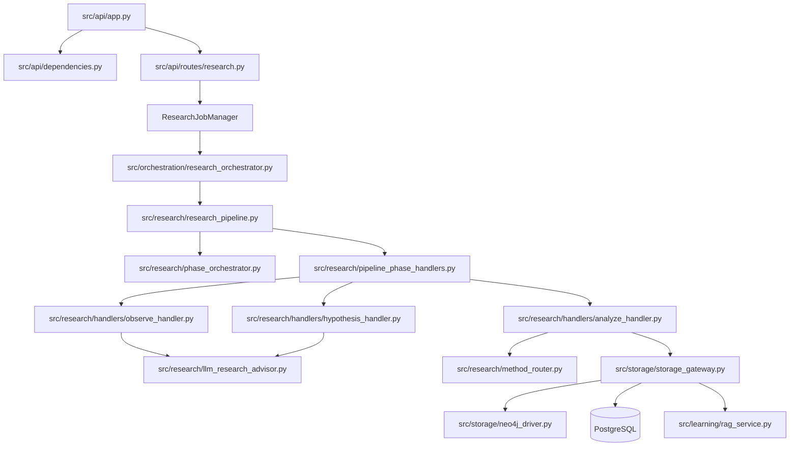
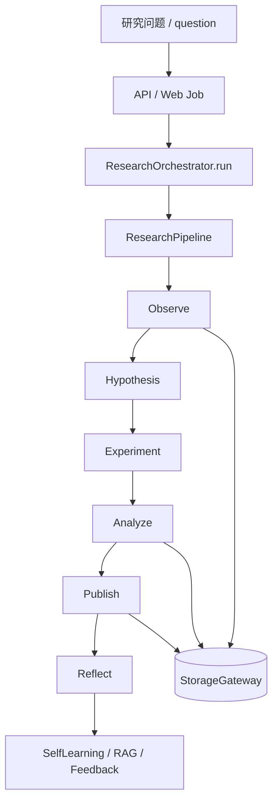
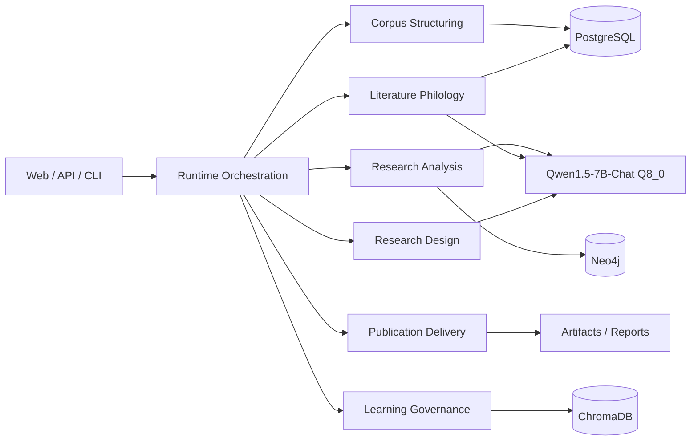
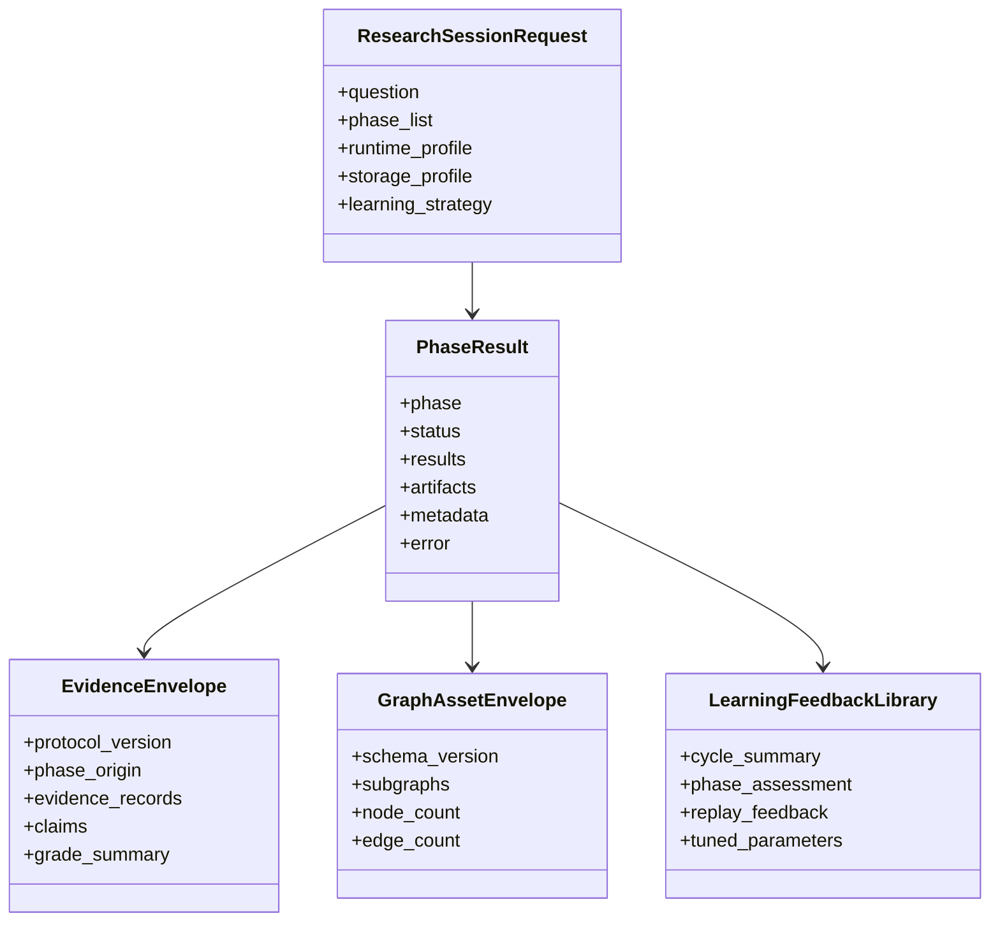
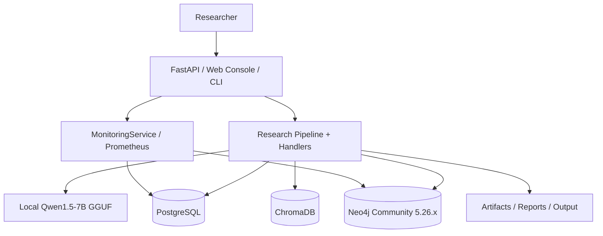

# 中医文献研究法视角的软件架构再审计（基于 main 分支）

日期：2026-04-21

范围：当前 `main` 分支代码、桌面《中医文献研究法》文档摘要、本地 `qwen1.5-7b-chat-q8_0.gguf` 部署方式、PostgreSQL / Neo4j / ChromaDB / Web/API 入口、科研主流程与测试基线。

方法：

- 通读关键入口与主流程：`README.md`、`config.yml`、`src/api/app.py`、`src/research/research_pipeline.py`、`src/research/phase_orchestrator.py`
- 通读阶段处理器与能力挂载：`src/research/handlers/*.py`
- 通读 LLM / RAG / 存储 / 监控 / 配置：`src/infrastructure/llm_service.py`、`src/learning/rag_service.py`、`src/storage/storage_gateway.py`、`src/infrastructure/config_loader.py`、`src/infrastructure/monitoring.py`
- 通读辅助编排与系统模型：`src/orchestration/research_orchestrator.py`、`src/core/architecture.py`
- 运行基线验证：`1251 passed, 20 failed, 1 skipped`（`pytest tests/. --maxfail=20`）
- 结合桌面《中医文献研究法》摘要提炼三层研究法框架：文献学研究、类编研究、学术研究

---

## 1. 执行摘要

当前 `main` 分支已经不再是早期“单体脚本拼接”的状态，而是一个具备以下特征的本地科研系统雏形：

- 已形成 API / Web / Orchestrator / Pipeline / Handler / Gateway 的多层结构。
- 已接入本地 Qwen 模型、RAG 向量检索、Neo4j 写入、PostgreSQL 结构化落库、Prometheus 指标导出。
- 已把中医文献研究拆成 Observe、Hypothesis、Experiment、Analyze、Publish、Reflect 六段，并增加研究方法路由、LLM 文献顾问、Self-Learning 挂点。

但如果从《中医文献研究法》的严格学术框架看，当前 `main` 更准确的定位仍是：

“一个偏工程化、能力很多、主链可跑，但文献学闭环尚未真正稳定、证据契约仍未最终统一、真实科研治理与架构边界仍有显著技术债务的中医文献科研平台雏形。”

最核心的结论有四条：

1. 文献学研究层没有真正成为主科研链的稳定第一公民，当前更多是 Observe 阶段的增强能力，而不是贯穿式的可治理资产。
2. 类编研究层已经最强，实体抽取、语义图、研究方法路由、图谱写入、RAG 这些能力都存在，但契约分散、命名并轨不彻底。
3. 学术研究层有完整阶段概念，但真实运行链仍混有“声明能力”和“实际落地能力”，尤其是 Experiment/Analyze/Publish 的产物契约不够统一。
4. 从工程质量看，当前 `main` 的现实状态比收口分支弱：测试基线不是全绿，而是 `1251 passed, 20 failed, 1 skipped`，说明主链存在回归和接口漂移。

---

## 2. 以《中医文献研究法》衡量当前实现度

桌面《中医文献研究法》可归纳为三层方法论：

1. 文献学研究：校勘、辑佚、训诂、考据、版本学、目录学。
2. 类编研究：将古籍知识分门别类、编码、索引、关系化，形成结构化知识资源。
3. 学术研究：在结构化知识基础上生成假说、研究设计、分析验证、学术输出与迭代修正。

据此对当前 `main` 评估如下。

| 方法论层级 | 当前实现度 | 当前判断 | 主要依据 |
| --- | ---: | --- | --- |
| 文献学研究 | 68% | 已有入口，但未形成真正稳定的 philology 主线 | Observe 阶段、`LLMResearchAdvisor`、语料采集、多源文献检索存在，但缺少稳定的 catalog / exegesis / fragment / textual evidence 治理主链 |
| 类编研究 | 83% | 是当前最成熟层 | `SemanticGraphBuilder`、`ResearchMethodRouter`、实体识别、知识图谱写入、RAG 索引、Neo4j / PostgreSQL / ChromaDB 组合基本齐备 |
| 学术研究 | 78% | 阶段齐全，但真实边界不够稳定 | `ResearchPipeline`、`ResearchOrchestrator`、Hypothesis/Analyze/Publish/Reflect 都存在，但阶段产物契约与质量门控仍不统一 |

### 2.1 文献学研究

优点：

- Observe 阶段已经具备语料采集、清洗、实体抽取、语义图构建和文献考证增强。
- 系统具备 CText / 本地语料 / LiteratureRetriever 的多源资料入口。
- `LLMResearchAdvisor` 已把中医古籍考证、假设生成、分析考证、论文摘要、研究反思拉进统一顾问接口。

不足：

- 目录学、版本学、考据学没有稳定边界上下文，仍散落在 Observe、Analyze、研究方法 analyzer 与 RAG 检索中。
- 桌面方法论中的“校勘 -> 分段 -> 编码 -> 关系抽取 -> 索引 -> 集成”七步分类法，没有被抽象成稳定、可重放的阶段契约。
- 文献学校核结果并未稳定沉淀为可跨会话比较、可图查询、可人工复核的研究资产。

### 2.2 类编研究

优点：

- `SemanticGraphBuilder` 已把方剂结构、类方比较、网络药理学、复杂性分析、总结分析等多类研究方法纳入统一输出面。
- `StorageGateway` 统一承接 Neo4j / PostgreSQL / ChromaDB 三种存储角色，形成知识图谱、结构化事实、向量检索三层底座。
- `ResearchMethodRouter` 已显式支持多分析方法路由，贴近类编研究“分类—编目—归纳—关联”的软件映射。

不足：

- 当前图谱 schema 仍不够稳定，没有 main 分支可见的统一 schema registry 与版本漂移治理。
- 语义图构建、方法路由、Neo4j 写入、研究阶段结果之间仍偏“拼接式”，没有统一的 graph asset 契约。
- 一部分 analyzer 是“存在即能力”，但没有全部进入统一验收与质量门控。

### 2.3 学术研究

优点：

- `ResearchPipeline` 和 `ResearchOrchestrator` 使“观察—假说—实验—分析—发表—反思”成为真实的可执行顺序。
- `HypothesisPhaseHandler`、`AnalyzePhaseHandler` 等 handler 将 LLM、RAG、研究方法路由与持久化挂接进阶段执行。
- Reflect 与 Self-Learning 引擎已经存在，为科研闭环提供最基础的自我修正能力。

不足：

- “实验设计”和“真实实验执行”之间仍没有完全拉开边界；main 仍是六阶段，而不是更严格的 protocol design / execution import 双阶段。
- Publish 阶段与论文交付链仍有真实缺口，测试里已经暴露 `imrd_docx` 等产物不稳定。
- 反思与学习存在挂点，但未形成强约束的 evidence-to-learning contract。

---

## 3. 当前架构模块评估

| 模块 | 关键文件 | 状态 | 实现度 | 优点 | 不足 |
| --- | --- | --- | ---: | --- | --- |
| API 入口 | `src/api/app.py` | active | 85% | FastAPI、健康检查、liveness/readiness、统一路由接入 | API 层主要包装 job manager，科研 contract 没完全收口 |
| 依赖注入 | `src/api/dependencies.py` | active | 78% | 已有 settings、architecture、monitoring、auth 依赖面 | 依赖注入与 runtime wiring 仍偏手工拼装 |
| Web 层 | `src/web/*.py` | active | 76% | 有 Web app、analysis/research routes、dashboard 面 | Web 主要是工作台层，和主链 contract 仍有漂移风险 |
| 科研主链 | `src/research/research_pipeline.py` | active | 74% | 研究周期、阶段执行、模块工厂、事件总线都有 | 仍然是 God Object，聚合职责过多 |
| 阶段编排 | `src/research/phase_orchestrator.py` | active | 75% | 相位生命周期、审计、导出、进度同步较完整 | 承担过多治理和持久化边界判断，仍偏重 |
| Handler 层 | `src/research/handlers/*.py` | active | 81% | 把 observe/hypothesis/analyze 等拆成独立处理器是正确方向 | 只是薄胶水层，很多真实逻辑仍回流到 `phase_handlers` / `research_pipeline` |
| LLM 基础设施 | `src/infrastructure/llm_service.py` | active | 84% | 抽象接口、磁盘缓存、API 兼容、本地引擎包装较清晰 | 业务层仍存在多处旁路或隐式 duck typing 依赖 |
| RAG / 自学习 | `src/learning/rag_service.py`、`src/learning/self_learning_engine.py` | partial | 72% | HyDE、Self-RAG、向量索引、自学习记录方向正确 | 真实学习闭环约束弱，缺少高质量反馈资产治理 |
| 存储门面 | `src/storage/storage_gateway.py` | active | 79% | Facade 方向正确，支持多后端降级 | 事务一致性较弱，仍偏 best-effort 而非强一致 |
| 图谱写入 | `src/storage/neo4j_driver.py`、`src/storage/neo4j_writer.py` | active | 70% | 已可写图，支持分析结果沉淀 | 缺统一 schema registry、drift 管理、资产级子图治理 |
| 配置中心 | `src/infrastructure/config_loader.py` | active | 88% | 环境隔离、路径解析、secret 注入、运行时 materialize 已成型 | `config.yml` 过重，配置语义和运行态语义混杂 |
| 监控服务 | `src/infrastructure/monitoring.py` | active | 82% | 健康检查、Prometheus 导出、主机/任务指标完整 | 没把科研治理指标和存储治理指标真正打通 |
| 研究方法路由 | `src/research/method_router.py` | active | 80% | 把多种 analyzer 接入统一路由，这是对的 | analyzer 质量和真实消费面不一致，存在“声明大于使用” |

---

## 4. 技术债务与耦合点

### 4.1 核心技术债务

| ID | 债务 | 严重度 | 理由 | 代价 |
| --- | --- | --- | --- | --- |
| TD-01 | `ResearchPipeline` 过重 | P0 | 同时负责模块装配、周期管理、阶段主链、异常治理、导出上下文 | 中高，4-6 人日 |
| TD-02 | `PhaseOrchestrator` 过重 | P0 | 生命周期、审计、持久化、运行时 metadata 汇总耦合过深 | 中高，4-6 人日 |
| TD-03 | handler 与 legacy `phase_handlers` 并存 | P0 | main 已向 handler 架构迁移，但真实逻辑仍未完全下沉 | 中，3-5 人日 |
| TD-04 | 缺少统一 graph schema registry | P0 | Neo4j 可用但不可治理，后续图演进高风险 | 中，3-4 人日 |
| TD-05 | 存储一致性偏 best-effort | P1 | `StorageGateway` 是 facade，不是事务协调器，PG/Neo4j/Chroma 没有强一致语义 | 中高，4-6 人日 |
| TD-06 | 文献学上下文未独立建模 | P1 | philology 能力存在但没有稳定 bounded context | 中，3-5 人日 |
| TD-07 | 阶段结果 contract 未完全统一 | P1 | 分阶段字段仍然散，消费方理解成本高 | 中，2-4 人日 |
| TD-08 | 测试基线非全绿 | P0 | 当前 main 为 `1251 passed, 20 failed, 1 skipped`，已有真实回归 | 中，2-4 人日 |

### 4.2 关键耦合点

最需要警惕的耦合不是“文件 import 多”，而是以下三种结构性耦合：

1. Pipeline 既是领域主链，又是模块装配器。
2. Orchestrator 既做运行时编排，又做持久化和导出汇总。
3. Handler 已出现，但很多真实业务逻辑仍未完全从主 pipeline 中剥离。

---

## 5. 真实科研流程运行情况评估

### 5.1 当前真实可执行链

### 5.2 已验证能力

- Web 入口可发现，`src.web.main --help` 正常。
- CLI/demo 入口可发现，`run_cycle_demo.py --help` 正常。
- 当前 main 的测试不是不可运行，而是“可运行但不稳定”：`1251 passed, 20 failed, 1 skipped`。

### 5.3 当前优点

- 从“有很多模块”进化为“有主链、有入口、有监控、有持久化”。
- 已具备把中医文献学、类编研究、知识图谱、RAG、LLM 组合进单机科研系统的雏形。
- 本地 Qwen 模型不只是独立调用，已经通过 `LLMResearchAdvisor`、`CachedLLMService`、RAGService 进入科研阶段。

### 5.4 当前不足

- 文献学研究在主链中仍是 Observe 的附属增强，而不是稳定的第一阶段核心资产。
- Hypothesis / Analyze / Publish 虽可跑，但产物契约未最终统一，跨阶段共享成本高。
- 实际测试失败显示部分模块接口已经漂移，例如论文输出、词典服务、ResearchPipeline 质量回归。
- 图谱写入目前更像结果投影，不是“研究资产模型”。

---

## 6. 没有真实使用或使用不充分的模块/方向

以下能力“存在于代码里”，但从 main 当前主链看，仍未完全成为默认执行路径：

| 能力 | 当前状态 | 问题 |
| --- | --- | --- |
| `LLMResearchAdvisor` | 已接入 Observe / Hypothesis | Analyze / Publish / Reflect 的真实消费深度仍不均衡 |
| `ResearchMethodRouter` | 已挂 Analyze | 不是所有分析器都在真实主链中稳定消费 |
| `RAGService.generate_with_rag()` | 能力存在 | 主流程更常见的是 retrieve/index，而非统一 self-rag 生成协议 |
| Monitoring 治理指标 | 已有系统指标 | 没真正转化为科研质量指标与存储一致性指标 |
| Neo4j 图谱 | 已可写入 | 缺 schema registry、缺 hypothesis/evidence/philology asset layer |
| SelfLearningEngine | 挂点存在 | 反馈数据与质量 gate 的契约仍弱，学习资产可追踪性不足 |

---

## 7. 优化方案

下面只给“值得进入下一阶段 backlog”的方案，每条都包含理由与代价。

### 7.1 新增边界上下文

| 建议 | 理由 | 代价 |
| --- | --- | --- |
| 新增 Literature Philology 上下文 | 文献学校核、目录学、训诂、版本链不能继续散在 Observe/Analyze/RAG 里 | 中，4-6 人日 |
| 新增 Research Asset Graph 上下文 | Hypothesis / Evidence / Philology 资产不能继续仅做投影，必须形成治理模型 | 中高，5-7 人日 |
| 新增 Quality Governance 上下文 | 监控、测试、研究质量、学习反馈目前没有统一治理面 | 中，3-5 人日 |

### 7.2 接口契约收口

| 建议 | 理由 | 代价 |
| --- | --- | --- |
| 建立统一 `PhaseResult` 最小公约 | 当前阶段字段差异大，消费方负担高 | 中，2-4 人日 |
| 扩展 EvidenceEnvelope 成跨阶段共享协议 | 这是 Observe/Hypothesis/Analyze/Publish/Reflect 之间最自然的共用载体 | 中，3-5 人日 |
| 为 graph assets 建立统一 contract | 解决 Neo4j 写入不可治理的问题 | 中，3-4 人日 |

### 7.3 架构重构

| 建议 | 理由 | 代价 |
| --- | --- | --- |
| 拆分 `ResearchPipeline` 为 runtime builder + phase runtime | 当前对象职责过重，难测且难演进 | 中高，4-6 人日 |
| 让 handler 成为唯一阶段承接面 | 避免 handler 与 legacy phase_handlers 双轨并存 | 中，3-5 人日 |
| 用 StorageBackendFactory / transaction coordinator 替换 `StorageGateway` 的 best-effort 双写 | 研究事实存储和图存储需要更清晰的一致性边界 | 中高，4-6 人日 |

### 7.4 中医研究能力增强

| 建议 | 理由 | 代价 |
| --- | --- | --- |
| 把桌面《中医文献研究法》的七步法做成显式 Observe 子流水线 | 现在主链只体现“功能”，没有体现“方法步骤” | 中，3-4 人日 |
| 给文献学结果增加 reviewer workbench contract | 文献学研究最终需要人工复核闭环，不能只靠 LLM | 中，4-6 人日 |
| 让 hypothesis/evidence/philology 三类资产可跨 cycle 对比 | 这是“科研平台”与“单次分析器”的本质差异 | 中，3-5 人日 |

### 7.5 结合 Google / NLP 研究趋势的建议

这里不强行绑定单篇“最新论文”结论，而是给出与 Google / 主流 NLP 研究方向一致、且适合本地 Qwen 场景的增量方案。

| 建议 | 理由 | 代价 |
| --- | --- | --- |
| 加入多候选自一致性（Self-Consistency）假说投票 | 假说阶段现在更像单路生成；多候选投票更适合中医研究中多解释并存的情况 | 中，2-3 人日 |
| 加入查询重写 + 多路检索 | 文献检索质量常受 query 表述影响，多查询重写比单 query 更稳 | 中，2-4 人日 |
| 加入分层摘要树或 RAPTOR 风格 dossier 压缩 | 本地 7B 模型上下文有限，长文献和多文献综述需要分层摘要 | 中，3-5 人日 |
| 加入显式工具规划（tool-plan-execute-review） | 当前 LLM 顾问更多是生成式解释，不够像科研流程中的“研究助理” | 中，3-4 人日 |
| 为反思阶段加入失败样例回放库 | 自学习目前更像结果记录，不像真正的 failure-driven learning | 中，2-4 人日 |

---

## 8. 建议的目标架构

### 8.1 边界上下文

1. Runtime Orchestration
2. Literature Philology
3. Corpus Structuring
4. Research Design
5. Research Analysis
6. Publication Delivery
7. Learning Governance
8. Research Asset Storage

### 8.2 能力拓扑

### 8.3 核心契约

### 8.4 部署视图

---

## 9. 分阶段实施计划

### Phase A：主链减重与契约统一

- 目标：拆分 `ResearchPipeline` / `PhaseOrchestrator`，统一 `PhaseResult`。
- 理由：不先减重，后续文献学子图、图谱治理、学习闭环都会继续堆在主对象上。
- 代价：约 1 周。

### Phase B：文献学主线独立化

- 目标：把《中医文献研究法》的文献学层做成独立 bounded context。
- 动作：catalog / exegesis / fragment / textual evidence chain / review workbench 统一 contract。
- 理由：当前软件最大的方法论缺口不在类编，而在文献学校核没有真正独立成层。
- 代价：约 1-2 周。

### Phase C：图谱资产治理

- 目标：建立 schema registry、hypothesis/evidence/philology graph assets。
- 动作：统一 schema versioning、graph stats、graph backfill、资产级查询。
- 理由：当前 Neo4j 只是能写，离“可治理研究资产”还有明显距离。
- 代价：约 1 周。

### Phase D：学习闭环升级

- 目标：让 SelfLearningEngine 从“记录器”升级为“可复盘、可调优、可回灌”的学习治理层。
- 动作：失败样例库、策略调优、phase benchmark、fallback 质量评估。
- 理由：当前自学习方向正确，但闭环还不够证据化。
- 代价：约 1 周。

### Phase E：质量门与运维导出

- 目标：把测试、存储一致性、科研质量和监控导出统一制度化。
- 动作：修复当前 20 个失败测试、增加 nightly smoke、增加 storage/research metrics。
- 理由：当前 main 不是稳定基线，先修回归再扩功能更稳。
- 代价：约 3-5 人日。

---

## 10. 最终判断

当前 main 分支已经具备“中医文献科研平台雏形”的基本骨架：

- 它不是普通 RAG 工具。
- 它也不是只会跑 demo 的古籍分析脚本。
- 它确实已经把本地 Qwen、RAG、图谱、科研阶段、监控、Web/API 连接成了一个可运行系统。

但从《中医文献研究法》的要求看，它还没有完全成为“文献学—类编研究—学术研究”三层严整贯通的平台。

最大的短板不是功能少，而是：

1. 方法论分层尚未彻底软件化。
2. 主链对象过重，技术债务抬高了演进成本。
3. 图谱和学习闭环已存在，但治理层没有完全成形。
4. 当前 main 测试基线不绿，说明工程稳定性还未进入稳态化阶段。

如果只给一句结论：

这套系统已经值得继续沿“本地中医文献科研平台”方向推进，但下一阶段应优先做边界收口、图谱治理、文献学独立化和测试基线修复，而不是继续叠加新功能。
