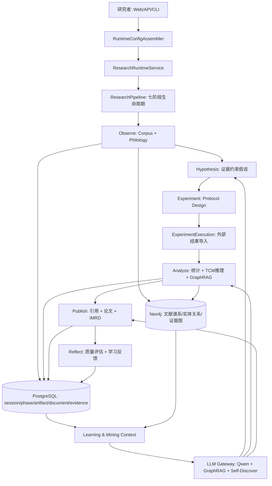
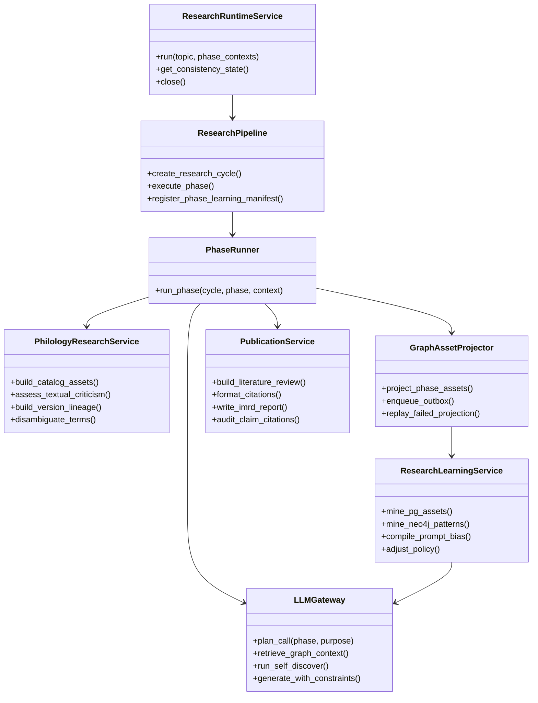
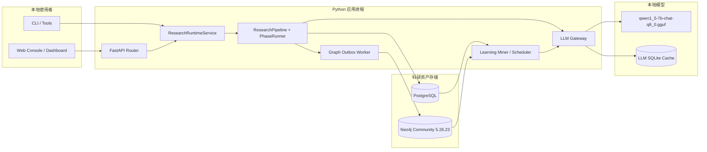
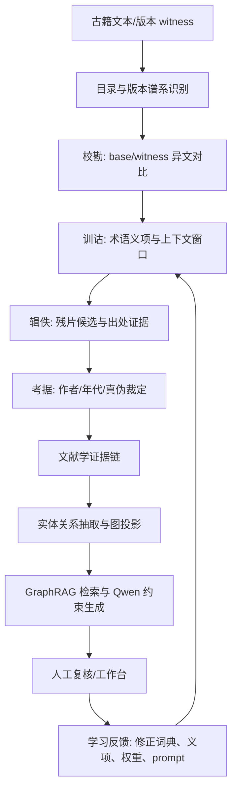

# 中医文献研究平台架构评估与演进设计

日期：2026-05-01
范围：本地 `qwen1_5-7b-chat-q8_0.gguf`、ResearchRuntimeService 七阶段主链、PostgreSQL、Neo4j、Web/API/CLI 入口、文献学资产、GraphRAG、自学习与无监督科研增强。

## 1. 执行摘要

本软件已经不是简单的“古籍文本分析脚本”，而是一个正在成形的本地化中医文献科研平台。主入口已经收敛到 `ResearchRuntimeService`，核心研究链为 `Observe -> Hypothesis -> Experiment -> ExperimentExecution -> Analyze -> Publish -> Reflect`。PostgreSQL 已作为结构化科研资产的主库，Neo4j 已作为图谱投影、GraphRAG、文献学资产关系与无监督主题挖掘的图数据库；本地 Qwen1.5-7B-Chat Q8_0 GGUF 已具备统一模型路径、缓存、token budget、小模型调用规划与本地 CUDA 运行保护。

当前最强的能力是“流程化科研产物 + 结构化落库 + 图谱资产 + 文献学首轮建模”。当前最主要的瓶颈不是缺少模块，而是多个能力已经存在但还没有全部变成每轮科研主链的强制闭环。例如 GraphRAG 已能在 Analyze 阶段注入，Web 分析入口已能生成无监督科研增强视图，GraphPatternMiningDaemon 已能从 Neo4j 挖掘高频共现，但这些结果尚未稳定沉淀为下一轮 Observe/Hypothesis/Analyze 的方法先验、prompt bias、证据权重和研究主题推荐。

建议下一阶段目标应从“继续堆功能”转为“把沉淀资产转化为科研方法能力”：围绕文献学深层能力、GraphRAG + Self-Discover 推理、PG/Neo4j 无监督自学习、引用证据总结、接口契约收敛与旧旁路清理推进。

## 2. 审计依据与关键文件

本次重点通读与核对如下关键位置：

| 类别 | 关键文件 | 观察结论 |
| --- | --- | --- |
| 入口与运行时 | `src/api/main.py`, `src/web/main.py`, `src/orchestration/research_runtime_service.py`, `src/orchestration/research_orchestrator.py` | API/Web 已桥接统一 runtime；`ResearchOrchestrator` 已标记弃用但仍被 runtime 复用其 DTO 与辅助函数。 |
| 七阶段科研主链 | `src/research/research_pipeline.py`, `src/research/phase_orchestrator.py`, `src/research/phase_handlers/*`, `src/research/phases/*` | 七阶段边界清晰，但 `ResearchPipeline` 与 `PhaseOrchestrator` 仍是中心枢纽，承担模块工厂、事件、持久化、图资产导出、阶段汇总等多重职责。 |
| 文献学能力 | `src/research/phases/observe_phase.py`, `src/research/observe_philology.py`, `src/research/catalog_contract.py`, `src/research/exegesis_contract.py`, `src/research/fragment_contract.py`, `src/research/textual_criticism/*`, `src/contexts/collation/*` | Observe 已具备目录、训诂、辑佚、考据、校勘、版本 witness、topic discovery 与工作台化资产入口，属于较成熟的首轮文献学主线。 |
| 中医推理与分析 | `src/research/phases/analyze_phase.py`, `src/research/tcm_reasoning/*`, `src/research/reasoning_template_selector.py`, `src/research/data_miner.py` | Analyze 已具备统计、证据分级、文本考据摘要消费、TCM 规则推理、GraphRAG 注入与 SelfRefine 前置上下文。 |
| 本地 LLM | `config.yml`, `src/llm/llm_engine.py`, `src/infra/llm_service.py`, `src/research/llm_role_profile.py` | 模型路径已指向 `./models/qwen1_5-7b-chat-q8_0.gguf`，默认 GPU layers 为 28，缓存、token budget、small model optimizer、prompt registry 已接入。 |
| 存储与图谱 | `src/storage/backend_factory.py`, `src/storage/transaction.py`, `src/storage/neo4j_driver.py`, `src/storage/graph_schema.py`, `src/infrastructure/research_session_repo.py` | PG + Neo4j 主链已成立；有事务协调、schema bootstrap、约束索引、schema drift 检查、降级治理，但 Web 分析入口仍存在局部 Neo4j 投影旁路。 |
| GraphRAG 与无监督增强 | `src/llm/graph_rag.py`, `src/knowledge/kg_rag.py`, `src/analysis/unsupervised_research_enhancer.py`, `src/learning/graph_pattern_miner.py`, `src/web/routes/analysis.py` | Typed GraphRAG、KG-RAG、无监督社区主题/桥接实体/新颖性候选已有实现；GraphPatternMiningDaemon 仍偏守护脚本/可选路径，未完全产品化。 |
| 学习闭环 | `src/research/learning_loop_orchestrator.py`, `src/learning/policy_adjuster.py`, `src/contexts/lfitl/*`, `src/learning/self_learning_engine.py` | 学习闭环从旧 `SelfLearningEngine` 迁往 PolicyAdjuster/LFITL；`self_learning_engine.py` 已是兼容 shim。 |
| 既往架构文档 | `ARCHITECTURE_TCM_RESEARCH_METHOD_AUDIT_2026_04_12.md`, `ARCHITECTURE_TCM_RESEARCH_METHOD_AUDIT_2026_04_20.md`, `ARCHITECTURE_TCM_RESEARCH_METHOD_DESIGN_2026_04_22.md`, `STAGE_SUMMARY.md` | 既往结论已完成多轮更新，本次评估沿用“主链已成立，下一步是资产闭环与深层方法能力”的现态。 |

## 3. 面向《中医文献研究法》的能力映射

中医古代文献研究不是普通 NLP 摘要任务。它至少包含三层：文献学研究、类编研究、学术研究。当前系统与三层方法的映射如下。

| 方法层 | 对应模块 | 实现程度 | 优点 | 不足与耦合点 |
| --- | --- | ---: | --- | --- |
| 文献学研究：目录、版本、校勘、辑佚、训诂、考据 | `ObservePhase`, `observe_philology`, `catalog_contract`, `exegesis_contract`, `fragment_contract`, `textual_criticism`, `CollationContext` | 82% | 已把文献学资产显式建模，能输出术语表、校勘条目、目录摘要、辑佚候选、证据链与版本 witness。 | 多义词义项、朝代/学派语义漂移、跨版本传抄链仍主要靠规则与字段合同；需要更强的上下文窗口、版本谱系图与人工复核闭环。 |
| 类编研究：分段、实体、关系、图谱、主题、知识整合 | `DocumentPreprocessor`, `AdvancedEntityExtractor`, `SemanticGraphBuilder`, `unsupervised_research_enhancer`, `Neo4jDriver`, `GraphRAG` | 80% | 已有实体图、无监督社区主题、桥接实体、新颖性候选、PG/Neo4j 投影与 GraphRAG 检索。 | `src/analysis/semantic_graph.py` 与 `src/semantic_modeling/*` 存在功能重叠；Web 分析入口有独立投影逻辑，尚未完全复用 storage factory。 |
| 学术研究：假说、方案、外部执行、证据分级、论文、反思 | `HypothesisEngine`, `ExperimentPhase`, `ExperimentExecutionPhase`, `AnalyzePhase`, `PublishPhase`, `ReflectPhase`, `LearningLoopOrchestrator` | 78% | 七阶段主链成立，实验边界已明确为“方案设计 + 外部结果导入”，Publish 能生成论文/IMRD/引用，Reflect 能回灌策略。 | Experiment 不应被宣传为系统内真实实验；Reflect/PolicyAdjuster 对图模式、引用质量和文献学复核结果的策略消费仍偏轻。 |
| 本地知识增强推理 | `LLMEngine`, `CachedLLMService`, `small_model_optimizer`, `GraphRAG`, `KGRAGService`, `SelfRefineRunner` | 76% | 本地模型可控，缓存与预算保护已经建立；Analyze 可在 SelfRefine 前注入 GraphRAG。 | GraphRAG 默认需要显式启用；Qwen 对复杂考据与跨文献归纳仍需要结构化推理模板和证据约束，不能单靠自由生成。 |
| 数据资产闭环 | `ResearchSessionRepository`, `TransactionCoordinator`, `GraphPatternMiningDaemon`, `LFITL` | 68% | PG/Neo4j 已沉淀大量结构化资产；GraphPatternMiningDaemon 有增量模式挖掘雏形。 | 图模式到学习策略、prompt bias、证据权重、few-shot 样本的闭环还不够强；守护任务缺少统一调度、观测、幂等和失败补偿合同。 |

总体判断：系统已经具备中医文献科研平台骨架，尤其是文献学资产建模和结构化存储主链较扎实。若要达到“深层文献学 + 自学习科研助手”的目标，下一步必须让数据库中的资产成为下一轮研究的先验，而不是只成为查询结果。

## 4. 真实科研主流程运行评估

### 4.1 当前真实运行链

真实主链可以概括为：

1. API/Web/CLI 通过统一配置中心装配 runtime。
2. `ResearchRuntimeService` 根据 profile 创建 `ResearchPipeline` 与研究 cycle。
3. `LearningLoopOrchestrator.prepare_cycle()` 冻结学习策略并注入各阶段 context。
4. 七阶段顺序执行：Observe、Hypothesis、Experiment、ExperimentExecution、Analyze、Publish、Reflect。
5. `PhaseResult` 将每阶段结果收敛为 `results / artifacts / metadata`。
6. `StorageBackendFactory` 在可用时初始化 PostgreSQL 与 Neo4j。
7. 研究 session、phase execution、artifact、文献学资产与图资产落库或投影。
8. Reflect 与 PolicyAdjuster 形成下一轮学习策略。

### 4.2 优点

- **主入口已经统一**：API 与 Web 启动都支持 `--config` 与 `--environment`，运行时会进入 shared runtime。
- **科研阶段语义清晰**：Experiment 已显式收口为 protocol design，ExperimentExecution 承接外部结果导入，避免把文献研究平台误说成自动临床实验平台。
- **文献学资产已一等化**：Observe 不只是采集文本，已经开始承载版本、目录、校勘、训诂、辑佚、考据与 topic discovery。
- **结构化存储真实接线**：开发/生产配置默认 PostgreSQL + Neo4j；事务协调器提供 PG flush、Neo4j 执行、PG commit 与补偿机制。
- **本地模型保护较完整**：Qwen Q8_0 默认路径明确，GPU layers 从历史不稳定的全量卸载降为 28，且有缓存、预算、planner 和 purpose profile。
- **无监督增强已有在线入口**：`/api/analysis/text` 与 `/api/analysis/distill` 已能生成社区主题、桥接实体、新颖性候选，并落入 PG/Neo4j 投影。

### 4.3 不足

- **GraphRAG 尚非每轮强制能力**：Analyze 中 `_apply_graph_rag()` 需要 `enable_graph_rag` 或学习策略开启；如果上游没有明确打开，Qwen 仍可能缺少图谱事实约束。
- **Web 分析入口仍有旁路**：`src/web/routes/analysis.py` 自建 Neo4j driver、SQLite KG singleton 与投影逻辑，未完全复用 `StorageBackendFactory` 与 `TransactionCoordinator`。
- **图模式挖掘未产品化**：`GraphPatternMiningDaemon` 可查询高频 Herb-Prescription-Symptom 模式，但调度、状态、失败补偿、PG 记录与主链消费合同仍薄。
- **文献学深层推断仍偏规则驱动**：文本考据服务已能做作者/年代/真伪裁定，但对传抄链、同词异义、异文沿袭和学派语义漂移的上下文建模还不足。
- **中心类职责过宽**：`ResearchPipeline` 和 `PhaseOrchestrator` 承担太多胶水与治理职责，后续新增边界上下文时容易继续堆入中心枢纽。

## 5. 模块优缺点与技术债务

| 模块 | 优点 | 技术债务 / 耦合点 | 优先级 |
| --- | --- | --- | --- |
| `ResearchRuntimeService` | 统一入口、profile、phase context、publish policy、storage lifecycle。 | 仍导入弃用 `ResearchOrchestrator` 的 DTO 与辅助函数；后续可把 DTO 与 `topic_to_phase_context` 抽到独立 contract。 | 高 |
| `ResearchPipeline` | 模块注册、注入、事件、服务启动完整；能承载七阶段主链。 | 仍是大中心，兼容导入多、可选依赖多、bootstrap 复杂；新能力容易继续塞入 pipeline。 | 高 |
| `PhaseOrchestrator` | 阶段生命周期、事件、持久化导出、图资产投影能力强。 | 负责调度、持久化、图谱与 metadata 装配，fan-out 大；建议拆成 phase runner、artifact persister、graph projector。 | 高 |
| `ObservePhase` | 文献学最关键入口，已经输出丰富资产。 | 子职责很多：采集、ingestion、collation、topic discovery、textual criticism、graph assets；建议按文献学 bounded context 拆服务。 | 高 |
| `AnalyzePhase` | 统计、证据分级、TCM 推理、GraphRAG、SelfRefine 串联完整。 | `_apply_graph_rag()` 是可选注入；证据协议、TCM 规则、GraphRAG 结果与 self-refine 输入仍可形成更强 contract。 | 高 |
| `PublishPhase` | 论文、IMRD、引用、报告产出较成熟。 | 输出路径多，引用质量与证据链一致性需要更强审稿式检查；文献综述仍可被 GraphRAG 和 citation graph 增强。 | 中 |
| `StorageBackendFactory` + `TransactionCoordinator` | PG/Neo4j 双写、降级、观测与补偿已有基础。 | 双写不是严格分布式事务；Neo4j 失败后依赖补偿/回填，建议增加 outbox 和幂等 projector。 | 高 |
| `Neo4jDriver` | 约束、全文索引、schema version、schema drift 检查已有实现。 | schema 定义仍分散在 graph_schema、driver、GraphRAG typed assets、analysis projection；建议建立独立 ontology contract。 | 高 |
| `LLMEngine` + `CachedLLMService` | 本地 GGUF 能稳定运行，缓存、token budget、small model optimizer 已接入。 | llama-cpp 初始化、CUDA DLL、生成锁、模型参数仍偏实现层；建议建立 LLM Gateway，把模型调用、GraphRAG、SelfRefine、role profile 全部纳入统一 contract。 | 中 |
| `GraphPatternMiningDaemon` | 高频子图挖掘雏形清晰。 | 无统一调度和持久化 contract；无驱动时返回模拟模式，生产需要显式禁用模拟输出。 | 高 |
| `self_learning_engine.py` | 兼容旧测试和导入。 | 已是“下版本删除” shim，新代码不应依赖；需要持续守门，避免主链回流旧类。 | 中 |

## 6. 没有真实进入主链或应收敛的模块

以下不是说“无用”，而是它们当前应被视为兼容、旁路、工具或候选上下文，不能继续作为新功能挂载点。

| 模块 / 路径 | 当前状态 | 建议 |
| --- | --- | --- |
| `src/orchestration/research_orchestrator.py` | 构造函数已发出“改用 ResearchRuntimeService”的弃用警告，但 DTO/辅助函数仍被 runtime 引用。 | 抽出 `orchestration_contract.py`，让 runtime 不再导入弃用类文件。 |
| `src/learning/self_learning_engine.py` 与 `src/learning/adaptive_tuner.py` | 明确为 T5.6 兼容 shim，下版本删除。 | 新代码只使用 `PolicyAdjuster`、`GraphPatternMiner/LFITL`；测试继续守门主链不得直接导入 shim。 |
| `src/web/routes/analysis.py` 的 Neo4j 投影与 KG singleton | 在线分析入口真实可用，但与 storage 主链存在并行投影逻辑。 | 迁入 `AnalysisIngestionService`，复用 `StorageBackendFactory`、outbox 和 graph projector。 |
| `src/knowledge/kg_rag.py` | AI assistant 场景可用，主科研 Analyze 主要使用 `src/llm/graph_rag.py`。 | 保留为交互问答 RAG；不要与科研主链 GraphRAG 混用合同。 |
| `src/semantic_modeling/*` 与 `src/analysis/semantic_graph.py` | 语义建图职责有重叠。 | 选定一个为主建图服务，另一个只保留方法库/兼容导出。 |
| `src/ai_assistant/*` | 历史聊天门面，具备 KG-RAG 接入。 | 定位为 Web/API 的交互 assistant bounded context，不应直接写科研主链事实。 |
| `tools/backfill_*`, `legacy_learning_feedback_backfill.py` | 治理和历史回填工具。 | 保持工具属性，禁止业务运行时隐式调用。 |
| `archive/dead_code_2026_04_28/*` | 已归档死代码与 shim 生成脚本。 | 不再作为实现参考，只可作为迁移历史。 |

## 7. 目标架构

目标架构的核心思想是把“中医文献研究方法”变成一组边界上下文，而不是继续把所有能力塞进 ResearchPipeline。

### 7.1 建议的边界上下文

| 边界上下文 | 责任 | 主数据 | 典型服务 |
| --- | --- | --- | --- |
| Corpus & Ingestion | 本地/外部语料采集、编码、切分、版本 metadata。 | Document, CorpusBundle, VersionWitness | `CorpusIngestionService` |
| Philology Context | 目录、校勘、训诂、辑佚、考据、版本谱系。 | Catalog, CollationEntry, ExegesisNote, FragmentCandidate, AuthenticityVerdict | `PhilologyResearchService` |
| Semantic Graph Context | 实体、关系、本体、图投影、schema/ontology。 | Entity, Relationship, GraphAsset, OntologyVersion | `GraphAssetProjector`, `OntologyRegistry` |
| Research Method Context | 假说、方案、外部执行导入、证据分级、TCM 推理。 | Hypothesis, Protocol, ExecutionImport, EvidenceClaim, TCMReasoningTrace | `ResearchMethodService` |
| LLM Reasoning Context | Qwen 调用、GraphRAG、Self-Discover、SelfRefine、prompt registry。 | PromptPlan, RetrievalContext, ReasoningTrace, LLMCallRecord | `LLMGateway` |
| Learning & Mining Context | PG/Neo4j 无监督挖掘、反馈、策略、prompt bias、权重更新。 | LearningInsight, GraphPattern, PolicyAdjustment, PromptBiasBlock | `ResearchLearningService` |
| Publication Context | 引用、综述、论文、IMRD、审稿式质量检查。 | CitationRecord, LiteratureReview, PaperDraft, ReportArtifact | `PublicationService` |

### 7.2 目标主流程



### 7.3 类图



### 7.4 部署图



### 7.5 文献学深层流程图



## 8. 具体优化方案：30 个代码生成指令

以下 30 条可直接作为代码生成代理的开发指令使用。每条都限定了目标、修改范围、生成要求、验收标准、理由与代价，便于按小步提交逐项落地。

### 8.1 指令 01：抽出 orchestration contract，解除 runtime 对弃用编排器的依赖

**目标**：让 `ResearchRuntimeService` 不再从已弃用的 `ResearchOrchestrator` 文件导入 DTO 与工具函数。

**修改范围**：新增 `src/orchestration/orchestration_contract.py`；迁移 `PhaseOutcome`、`OrchestrationResult`、`_slug_topic`、`topic_to_phase_context`；更新 `src/orchestration/research_runtime_service.py` 与 `src/orchestration/research_orchestrator.py` 的导入。

**生成要求**：保持 public 字段与 `to_dict()` 输出完全兼容；`ResearchOrchestrator` 继续保留弃用警告，但改为从 contract 导入类型；不要改变现有 runtime profile 行为。

**验收标准**：新增或更新 `tests/unit/test_entry_point_contract.py`，断言 `ResearchRuntimeService` 源码不包含 `from src.orchestration.research_orchestrator import`；既有 runtime service 测试通过。

**理由**：主入口认知会更清楚，新功能不会继续挂到弃用类旁边。

**代价**：会影响导入路径，需要同步少量测试与 `__init__.py` 导出。

### 8.2 指令 02：新增 LLMGateway 契约与结果模型

**目标**：建立统一的大模型调用入口，为 Qwen、GraphRAG、Self-Discover、SelfRefine、schema validation 提供单一合同。

**修改范围**：新增 `src/contexts/llm_reasoning/__init__.py`、`src/contexts/llm_reasoning/contracts.py`、`src/contexts/llm_reasoning/service.py`。

**生成要求**：定义 `LLMGatewayRequest`、`LLMGatewayResult`、`LLMReasoningMode`、`LLMRetrievalPolicy`；支持 `phase`、`purpose`、`task_type`、`schema_name`、`graph_rag`、`reasoning_mode`、`max_input_tokens`；结果必须包含 `text`、`structured`、`citations`、`retrieval_trace`、`llm_cost_report`、`warnings`。

**验收标准**：新增 `tests/unit/test_llm_gateway_contract.py`，覆盖 request/result 的最小构造、`to_dict()`、缺省值和 JSON 可序列化。

**理由**：Qwen 本地生成必须有统一边界，否则 GraphRAG、token budget、prompt registry 会继续散落。

**代价**：新增抽象层，短期会有适配工作。

### 8.3 指令 03：为 LLMGateway 接入 CachedLLMService 与 token budget

**目标**：让 LLMGateway 能复用现有 `CachedLLMService`、`prepare_planned_llm_call()` 与 token budget，而不是重复实现模型加载。

**修改范围**：`src/contexts/llm_reasoning/service.py`、`src/infra/llm_service.py` 只做必要导出；不直接修改 `LLMEngine` 行为。

**生成要求**：实现 `LLMGateway.generate(request)`：先调用 small model optimizer 规划，再应用 token budget，再调用 wrapped service；所有异常返回带 `warnings` 的降级结果，不吞掉日志。

**验收标准**：单测用 fake LLM service 验证 prompt 被预算裁剪、cache/cost metadata 透传、异常时 `structured={}` 且 `warnings` 非空。

**理由**：保护本地 Qwen Q8_0 的显存、上下文窗口和响应稳定性。

**代价**：需要 mock planner 与 fake service，测试复杂度略升。

### 8.4 指令 04：实现 Self-Discover 推理模板选择器

**目标**：为复杂中医文献任务生成可审计的多步推理框架，而不是直接让 Qwen 自由回答。

**修改范围**：新增 `src/contexts/llm_reasoning/self_discover.py`；复用 `src/research/reasoning_template_selector.py` 的 framework 概念。

**生成要求**：实现 `build_self_discover_plan(question, evidence_context, task_type)`，输出 `selected_modules`、`reasoning_steps`、`evidence_slots`、`output_schema_hint`；内置任务类型包括 `philology_exegesis`、`formula_lineage`、`pathogenesis_reasoning`、`citation_synthesis`。

**验收标准**：新增单测验证四类任务分别生成不同步骤，且每步包含 `required_evidence` 与 `failure_fallback`。

**理由**：Self-Discover 类方法适合小模型先选推理结构再填证据，可降低幻觉。

**代价**：复杂任务会增加一次规划调用或规则规划成本。

### 8.5 指令 05：将 Prompt Registry 与 JSON Schema 校验接入 LLMGateway

**目标**：让结构化输出统一经过 schema 约束与校验。

**修改范围**：`src/contexts/llm_reasoning/service.py`；读取现有 `config.yml` 中 `models.llm.prompt_registry` 配置；必要时新增 `src/contexts/llm_reasoning/schema_registry.py`。

**生成要求**：当 `schema_name` 非空时，把 schema 摘要附加到 prompt；生成后尝试解析 JSON；schema 不匹配时返回原文、`structured={}`、`warnings`，不得抛出阻断主链。

**验收标准**：单测覆盖合法 JSON、非法 JSON、schema 缺失、`fail_on_schema_validation=false` 的降级。

**理由**：中医文献研究输出需要可落库、可审计，不能依赖自由文本。

**代价**：prompt 变长，可能占用更多 token budget。

### 8.6 指令 06：让 Analyze 默认使用 GraphRAG，但保留显式关闭开关

**目标**：把 Analyze 阶段的图谱证据从可选增强提升为默认上下文。

**修改范围**：`src/research/phases/analyze_phase.py`、`config.yml`、`config/test.yml`。

**生成要求**：新增 `graph_rag.default_enabled=true` 配置；`context["enable_graph_rag"]` 显式为 `False` 时关闭；无 Neo4j 或无结果时返回空块并记录 metadata，不阻断分析。

**验收标准**：更新 `tests/unit/test_analyze_phase.py` 或新增单测，验证默认调用 `_apply_graph_rag()`、显式关闭不调用、Neo4j 缺失时 metadata 标记 `graph_rag.status=degraded`。

**理由**：Qwen 分析必须默认带证据，减少无依据归纳。

**代价**：默认路径会多一次图查询，测试需要更新 fake runner。

### 8.7 指令 07：为 GraphRAG 增加检索缓存

**目标**：降低默认 GraphRAG 对 Neo4j 的查询压力。

**修改范围**：`src/llm/graph_rag.py`，可新增 `src/llm/graph_rag_cache.py`。

**生成要求**：按 `scope + query + topic_keys + entity_ids + asset_type + cycle_id` 生成 cache key；支持内存 LRU，默认大小 256；缓存结果必须深拷贝返回，避免调用方污染。

**验收标准**：单测验证相同请求只调用一次 session.run，不同 `cycle_id` 或 `asset_type` 不共用缓存。

**理由**：Analyze/Publish 默认化后，缓存是避免图查询放大的必要保护。

**代价**：需要处理缓存过期与内存占用；初版可先只做进程内缓存。

### 8.8 指令 08：将 Publish 阶段接入 GraphRAG citation trace

**目标**：生成论文、IMRD 和讨论段落时携带可追溯图谱证据。

**修改范围**：`src/research/phases/publish_phase.py`、`src/generation/paper_writer.py`、`src/generation/llm_context_adapter.py`。

**生成要求**：构造 `publish_graph_context`，至少包含 EvidenceClaim、VersionWitness、CitationRecord 三类 trace；写入 `paper_context` 与 publish metadata；无图数据时给出 `unsupported_claim_warning_count`。

**验收标准**：更新 publish 阶段单测，验证 `paper_context` 含 `graph_rag_citations`，且 report/session payload 可读到 traceability。

**理由**：引用综述和讨论部分最容易出现“像论文但无出处”的问题。

**代价**：生成上下文更大，可能增加 token 裁剪概率。

### 8.9 指令 09：新增 CitationEvidenceSynthesizer

**目标**：把“格式化引用”升级为“观点-证据-引文-版本 witness”矩阵。

**修改范围**：新增 `src/generation/citation_evidence_synthesizer.py`；在 `publish_phase.py` 中调用。

**生成要求**：输入 `evidence_protocol`、`citation_records`、`observe_philology`、`graph_rag_context`；输出 `CitationGroundingRecord` 列表，支持 `strong/moderate/weak/unsupported`。

**验收标准**：新增单测覆盖有 EvidenceClaim、只有 CitationRecord、无证据三种情况；无证据时 support_level 必须是 `unsupported`。

**理由**：中医文献研究的学术可信度取决于出处链，而不是引用格式本身。

**代价**：Publish 结果会更严格，旧报告可能出现更多未支持提示。

### 8.10 指令 10：建立 Ontology Registry 的 Pydantic 合同

**目标**：统一中医文献知识图谱节点、边、属性和 traceability 字段。

**修改范围**：新增 `src/storage/ontology/models.py`、`src/storage/ontology/registry.py`、`config/ontology/tcm_literature_graph.yml`。

**生成要求**：定义节点 `Literature`、`VersionWitness`、`VersionLineage`、`Formula`、`Herb`、`Symptom`、`Syndrome`、`Pathogenesis`、`EvidenceClaim`、`Citation`、`ResearchTopic`；定义边 `APPEARS_IN`、`CONTAINS`、`TREATS`、`BELONGS_TO_LINEAGE`、`EVIDENCE_FOR`、`CITES`、`BELONGS_TO_TOPIC`。

**验收标准**：新增单测验证 YAML 可加载、节点/边名称合法、必填属性校验失败会报告具体字段。

**理由**：当前 graph schema 分散，容易造成 Neo4j、GraphRAG、Web 投影语义漂移。

**代价**：需要后续迁移旧标签和历史投影。

### 8.11 指令 11：让 Neo4jDriver 从 Ontology Registry 创建约束和索引

**目标**：替换 Neo4jDriver 中硬编码的部分约束/索引。

**修改范围**：`src/storage/neo4j_driver.py`、`src/storage/ontology/registry.py`。

**生成要求**：`_setup_constraints_and_indexes()` 优先读取 ontology registry；对每个节点 label 的唯一键和全文索引生成 Cypher；保留旧约束作为 fallback。

**验收标准**：用 mock session 验证为 Herb、Literature、Prescription/Formula、EvidenceClaim 创建约束；非法 label 必须经 `_safe_cypher_label()` 拒绝。

**理由**：schema 应由同一个本体定义驱动。

**代价**：Neo4j 启动时多一次 registry 读取，失败处理要谨慎。

### 8.12 指令 12：实现 Graph Outbox 统一投影入口

**目标**：把阶段图资产投影统一为 PG outbox 事件，再由 worker 写 Neo4j。

**修改范围**：`src/storage/outbox/*`、`src/storage/backend_factory.py`、`src/research/phase_orchestrator.py`。

**生成要求**：新增 helper `enqueue_graph_projection(cycle_id, phase, graph_payload, idempotency_key)`；PhaseOrchestrator 不直接写 Neo4j 时可写 outbox；事件 payload 必须 JSON-safe。

**验收标准**：集成测试验证 PG session commit 后 outbox event 存在，worker drain 后状态为 processed。

**理由**：解决 PG 成功但 Neo4j 投影失败的弱一致性问题。

**代价**：图数据从同步可见变成最终一致，需要 UI 显示投影状态。

### 8.13 指令 13：为 outbox worker 增加幂等 projector

**目标**：确保重复消费同一图投影事件不会产生重复节点或重复边。

**修改范围**：新增 `src/storage/outbox/graph_projector.py`；更新 `src/storage/outbox/outbox_worker.py` handler 注册。

**生成要求**：支持 nodes/edges payload；节点用 `MERGE (n:Label {id})`，边用 `MERGE` 并累加或覆盖可配置；写入 `projection_event_id` 与 `projected_at`。

**验收标准**：mock Neo4j session 验证同一 event 调用两次生成相同 MERGE，不生成 CREATE；失败进入 retry/DLQ。

**理由**：outbox 的核心价值来自可重放，幂等是前提。

**代价**：Cypher 生成逻辑更复杂，需要严控 label/relationship 注入。

### 8.14 指令 14：将 Web analysis 持久化迁入 AnalysisIngestionService

**目标**：收敛 `src/web/routes/analysis.py` 中的 ORM 写入、Neo4j 投影和无监督资产拼装。

**修改范围**：新增 `src/analysis/ingestion_service.py`；瘦身 `src/web/routes/analysis.py`。

**生成要求**：服务方法 `analyze_and_persist(raw_text, source_file, metadata)` 返回原 API 需要的 response summary；内部复用现有 preprocessor/extractor/graph_builder/unsupervised enhancer；写库通过 `StorageBackendFactory` 或注入 repository。

**验收标准**：新增单测用 fake factory 验证 route 只调用 service，不直接调用 `_project_to_neo4j()`；保持 `/api/analysis/text` 响应字段兼容。

**理由**：路由层不应承担数据库投影与科研资产拼装。

**代价**：迁移文件较大，需小步保留兼容 wrapper。

### 8.15 指令 15：删除 Web analysis 的本地 Neo4j driver 旁路

**目标**：停止在 route 文件中通过环境变量直接创建 Neo4j driver。

**修改范围**：`src/web/routes/analysis.py`、`src/analysis/ingestion_service.py`、相关测试。

**生成要求**：移除或弃用 `_get_neo4j_driver()` 与 `_project_to_neo4j()`；若必须兼容，保留函数但内部调用 `AnalysisIngestionService.project_graph_assets()` 并发出 `DeprecationWarning`。

**验收标准**：架构守门测试扫描 `src/web/routes/analysis.py`，不允许出现 `GraphDatabase.driver`。

**理由**：统一 storage governance、schema drift 和 outbox 观测口径。

**代价**：需要补服务层测试，避免 distill 工作流回归。

### 8.16 指令 16：新增 LearningInsight 持久化模型

**目标**：为 PG/Neo4j 无监督学习产物提供标准存储表和 repository。

**修改范围**：`src/infrastructure/persistence.py`、新增 alembic migration、`src/learning/learning_insight_repo.py`。

**生成要求**：表字段包括 `insight_id`、`source`、`target_phase`、`insight_type`、`description`、`confidence`、`evidence_refs_json`、`status`、`expires_at`、`created_at`；repository 支持 upsert、list_active、mark_reviewed、expire_old。

**验收标准**：SQLite 内存库单测覆盖 upsert 幂等、按 phase 查询、过期过滤。

**理由**：无监督挖掘结果必须可追溯、可复核、可过期。

**代价**：新增 migration 与 repository 维护成本。

### 8.17 指令 17：实现 ResearchLearningService 主服务

**目标**：统一调度 PG 资产挖掘、Neo4j 图模式挖掘、质量反馈吸收和 LFITL 输出。

**修改范围**：新增 `src/learning/research_learning_service.py`。

**生成要求**：实现 `run_cycle_learning(cycle_id)`、`mine_pg_assets(cycle_id)`、`mine_neo4j_patterns(cycle_id)`、`compile_prompt_bias(cycle_id)`；输出 `LearningInsight` 列表和 policy adjustment summary。

**验收标准**：单测用 fake repo/fake graph miner 验证 insight 会进入 `PromptBiasCompiler`，并生成 phase-specific bias。

**理由**：把“学习闭环”从 reflect 内部逻辑提升为可测试服务。

**代价**：需要梳理 LFITL 现有类之间的数据适配。

### 8.18 指令 18：产品化 GraphPatternMiningDaemon，禁止无驱动模拟输出进入生产

**目标**：让图模式挖掘成为可靠任务，而不是缺 driver 时返回示例数据。

**修改范围**：`src/learning/graph_pattern_miner.py`。

**生成要求**：新增 `allow_mock_patterns: bool = False`；生产默认无 driver 返回空列表和 warning；Cypher 查询使用 `created_at` 或 outbox processed time 游标；输出转换为 `LearningInsight`。

**验收标准**：单测验证默认无 driver 不产生“连翘/银翘散”模拟 insight；显式 `allow_mock_patterns=True` 才允许测试模拟。

**理由**：生产学习不能被演示数据污染。

**代价**：原有依赖模拟输出的测试需要调整。

### 8.19 指令 19：将 LearningInsight 接入 LFITL PromptBiasCompiler

**目标**：让学习 insight 能变成下一轮阶段 prompt 偏置。

**修改范围**：`src/contexts/lfitl/prompt_bias_compiler.py`、`src/research/learning_loop_orchestrator.py`。

**生成要求**：支持 insight_type 为 `prompt_bias`、`evidence_weight`、`method_policy`；按 `target_phase` 生成 `prompt_bias_blocks[phase]`；低置信度或过期 insight 不进入 prompt。

**验收标准**：单测构造 3 条 insight，验证只输出 active 且 confidence >= threshold 的条目。

**理由**：把数据库沉淀转化为下一轮研究行为。

**代价**：需要阈值配置，避免 prompt 被噪声撑大。

### 8.20 指令 20：将 LearningInsight 接入 GraphWeightUpdater

**目标**：让高置信图模式影响 GraphRAG 检索排序。

**修改范围**：`src/contexts/lfitl/graph_weight_updater.py`、`src/llm/graph_rag.py`。

**生成要求**：GraphRAG 支持可选 `weight_hints`；GraphWeightUpdater 把 insight 转为 entity/relationship boost；检索输出 metadata 包含 `weight_hint_applied_count`。

**验收标准**：单测验证带 boost 的 EvidenceClaim 排序优先于无 boost 项。

**理由**：无监督学习不只影响 prompt，也应影响证据召回。

**代价**：排序可解释性需要额外 metadata。

### 8.21 指令 21：扩展 Exegesis 输入为上下文义项窗口

**目标**：让训诂/术语义项判断支持前后文、朝代、学派、版本 witness 和图邻居。

**修改范围**：`src/research/exegesis_contract.py`、`src/research/observe_philology.py`。

**生成要求**：新增 `ExegesisContextWindow`，字段包括 `term`、`left_context`、`right_context`、`dynasty`、`school`、`witness_key`、`graph_neighbors`；输出 `disambiguation_basis` 必须引用至少一个上下文字段。

**验收标准**：单测验证同一术语在不同 dynasty/context 下可生成不同 basis，空上下文时降级不报错。

**理由**：古籍术语义项会随时代和语境变化。

**代价**：Observe ingestion 需要携带更多上下文，内存和 token 开销上升。

### 8.22 指令 22：新增 VersionLineageDiff 与 VariantReading 合同

**目标**：显式表达同一文献/方剂/药物在不同版本中的异文和沿袭。

**修改范围**：新增 `src/research/version_lineage_contract.py`；接入 `observe_philology.py` 与 graph assets。

**生成要求**：定义 `VariantReading`、`LineageDiff`、`LineageDiffSummary`；支持 `base_witness`、`target_witness`、`variant_text`、`normalized_meaning`、`impact_level`、`evidence_ref`。

**验收标准**：单测验证两个 witness 的异文列表能生成 diff summary，并能转为 Neo4j nodes/edges payload。

**理由**：版本传抄链是中医古代文献研究的硬核能力。

**代价**：需要后续补真实对勘算法，目前可先建合同与转换。

### 8.23 指令 23：增强 TextualCriticism 的证据引用与人工复核状态

**目标**：让作者/年代/真伪裁定可追溯、可复核、可学习。

**修改范围**：`src/research/textual_criticism/verdict_contract.py`、`textual_criticism_service.py`、相关 Observe/Analyze 消费代码。

**生成要求**：裁定结果新增 `citation_refs`、`witness_keys`、`review_status`、`reviewer_decision`、`reviewed_at`；`needs_review=True` 时必须给出 reason。

**验收标准**：单测覆盖 disputed/legendary/anonymous 情况，验证 `needs_review_reason` 非空。

**理由**：考据结论不应只靠规则输出，必须支持人工复核闭环。

**代价**：需要更新旧 verdict normalization。

### 8.24 指令 24：把文献学工作台复核结果写回 learning feedback

**目标**：让人工采纳/驳回校勘、训诂、考据结论能影响下一轮研究。

**修改范围**：`src/research/review_workbench.py`、`src/infrastructure/research_session_repo.py`、`src/research/learning_loop_orchestrator.py`。

**生成要求**：新增 `philology_review` feedback_scope；记录 `asset_kind`、`asset_id`、`decision`、`reason`、`target_phase`；导入后能生成 prompt bias，例如“此类术语需优先检查版本 witness”。

**验收标准**：集成测试模拟一条驳回的 exegesis decision，下一轮 `prepare_cycle()` 出现对应 bias。

**理由**：中医文献研究必须有人机协同，专家复核应成为学习资产。

**代价**：需要设计 UI/API 或先用 repository 级接口模拟。

### 8.25 指令 25：让 TCMReasoning 消费 GraphRAG EvidenceClaim

**目标**：TCM 推理规则不只看 analyze_records，还能引用 GraphRAG 召回的证据声明。

**修改范围**：`src/research/phases/analyze_phase.py`、`src/research/tcm_reasoning/*`。

**生成要求**：把 GraphRAG typed asset `claim/evidence` 转为 `TCMReasoningPremise`；premise 中保留 `claim_id`、`source_phase`、`confidence`；推理 step 输出必须列出 premise refs。

**验收标准**：单测构造 GraphRAG claim，验证触发方证对应/君臣佐使规则并保留 claim_id。

**理由**：中医推理要基于证据图，而不是仅依赖当前文本抽取。

**代价**：premise normalization 更复杂，需要去重。

### 8.26 指令 26：建立 Research Evaluation Gold Set

**目标**：创建小型、可自动运行的中医文献科研质量评测集。

**修改范围**：新增 `tests/fixtures/research_gold_set/`、`tests/evaluation/test_research_gold_set.py`、`tools/evaluate_research_quality.py`。

**生成要求**：至少包含 5 类样例：方剂组成、药物别名、病证术语义项、版本异文、引用综述；每条 fixture 有 expected entities、relationships、philology verdict、citation support。

**验收标准**：工具输出 JSON summary，包含 precision/recall、citation_support_rate、json_schema_pass_rate；初始阈值可设为 non-blocking warning。

**理由**：提升科研质量必须有领域评测，而不只是单元测试。

**代价**：需要持续维护专家标注。

### 8.27 指令 27：新增引用一致性评测指标

**目标**：衡量生成报告中的 claim 是否被引用和证据链支持。

**修改范围**：新增 `src/quality/citation_grounding_evaluator.py`；接入 `tools/evaluate_research_quality.py`。

**生成要求**：输入 publish result 或 report markdown；识别 claim blocks 与 citation keys；根据 `CitationGroundingRecord` 输出 supported/unsupported 统计。

**验收标准**：单测覆盖完整支持、弱支持、无引用三种段落。

**理由**：中医文献综述最重要的质量风险是无证据总结。

**代价**：Markdown claim 识别初期可能粗糙，需要逐步迭代。

### 8.28 指令 28：新增架构守门测试，禁止旧旁路复活

**目标**：防止新代码直接 new LLMEngine、直接写 Neo4j、直接导入 self_learning_engine shim。

**修改范围**：`tests/unit/test_architecture_regression_guard.py`。

**生成要求**：AST 扫描 `src/`：禁止业务层新增 `from src.learning.self_learning_engine import`；禁止 `src/web/routes/` 出现 `GraphDatabase.driver`；禁止阶段文件直接实例化 `LLMEngine()`，应使用 gateway/service。

**验收标准**：测试给出违规文件和行号；现有允许例外必须白名单化并写明理由。

**理由**：架构收敛最怕旧路径悄悄长回来。

**代价**：守门测试会增加重构时的约束，需要维护白名单。

### 8.29 指令 29：收敛 semantic_graph 与 semantic_modeling 的职责

**目标**：明确一个主建图服务，另一个成为兼容/方法库，减少重复抽象。

**修改范围**：`src/analysis/semantic_graph.py`、`src/semantic_modeling/*`、`src/research/module_pipeline.py`。

**生成要求**：新增 `SemanticGraphService` facade；主链只依赖 facade；旧入口发出 `DeprecationWarning` 或仅导出纯函数；文档说明主路径。

**验收标准**：架构测试扫描主链不直接同时导入 `src.analysis.semantic_graph` 与 `src.semantic_modeling.semantic_graph_builder`。

**理由**：重复建图入口会导致实体/关系 schema 不一致。

**代价**：需要迁移导入路径，短期会触发多处测试调整。

**主路径说明**：语义建图主链以 `src.analysis.semantic_graph.SemanticGraphService` 为 facade；`SemanticGraphBuilder` 保留为底层实现与历史兼容 API；`src.semantic_modeling.semantic_graph_builder` 仅作为弃用 shim，`src.semantic_modeling.methods` 保留为方剂结构、网络药理、复杂性分析等方法库。

### 8.30 指令 30：建立阶段化最小回归命令并写入 VS Code task

**目标**：为上述改造提供快速回归入口，避免每次都跑全量测试。

**修改范围**：更新 `tools/run_card_g_minimal_regression.py` 或新增 `tools/run_architecture_evolution_regression.py`；更新 `.vscode/tasks.json`。

**生成要求**：回归组至少包含 LLMGateway、GraphRAG、Outbox、Ontology、LearningInsight、Observe 文献学、Publish citation grounding、architecture guard；支持 `--print-only`、`--include-e2e`、`--strict-known-failures`。

**验收标准**：新增单测验证 manifest 包含上述组；VS Code task 可运行并显示清晰 label。

**理由**：这些改造横跨主链，必须有便宜、稳定、可重复的回归入口。

**代价**：需要维护测试清单；新增模块时要同步 manifest。

## 9. 推荐接口契约

### 9.1 Graph Outbox

```python
class GraphOutboxEvent(TypedDict):
    event_id: str
    cycle_id: str
    phase: str
    aggregate_type: str
    aggregate_id: str
    graph_payload: dict[str, Any]
    idempotency_key: str
    status: Literal["pending", "projected", "failed", "dead_letter"]
    retry_count: int
    created_at: str
```

### 9.2 Philology Verdict

```python
class PhilologyVerdict(TypedDict):
    verdict_id: str
    document_urn: str
    witness_key: str
    verdict_type: Literal["collation", "exegesis", "fragment", "authenticity"]
    claim: str
    evidence: list[dict[str, Any]]
    confidence: float
    needs_human_review: bool
    reviewer_decision: str | None
```

### 9.3 Citation Grounding

```python
class CitationGroundingRecord(TypedDict):
    claim_id: str
    paragraph_id: str
    citation_keys: list[str]
    evidence_claim_ids: list[str]
    witness_keys: list[str]
    support_level: Literal["strong", "moderate", "weak", "unsupported"]
    uncertainty_note: str
```

## 10. 分阶段实施计划

### 阶段 0：基线冻结与风险控制，1 周

- 固化当前可运行基线：运行 `card-g minimal regression`、GraphRAG 相关测试、Web distill smoke、storage preflight。
- 输出当前 PG/Neo4j schema 与主要节点/边统计。
- 建立“不得新增直接 LLMEngine 调用、不得新增 Web 分析旁路投影、不得新增主链 self_learning_engine import”的架构守门。

**理由**：后续会动主链，必须先固定回归面。
**代价**：短期看似不产出功能，需要花时间维护测试和检查脚本。

### 阶段 1：LLM Gateway + GraphRAG 默认化，2-3 周

- 新增 LLM Gateway contract。
- 将 Analyze 的 GraphRAG 从可选配置提升为默认策略，但保留降级。
- Publish 生成综述/讨论时强制携带 citations 与 traceability。
- 引入 Self-Discover 模式用于复杂任务：跨文献沿革、病机推导、方证关系解释、引用综述。

**理由**：先约束 Qwen 的输入和证据边界，能最快降低幻觉。
**代价**：需要迁移调用点，旧测试的 prompt 输出可能变化。

### 阶段 2：Outbox + Ontology Registry，3-4 周

- 新增 ontology registry，统一节点/边/属性合同。
- 新增 graph outbox 表与 projector worker。
- 将 Web analysis 的 Neo4j 投影迁入统一 projector。
- 增加投影状态 dashboard：pending、projected、failed、dead_letter。

**理由**：存储一致性是平台可靠性的地基。
**代价**：需要 schema migration、历史回填和投影幂等设计。

### 阶段 3：无监督自学习闭环，3-5 周

- 产品化 `ResearchLearningService`。
- 从 PG/Neo4j 读取高频共现、桥接实体、新颖性候选、弱证据链、低质量引用段落。
- 生成 LearningInsight，并进入 LFITL 的 prompt bias、graph weight、policy adjustment。
- 每轮研究启动时加载 top-k 有效 insight。

**理由**：把“数据库中沉淀的科研资产”转化为下一轮研究能力。
**代价**：需要处理噪声、过拟合、过期策略和人工复核。

### 阶段 4：文献学深层能力二期，4-6 周

- 上下文义项消歧：术语 + 前后文 + 朝代 + 学派 + graph neighbors。
- 版本传抄链：VersionLineage、VariantReading、LineageDiff。
- 考据复核：作者/年代/真伪裁定增加引用证据和人工确认状态。
- 文献工作台补“采纳/驳回/待复核”回写到学习闭环。

**理由**：这是中医古代文献研究区别于普通知识抽取的核心。
**代价**：需要专家样本与人工复核流程；实现复杂度高。

### 阶段 5：引用综述与科研质量评测，持续推进

- 建立 CitationEvidenceSynthesizer。
- 形成 claim-citation-witness 矩阵。
- 建立 gold set 与自动评测：实体、关系、文献学裁定、GraphRAG 命中、引用支持度、LLM JSON 合规。
- 将评测结果回灌 PolicyAdjuster。

**理由**：平台最终价值不只是跑完流程，而是产出可靠、可审稿、可追溯的研究结论。
**代价**：专家标注与评测集维护成本高。

## 11. 风险清单

| 风险 | 表现 | 缓解 |
| --- | --- | --- |
| 本地 7B 模型幻觉 | 生成解释通顺但证据不明。 | GraphRAG 默认化、schema 输出、citation grounding、unsupported warning。 |
| Neo4j 不可用 | 图投影失败或 GraphRAG 空结果。 | Outbox、PG source of truth、降级标记、重放 worker。 |
| 无监督学习引入噪声 | 高频共现被误当医学规律。 | 置信度、证据链、人工复核、过期策略、黑名单。 |
| 文献学规则过拟合 | 朝代/作者/义项裁定机械化。 | 上下文窗口、版本证据、人工复核和 gold set。 |
| 中心类继续膨胀 | 新能力继续加入 Pipeline/Orchestrator。 | 边界上下文服务化，PhaseRunner 只做调度。 |
| 旧旁路复活 | route/tool 直接写库或直接 new LLM。 | AST 守门、架构测试、DeprecationWarning 升级为 fail。 |

## 12. 最终判断

该系统的架构方向是正确的：本地 Qwen 适合私有中医文献资料，PostgreSQL 适合承载结构化科研事实，Neo4j 适合承载版本谱系、实体关系、证据链和 GraphRAG。当前已经有较完整的七阶段科研主链和文献学资产首轮实现。

下一步最重要的不是继续新增零散模块，而是完成三件事：第一，把 GraphRAG 和引用证据约束变成 Qwen 生成的默认前提；第二，把 PG/Neo4j 中沉淀的资产转化成无监督学习 insight，并回灌到下一轮研究策略；第三，把文献学深层能力从“字段合同 + 规则判断”推进到“版本谱系 + 上下文义项 + 人工复核 + 学习反馈”的闭环。

只要沿这个方向推进，本软件可以从“中医文献半自动科研助手”升级为“本地化、可追溯、可自学习的中医古代文献科研平台”。