# 中医古籍全自动研究系统 — 架构评估与重构方案

> **版本**: 3.0-Draft  
> **日期**: 2026-03-30  
> **标准依据**: T/C IATCM 098-2023 · GB/T 15657 · ISO 21000

---

## 目录

1. [现有架构评估](#1-现有架构评估)
2. [技术债务与耦合清单](#2-技术债务与耦合清单)
3. [目标系统全景](#3-目标系统全景)
4. [领域驱动模块划分](#4-领域驱动模块划分)
5. [接口契约设计](#5-接口契约设计)
6. [核心流程图](#6-核心流程图)
7. [类图设计](#7-类图设计)
8. [部署架构](#8-部署架构)
9. [分阶段实施计划](#9-分阶段实施计划)
10. [风险与缓解](#10-风险与缓解)

---

## 1. 现有架构评估

### 1.1 架构概览

当前系统采用**分层模块化 + 管道编排**架构，共 55+ Python 文件，约 16,000 行核心代码，划分为 10 个子包：

| 子包 | 职责 | 文件数 | 核心行数 |
|------|------|--------|----------|
| `core/` | 模块注册、基类、接口契约、算法选择 | 4 | 2,153 |
| `preprocessor/` | 文档预处理（jieba + opencc） | 1 | ~250 |
| `extractors/` | TCM 实体识别（6000+ 术语） | 1 | ~350 |
| `semantic_modeling/` | 知识图谱、关系定义、8种研究方法 | 3 | 2,154 |
| `reasoning/` | 逻辑推理、时序分析 | 1 | ~100 |
| `learning/` | 自学习、自适应调参、模式识别 | 3 | ~770 |
| `llm/` | 本地 LLM 推理（Qwen via llama-cpp） | 1 | 291 |
| `research/` | 科研流程、文献检索、语料采集、多模态融合 | 7 | 3,696 |
| `cycle/` | 迭代循环（模块级/系统级/测试驱动/修复） | 5 | 3,244 |
| `test/` | 自动化测试框架 | 2 | 1,963 |

### 1.2 优点 ✅

| # | 优点 | 说明 |
|---|------|------|
| 1 | **模块化分层清晰** | `BaseModule` 抽象基类 + `ModuleInterface` 契约，每个模块有统一的 `initialize/execute/cleanup` 生命周期 |
| 2 | **学术标准嵌入** | 从配置到代码全面内嵌 T/C IATCM 098-2023 等 4 项标准 |
| 3 | **多源文献聚合** | `LiteratureRetriever` 支持 12+ 数据源（PubMed, Semantic Scholar, arXiv 等） |
| 4 | **多模态融合** | `MultimodalFusionEngine` 实现 Softmax-Attention 等 4 种融合策略 |
| 5 | **自学习闭环** | EWMA 平滑 + 模式识别 + 自适应调参，具备自我改进能力 |
| 6 | **迭代循环机制** | 三级迭代（模块/系统/测试驱动）+ 自动修复，生成→测试→修复→分析→优化 |
| 7 | **研究方法丰富** | 覆盖方剂结构、类方比较、网络药理学、超分子化学、复杂性科学等 8+ 方法 |
| 8 | **质量门控体系** | 7 层质量门 + 持续改进 + 创新激励 + 历史归档 |
| 9 | **全局线程池** | `get_global_executor()` 避免线程池泄漏 |
| 10 | **TCM 领域词典** | 6000+ 内置术语 + 外部词典加载（THUOCL 等） |

### 1.3 缺点 ❌

| # | 缺点 | 严重度 | 说明 |
|---|------|--------|------|
| 1 | **双轨接口体系** | 🔴 高 | `ModuleInterface`（dataclass）与 `BaseModule`（ABC）并存，职责重叠、继承关系混乱。`ModuleInterface` 用 `raise NotImplementedError` 而非 ABC |
| 2 | **God Module — research_pipeline.py** | 🔴 高 | 1,390 行，同时承担流程编排、文献检索调度、假设生成、实验设计、分析、发布 6 大职责，直接硬编码实例化 5 个下游模块 |
| 3 | **God Module — research_methods.py** | 🟡 中 | 1,538 行，8 个分析器类塞进一个文件，无法独立测试和演进 |
| 4 | **缺失模块** | 🔴 高 | `src/output/output_generator.py` 和 `src/data/tcm_lexicon.py` 被 import 但**不存在**，运行即 `ImportError` |
| 5 | **配置 YAML 语法错误** | 🟡 中 | `config.yml` 第 277 行 `memory_usage: 85` 缩进在 `ctext_corpus` 下层，造成键冲突；`cluster_nodes` 重复定义 |
| 6 | **模块间紧耦合** | 🔴 高 | `research_pipeline.py` 直接 `from src.extractors import …` 硬编码，无依赖注入；模块替换需改源码 |
| 7 | **无异步/事件驱动** | 🟡 中 | 文献检索（HTTP）使用同步 `requests`，无法并发；配置声明 `asyncio` 但未实际使用 |
| 8 | **无持久化层** | 🟡 中 | 配置声明 SQLite，代码中未见 ORM 或数据库操作；学习记录用 pickle 序列化，无法查询 |
| 9 | **科研图片生成缺失** | 🟡 中 | 仅有 `examples/` 中的 demo 脚本，未集成进核心管道 |
| 10 | **论文初稿生成缺失** | 🟡 中 | `OutputGenerator` 模块不存在，IMRD 模板仅在 `examples/` 中 |
| 11 | **无 API 服务层** | 🟢 低 | 依赖中有 FastAPI/Flask 但无实际 API 服务代码 |
| 12 | **测试覆盖不均** | 🟡 中 | tools/ 有 15 个单测，但 src/ 核心模块的单测薄弱，许多测试依赖模拟数据 |
| 13 | **安全配置仅声明** | 🟢 低 | JWT/AES-256 仅出现在 config.yml，无实现代码 |

---

## 2. 技术债务与耦合清单

### 2.1 技术债务

```
优先级 P0 = 阻塞运行, P1 = 影响核心功能, P2 = 影响可维护性
```

| ID | 债务项 | 优先级 | 理由 | 代价 |
|----|--------|--------|------|------|
| TD-01 | `output_generator.py` 不存在 | P0 | `run_cycle_demo.py` 第 19 行 import 直接 crash | 实现约 400 行代码 |
| TD-02 | `tcm_lexicon.py` 不存在 | P0 | `advanced_entity_extractor.py` import 失败 | 实现约 200 行代码 |
| TD-03 | `config.yml` YAML 语法错误 | P0 | 解析失败影响所有配置读取 | 约 0.5h 修复 |
| TD-04 | 双轨接口合一 | P1 | `ModuleInterface` vs `BaseModule` 混淆开发者 | 约 2h 重构 |
| TD-05 | `research_pipeline.py` 拆分 | P1 | 1390 行 God Module 难以维护和测试 | 约 8h 重构 |
| TD-06 | 缺乏依赖注入 | P1 | 模块替换需改源码 | 约 4h 引入 DI 容器 |
| TD-07 | 同步 HTTP 改异步 | P2 | 文献检索性能瓶颈 | 约 4h 改造 |
| TD-08 | 持久化层缺失 | P2 | 数据不可查询、不可追溯 | 约 8h 实现 |
| TD-09 | `research_methods.py` 拆分 | P2 | 1538 行单文件 8 个分析器 | 约 4h 拆分 |
| TD-10 | pickle → 结构化存储 | P2 | 学习记录不可查询 | 约 3h 迁移 |

### 2.2 耦合关系图

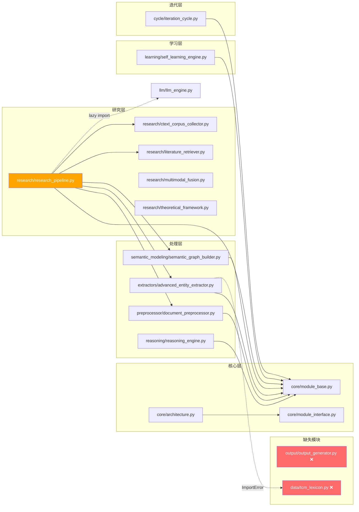

> **关键耦合点**：`research_pipeline.py` 是扇出最高的模块（7 个直接依赖），是系统最大的耦合风险点。

---

## 3. 目标系统全景

### 3.1 目标能力矩阵

根据需求，目标系统需覆盖完整科研闭环的 **10 大能力**：

| # | 能力 | 当前状态 | 目标状态 |
|---|------|----------|----------|
| 1 | 中医古代文献自动收集 | ✅ 部分（ctext API + 文献检索） | ✅ 完善（批量爬取 + 格式统一） |
| 2 | 格式自动转换 | ✅ 部分（编码检测 + opencc） | ✅ 完善（PDF/EPUB/扫描件 OCR） |
| 3 | 信息统一化 | ✅ 部分（文本清洗 + 分词） | ✅ 完善（标准术语映射 + 元数据规范化） |
| 4 | 文献内容分析 | ✅ 部分（实体抽取 + 知识图谱） | ✅ 完善（深度语义 + 跨文献关联） |
| 5 | 多模态指标思考 | ✅ 部分（4 策略融合引擎） | ✅ 完善（图像特征 + 表格结构 + 时序数据） |
| 6 | 科学研究假设输出 | ✅ 部分（假设框架 + LLM 辅助） | ✅ 完善（证据链溯源 + 可证伪性评估） |
| 7 | 数据挖掘 | ⚠️ 基础（模式识别 + 统计） | ✅ 完善（关联规则 + 聚类 + 预测建模） |
| 8 | 科研图片绘制 | ❌ 仅 demo 脚本 | ✅ 完善（集成管道 + 出版级图片） |
| 9 | 论文初稿撰写 | ❌ 模块缺失 | ✅ 完善（IMRD 结构 + 多格式输出） |
| 10 | 端到端流程编排 | ✅ 部分（迭代循环） | ✅ 完善（事件驱动 + 可视化进度） |

### 3.2 目标架构总览

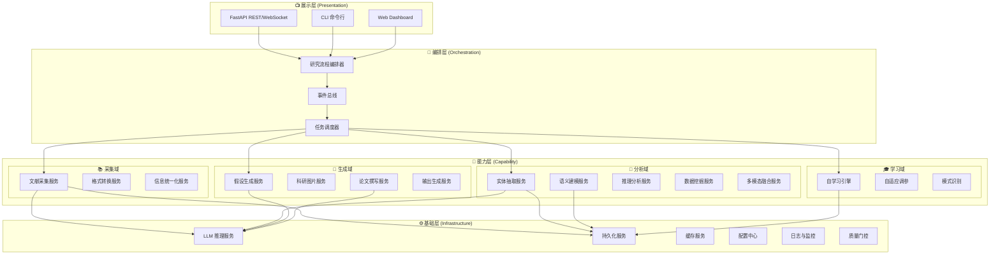

---

## 4. 领域驱动模块划分

### 4.1 限界上下文（Bounded Context）

```mermaid
graph LR
    subgraph BC1["BC1: 文献采集上下文"]
        S1[文献采集服务]
        S2[格式转换服务]
        S3[信息统一化服务]
        S4[语料验证服务]
    end

    subgraph BC2["BC2: 文本分析上下文"]
        S5[文档预处理服务]
        S6[实体抽取服务]
        S7[语义建模服务]
        S8[推理分析服务]
    end

    subgraph BC3["BC3: 研究智能上下文"]
        S9[假设生成服务]
        S10[数据挖掘服务]
        S11[多模态融合服务]
        S12[研究方法服务]
    end

    subgraph BC4["BC4: 成果输出上下文"]
        S13[科研图片服务]
        S14[论文撰写服务]
        S15[输出格式服务]
        S16[引用管理服务]
    end

    subgraph BC5["BC5: 质量演进上下文"]
        S17[自学习引擎]
        S18[迭代循环引擎]
        S19[质量门控服务]
        S20[修复引擎]
    end

    subgraph BC6["BC6: 平台基础上下文"]
        S21[LLM 推理服务]
        S22[持久化服务]
        S23[配置中心]
        S24[事件总线]
    end

    BC1 -->|标准化文档| BC2
    BC2 -->|分析结果| BC3
    BC3 -->|研究成果| BC4
    BC5 -.->|质量反馈| BC1
    BC5 -.->|质量反馈| BC2
    BC5 -.->|质量反馈| BC3
    BC5 -.->|质量反馈| BC4
    BC6 -.->|基础设施| BC1
    BC6 -.->|基础设施| BC2
    BC6 -.->|基础设施| BC3
    BC6 -.->|基础设施| BC4
    BC6 -.->|基础设施| BC5
```

### 4.2 模块划分方案

#### 📦 新增模块

| 模块 | 路径 | 职责 | 理由 | 代价 |
|------|------|------|------|------|
| **格式转换服务** | `src/collector/format_converter.py` | PDF/EPUB/扫描件解析、OCR 识别、统一为内部 Markdown | 当前仅支持 TXT/DOCX，无法处理古籍扫描件 | 约 800 行，依赖 pymupdf + tesseract |
| **信息统一化服务** | `src/collector/normalizer.py` | 术语标准化映射、元数据规范化、编码统一 | 分散在 preprocessor 中，需独立为可复用服务 | 约 400 行 |
| **数据挖掘服务** | `src/analysis/data_mining.py` | 关联规则、聚类分析、频繁项集、预测建模 | 当前仅有基础模式识别，缺乏经典数据挖掘算法 | 约 600 行，依赖 mlxtend + sklearn |
| **科研图片服务** | `src/generation/figure_generator.py` | 网络图、热力图、森林图、Venn 图等出版级科研图片 | 仅在 examples/ 有 demo，未集成管道 | 约 500 行，依赖 matplotlib + seaborn |
| **论文撰写服务** | `src/generation/paper_writer.py` | IMRD 结构论文、摘要生成、参考文献格式化 | OutputGenerator 模块缺失，是核心需求 | 约 600 行，依赖 python-docx + LLM |
| **引用管理服务** | `src/generation/citation_manager.py` | GB/T 7714-2015 引用格式、参考文献库管理 | 配置声明但无实现 | 约 300 行 |
| **持久化服务** | `src/infrastructure/persistence.py` | SQLAlchemy ORM、知识库存储、研究记录管理 | 当前无数据库操作代码 | 约 500 行 |
| **事件总线** | `src/infrastructure/event_bus.py` | 发布/订阅解耦、异步事件驱动 | 模块间硬编码调用，需要解耦 | 约 300 行 |
| **API 服务层** | `src/api/app.py` | FastAPI REST API + WebSocket 实时进度 | 仅有 CLI 入口，缺乏远程交互能力 | 约 400 行 |

#### 🔧 重构模块

| 现有模块 | 重构动作 | 理由 | 代价 |
|----------|----------|------|------|
| `core/module_interface.py` + `core/module_base.py` | **合并**为单一 `BaseModule(ABC)` | 消除双轨接口混乱 | ⚠️ **破坏性变更**：所有模块需更新继承关系，约 2h |
| `research/research_pipeline.py` | **拆分**为 `ResearchOrchestrator` + 各阶段 Handler | 消除 God Module | ⚠️ **破坏性变更**：调用方需更新引用，约 8h |
| `semantic_modeling/research_methods.py` | **拆分**为 8 个独立文件 | 1538 行无法独立演进 | 兼容性变更：约 4h |
| `learning/self_learning_engine.py` | pickle → SQLite 持久化 | 数据可查询、可追溯 | 兼容性变更：约 3h |
| `research/literature_retriever.py` | 同步 → `httpx.AsyncClient` | 并发性能提升 5-10x | 兼容性变更：约 4h |

### 4.3 目录结构方案

```
src/
├── core/                        # 核心框架（精简）
│   ├── base_module.py           # 统一基类 (合并后)
│   ├── architecture.py          # 系统编排
│   ├── algorithm_optimizer.py   # 算法选择
│   └── event_bus.py             # 事件总线 (新增)
│
├── collector/                   # BC1: 文献采集上下文 (新增包)
│   ├── corpus_collector.py      # ctext + 批量采集
│   ├── literature_retriever.py  # 多源文献检索 (迁移)
│   ├── format_converter.py      # 格式转换 (新增)
│   ├── normalizer.py            # 信息统一化 (新增)
│   └── whitelist.py             # 来源白名单 (迁移)
│
├── analysis/                    # BC2: 文本分析上下文 (重组)
│   ├── preprocessor.py          # 文档预处理 (迁移)
│   ├── entity_extractor.py      # 实体抽取 (迁移)
│   ├── semantic_graph.py        # 语义建模 (迁移)
│   ├── reasoning_engine.py      # 推理分析 (迁移)
│   ├── data_mining.py           # 数据挖掘 (新增)
│   └── multimodal_fusion.py     # 多模态融合 (迁移)
│
├── research/                    # BC3: 研究智能上下文 (精简)
│   ├── orchestrator.py          # 研究流程编排 (从 pipeline 拆出)
│   ├── hypothesis_generator.py  # 假设生成 (从 pipeline 拆出)
│   ├── experiment_designer.py   # 实验设计 (从 pipeline 拆出)
│   ├── theoretical_framework.py # 理论框架 (保留)
│   └── methods/                 # 研究方法 (从 1 文件拆为 8 文件)
│       ├── formula_structure.py
│       ├── formula_comparator.py
│       ├── pharmacology.py
│       ├── network_pharmacology.py
│       ├── supramolecular.py
│       ├── classical_literature.py
│       ├── complexity_science.py
│       └── integrated_analyzer.py
│
├── generation/                  # BC4: 成果输出上下文 (新增包)
│   ├── figure_generator.py      # 科研图片 (新增)
│   ├── paper_writer.py          # 论文撰写 (新增)
│   ├── citation_manager.py      # 引用管理 (新增)
│   └── output_formatter.py      # 输出格式化 (新增)
│
├── learning/                    # BC5: 质量演进上下文 (保留)
│   ├── self_learning_engine.py
│   ├── adaptive_tuner.py
│   └── pattern_recognizer.py
│
├── cycle/                       # BC5: 迭代循环 (保留)
│   ├── iteration_cycle.py
│   ├── module_iteration.py
│   ├── system_iteration.py
│   ├── test_driven_iteration.py
│   └── fixing_stage.py
│
├── infrastructure/              # BC6: 平台基础 (新增包)
│   ├── persistence.py           # 数据库 ORM (新增)
│   ├── cache.py                 # 缓存服务 (新增)
│   ├── config_loader.py         # 配置中心 (新增)
│   └── monitoring.py            # 监控服务 (新增)
│
├── llm/                         # LLM 推理 (保留)
│   └── llm_engine.py
│
├── api/                         # 展示层 (新增)
│   ├── app.py                   # FastAPI 应用
│   ├── routes/
│   │   ├── research.py
│   │   ├── collection.py
│   │   └── analysis.py
│   └── websocket.py             # 实时进度推送
│
└── test/                        # 测试框架 (保留)
    ├── automated_tester.py
    └── integration_tester.py
```

---

## 5. 接口契约设计

### 5.1 统一基类契约

```python
# src/core/base_module.py (合并后)
from abc import ABC, abstractmethod
from typing import Any, Dict, Optional
from dataclasses import dataclass, field

@dataclass
class ModuleContext:
    """模块执行上下文 - 统一数据传递契约"""
    context_id: str
    input_data: Dict[str, Any]
    metadata: Dict[str, Any] = field(default_factory=dict)
    parameters: Dict[str, Any] = field(default_factory=dict)

@dataclass  
class ModuleOutput:
    """模块输出 - 统一结果契约"""
    success: bool
    output_data: Dict[str, Any]
    execution_time: float = 0.0
    quality_metrics: Dict[str, float] = field(default_factory=dict)
    errors: list = field(default_factory=list)

class BaseModule(ABC):
    """所有模块的唯一基类"""
    
    @abstractmethod
    def initialize(self, config: Dict[str, Any]) -> bool: ...
    
    @abstractmethod
    def execute(self, context: ModuleContext) -> ModuleOutput: ...
    
    @abstractmethod
    def cleanup(self) -> bool: ...
    
    def health_check(self) -> bool:
        """健康检查（默认实现）"""
        return self.initialized
```

### 5.2 事件总线契约

```python
# src/core/event_bus.py
from typing import Callable, Any

class EventBus:
    """发布/订阅事件总线 - 模块解耦"""
    
    def subscribe(self, event_type: str, handler: Callable) -> None: ...
    def publish(self, event_type: str, data: Any) -> None: ...
    def unsubscribe(self, event_type: str, handler: Callable) -> None: ...

# 事件类型定义
class Events:
    DOCUMENT_COLLECTED = "document.collected"
    DOCUMENT_PREPROCESSED = "document.preprocessed"
    ENTITIES_EXTRACTED = "entities.extracted"
    GRAPH_BUILT = "graph.built"
    HYPOTHESIS_GENERATED = "hypothesis.generated"
    EXPERIMENT_DESIGNED = "experiment.designed"
    ANALYSIS_COMPLETED = "analysis.completed"
    FIGURE_GENERATED = "figure.generated"
    PAPER_DRAFTED = "paper.drafted"
    QUALITY_CHECKED = "quality.checked"
```

### 5.3 跨上下文接口

| 源上下文 | 目标上下文 | 接口 | 数据格式 |
|----------|-----------|------|----------|
| 采集域 → 分析域 | `StandardDocument` | 统一文档 DTO | `{id, text, metadata, source, format_info}` |
| 分析域 → 研究域 | `AnalysisResult` | 分析结果 DTO | `{entities, graph, reasoning, statistics}` |
| 研究域 → 生成域 | `ResearchArtifact` | 研究产物 DTO | `{hypothesis, evidence, data_mining_result}` |
| 任意域 → 学习域 | `FeedbackRecord` | 反馈记录 DTO | `{task_id, score, metrics, suggestions}` |
| 任意域 → 基础域 | `PersistenceCommand` | 持久化命令 | `{entity_type, operation, data}` |

---

## 6. 核心流程图

### 6.1 端到端科研流程

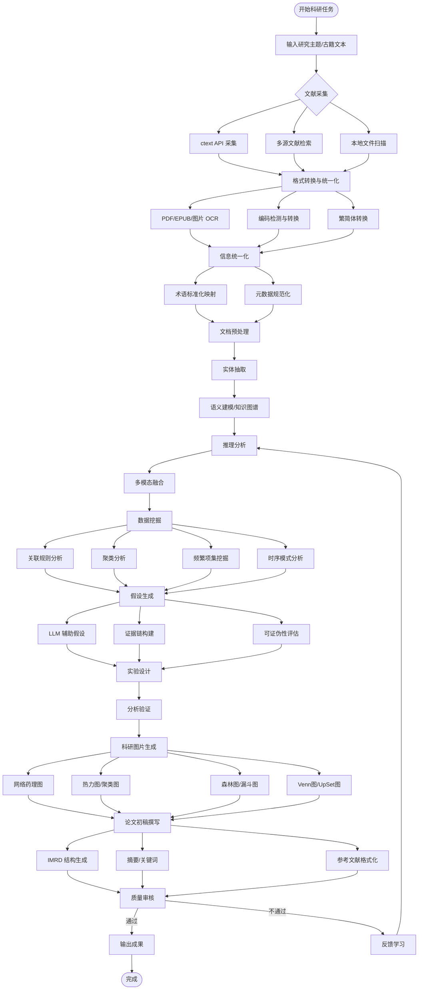

### 6.2 迭代循环流程

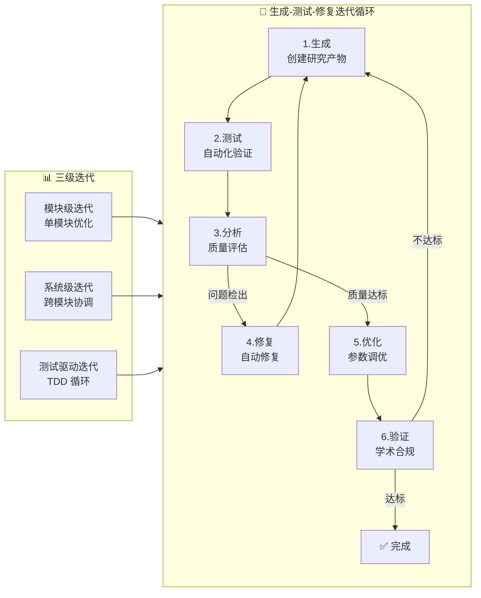

---

## 7. 类图设计

### 7.1 核心类图

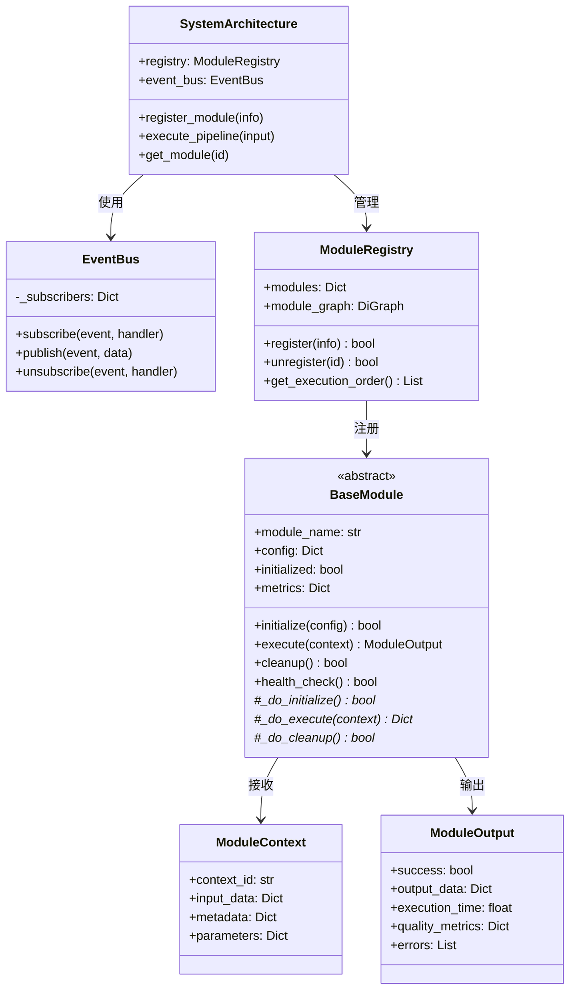

### 7.2 采集域类图

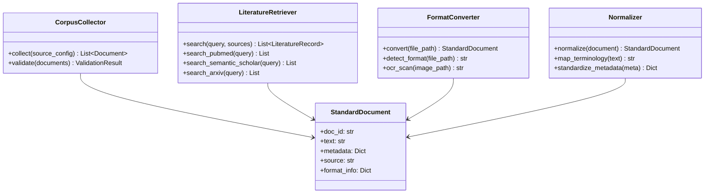

### 7.3 生成域类图

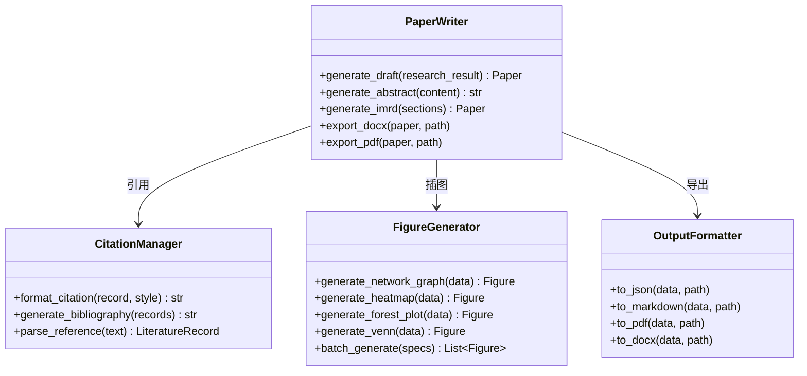

---

## 8. 部署架构

### 8.1 单机部署（当前推荐）

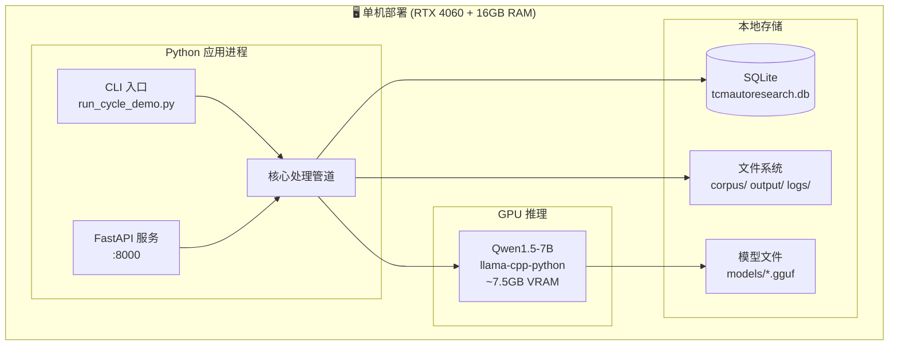

### 8.2 分布式部署（未来演进）

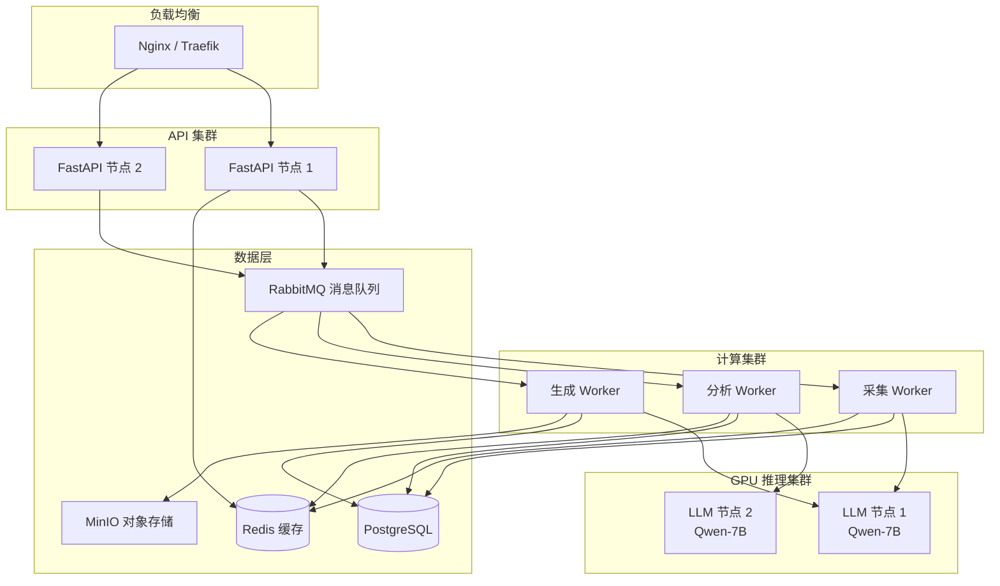

---

## 9. 分阶段实施计划

### 阶段 0: 紧急修复（1 周）

> **目标**: 让系统可运行

| 任务 | 优先级 | 工时 | 破坏性 |
|------|--------|------|--------|
| 实现 `src/output/output_generator.py` | P0 | 4h | 否 |
| 实现 `src/data/tcm_lexicon.py` | P0 | 2h | 否 |
| 修复 `config.yml` YAML 语法错误 | P0 | 0.5h | 否 |
| 补充基础单测确保主流程可跑 | P0 | 4h | 否 |

### 阶段 1: 核心重构（2-3 周）

> **目标**: 消除技术债务，统一架构

| 任务 | 优先级 | 工时 | 破坏性 |
|------|--------|------|--------|
| 合并 `ModuleInterface` 和 `BaseModule` 为统一基类 | P1 | 4h | ⚠️ 是 |
| 拆分 `research_pipeline.py` 为编排器 + 阶段处理器 | P1 | 8h | ⚠️ 是 |
| 拆分 `research_methods.py` 为 8 个独立文件 | P1 | 4h | 否 |
| 引入依赖注入（模块工厂模式） | P1 | 4h | ⚠️ 是 |
| 引入事件总线，解耦模块间直接调用 | P1 | 4h | 否 |
| 重组目录结构（collector/ analysis/ generation/） | P1 | 4h | ⚠️ 是 |
| 更新所有测试以适配新结构 | P1 | 8h | 否 |

### 阶段 2: 能力补全（3-4 周）

> **目标**: 补齐 10 大能力

| 任务 | 优先级 | 工时 | 破坏性 |
|------|--------|------|--------|
| 实现格式转换服务（PDF/EPUB/OCR） | P1 | 8h | 否 |
| 实现信息统一化服务 | P1 | 4h | 否 |
| 实现数据挖掘服务（关联规则/聚类/频繁项集） | P1 | 8h | 否 |
| 实现科研图片生成服务 | P1 | 6h | 否 |
| 实现论文初稿撰写服务（IMRD） | P1 | 8h | 否 |
| 实现引用管理服务 | P2 | 4h | 否 |
| 实现持久化层（SQLAlchemy ORM） | P1 | 8h | 否 |
| 文献检索改异步（httpx.AsyncClient） | P2 | 4h | 否 |

### 阶段 3: 平台化（2-3 周）

> **目标**: 提供服务化能力

| 任务 | 优先级 | 工时 | 破坏性 |
|------|--------|------|--------|
| 实现 FastAPI REST API | P2 | 8h | 否 |
| 实现 WebSocket 实时进度推送 | P2 | 4h | 否 |
| 实现配置中心（环境隔离） | P2 | 4h | 否 |
| 实现缓存服务（LRU + 可选 Redis） | P2 | 4h | 否 |
| 实现监控服务（指标采集 + 健康检查） | P2 | 4h | 否 |
| Docker 容器化 | P2 | 4h | 否 |
| 编写完整 API 文档 | P2 | 4h | 否 |

### 阶段 4: 质量强化（持续）

> **目标**: 达到生产级质量

| 任务 | 优先级 | 工时 | 破坏性 |
|------|--------|------|--------|
| 核心模块单测覆盖率 ≥ 90% | P2 | 16h | 否 |
| 集成测试 + E2E 测试 | P2 | 8h | 否 |
| 性能基准测试 + 优化 | P2 | 8h | 否 |
| 安全审计（JWT/加密落地） | P2 | 8h | 否 |
| CI/CD 完善（自动测试 + 发布） | P2 | 4h | 否 |

### 时间线甘特图

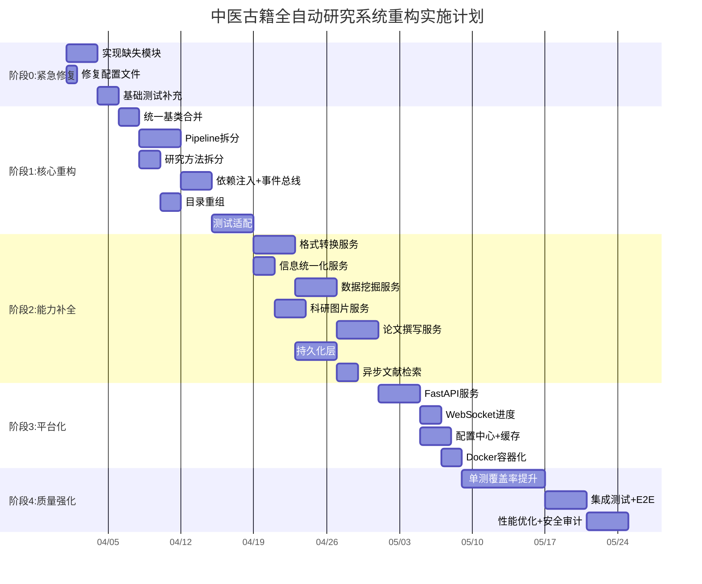

---

## 10. 风险与缓解

| # | 风险 | 影响 | 概率 | 缓解措施 |
|---|------|------|------|----------|
| 1 | 阶段 1 破坏性重构导致回归 | 🔴 高 | 🟡 中 | 先建立全面测试基线（阶段 0），每次重构后运行全量测试 |
| 2 | LLM 推理性能不足 | 🟡 中 | 🟡 中 | 保留 CPU fallback；支持更大模型热替换 |
| 3 | OCR 识别古籍手写体困难 | 🟡 中 | 🔴 高 | 集成专用古文 OCR 模型；人工校对兜底 |
| 4 | 163 个依赖的安全风险 | 🟡 中 | 🟡 中 | 精简依赖；引入 `pip-audit` 持续扫描 |
| 5 | 单人维护时间不足 | 🔴 高 | 🔴 高 | 严格按阶段推进，每阶段交付可运行版本 |
| 6 | 数据迁移（pickle → SQLite） | 🟢 低 | 🟢 低 | 编写迁移脚本，支持双写过渡期 |

---

## 附录 A: 破坏性变更清单

以下变更会影响现有调用方，需要在实施时特别注意兼容性：

| 变更 | 影响范围 | 迁移策略 |
|------|----------|----------|
| `ModuleInterface` 删除 | 直接使用 `ModuleInterface` 的代码 | 替换为 `BaseModule`，提供 1 个版本的兼容别名 |
| `research_pipeline.py` 拆分 | 所有 `from src.research.research_pipeline import ResearchPipeline` | 在原文件保留 re-export 兼容层 |
| 目录重组 | 所有跨包 import | 在旧路径放置 `__init__.py` 做 re-export，标记 `DeprecationWarning` |
| `BaseModule.execute()` 签名变更 | 所有模块子类 | 保持 `Dict[str, Any]` 入参兼容，内部转为 `ModuleContext` |

---

## 附录 B: 关键设计决策记录

| 决策 | 选项 | 选择 | 理由 |
|------|------|------|------|
| 基类统一方案 | A.保留双轨 B.合并为 BaseModule | **B** | 消除开发者困惑，减少维护面 |
| 模块通信 | A.直接调用 B.事件总线 C.消息队列 | **B** | 进程内轻量解耦，无需引入外部 MQ |
| 持久化 | A.pickle B.SQLite C.PostgreSQL | **B→C** | 阶段 2 用 SQLite，阶段 3 平台化后切 PostgreSQL |
| 异步框架 | A.threading B.asyncio C.Celery | **B** | 配合 FastAPI 原生 async，文献检索天然 IO 密集 |
| 图片生成 | A.matplotlib B.plotly C.两者兼用 | **C** | matplotlib 出版级静态图 + plotly 交互式探索 |
| 论文格式 | A.纯 Markdown B.python-docx C.LaTeX | **B+A** | DOCX 直接投稿，Markdown 便于版本管理 |
