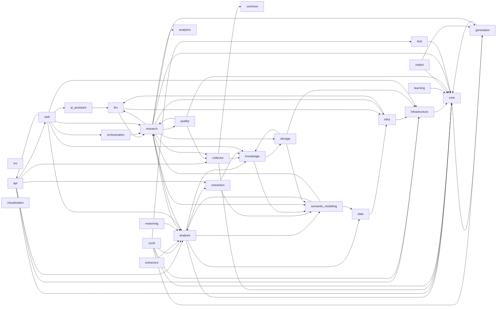

# Dependency Graph

This document is generated from internal imports under src/.

## Summary

- Module count: 205
- Module edges: 432
- Package count: 28
- Package edges: 66

## Package Graph

## Packages

| Package | In Degree | Out Degree |
|---|---:|---:|
| src | 0 | 0 |
| src.ai_assistant | 1 | 1 |
| src.analysis | 7 | 6 |
| src.analytics | 1 | 0 |
| src.api | 1 | 6 |
| src.collector | 3 | 3 |
| src.common | 1 | 0 |
| src.core | 11 | 1 |
| src.cycle | 0 | 5 |
| src.data | 2 | 1 |
| src.extraction | 2 | 2 |
| src.extractors | 0 | 1 |
| src.generation | 4 | 1 |
| src.infra | 3 | 2 |
| src.infrastructure | 5 | 1 |
| src.knowledge | 5 | 2 |
| src.learning | 0 | 1 |
| src.llm | 3 | 2 |
| src.orchestration | 1 | 1 |
| src.output | 0 | 2 |
| src.quality | 1 | 3 |
| src.reasoning | 0 | 1 |
| src.research | 6 | 10 |
| src.semantic_modeling | 5 | 3 |
| src.storage | 2 | 3 |
| src.test | 1 | 1 |
| src.visualization | 0 | 0 |
| src.web | 1 | 7 |
