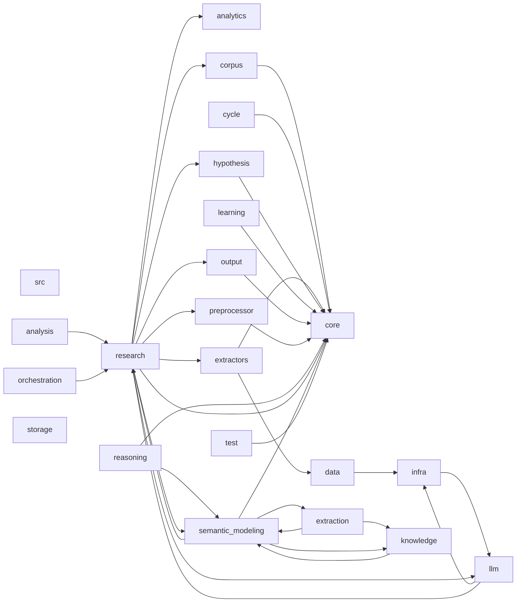

# Dependency Graph

This document is generated from internal imports under src/.

## Summary

- Module count: 81
- Module edges: 119
- Package count: 22
- Package edges: 33

## Package Graph

## Packages

| Package | In Degree | Out Degree |
|---|---:|---:|
| src | 0 | 0 |
| src.analysis | 0 | 1 |
| src.analytics | 1 | 0 |
| src.core | 11 | 0 |
| src.corpus | 1 | 1 |
| src.cycle | 0 | 1 |
| src.data | 1 | 1 |
| src.extraction | 1 | 2 |
| src.extractors | 1 | 2 |
| src.hypothesis | 1 | 1 |
| src.infra | 2 | 1 |
| src.knowledge | 2 | 1 |
| src.learning | 0 | 1 |
| src.llm | 2 | 2 |
| src.orchestration | 0 | 1 |
| src.output | 1 | 1 |
| src.preprocessor | 1 | 1 |
| src.reasoning | 0 | 2 |
| src.research | 4 | 9 |
| src.semantic_modeling | 4 | 4 |
| src.storage | 0 | 0 |
| src.test | 0 | 1 |
