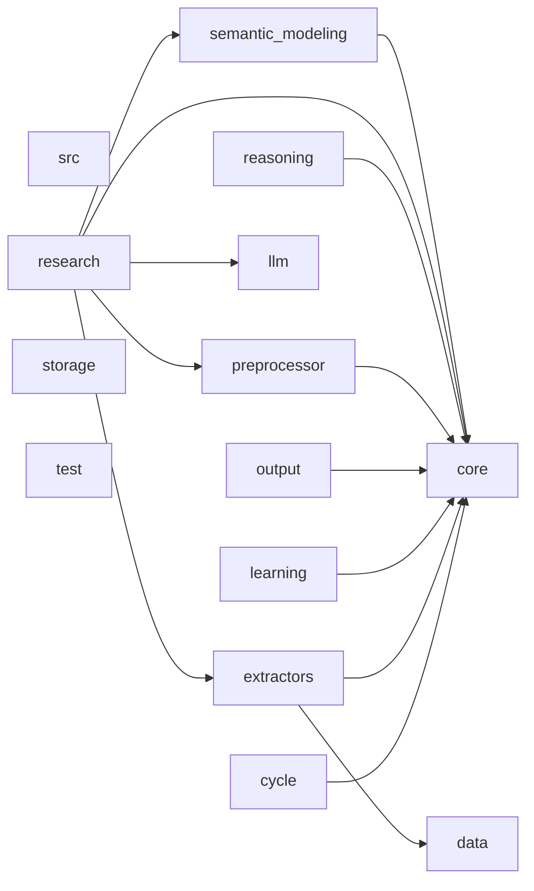

# Dependency Graph

This document is generated from internal imports under src/.

## Summary

- Module count: 54
- Module edges: 59
- Package count: 14
- Package edges: 13

## Package Graph

## Packages

| Package | In Degree | Out Degree |
|---|---:|---:|
| src | 0 | 0 |
| src.core | 8 | 0 |
| src.cycle | 0 | 1 |
| src.data | 1 | 0 |
| src.extractors | 1 | 2 |
| src.learning | 0 | 1 |
| src.llm | 1 | 0 |
| src.output | 0 | 1 |
| src.preprocessor | 1 | 1 |
| src.reasoning | 0 | 1 |
| src.research | 0 | 5 |
| src.semantic_modeling | 1 | 1 |
| src.storage | 0 | 0 |
| src.test | 0 | 0 |
