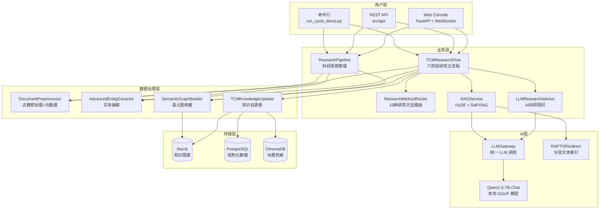
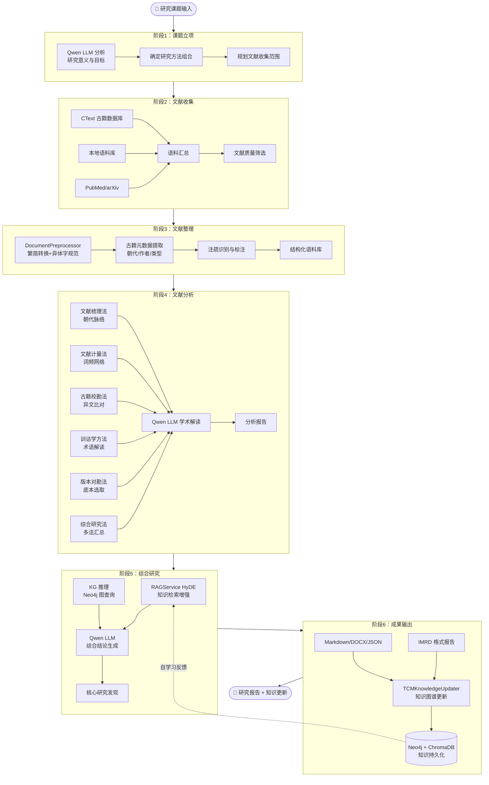
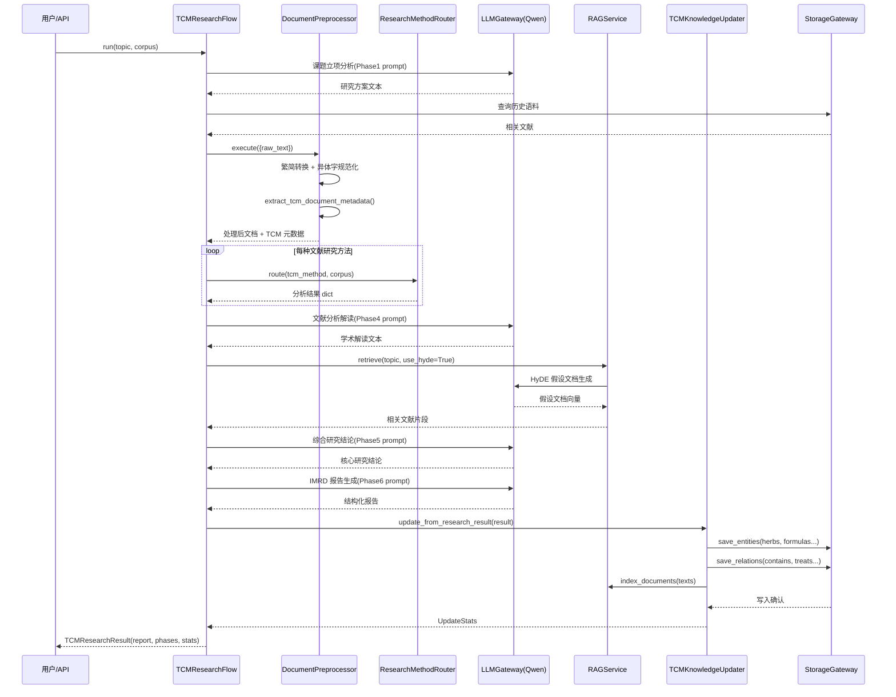
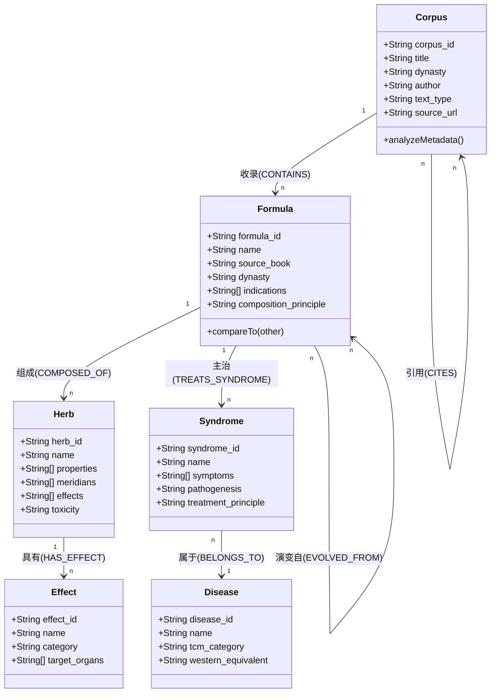
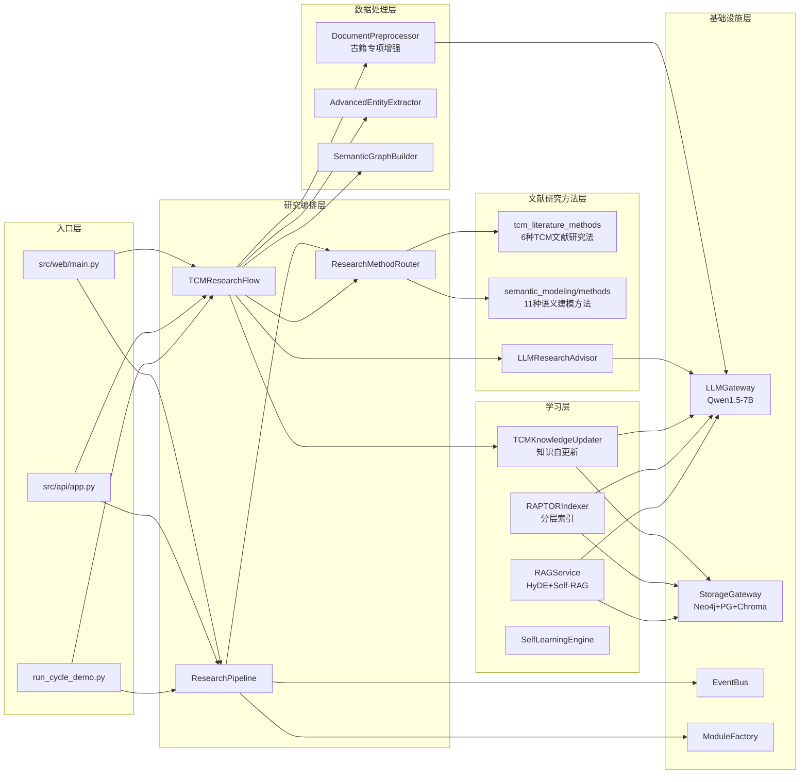
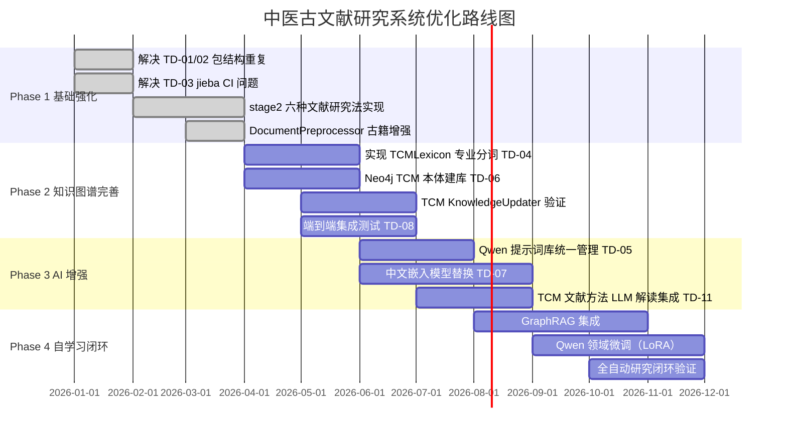

# 中医古文献研究系统 — 架构设计文档 v2.0

> **分支**: `stage2-s2_1-preprocessor-opt`
> **日期**: 2026-04-21
> **版本**: 2.0.0

---

## 目录

1. [系统架构概览](#1-系统架构概览)
2. [中医文献研究法实现矩阵](#2-中医文献研究法实现矩阵)
3. [研究主流程图](#3-研究主流程图)
4. [数据流时序图](#4-数据流时序图)
5. [TCM 知识图谱本体模型](#5-tcm-知识图谱本体模型)
6. [模块依赖关系图](#6-模块依赖关系图)
7. [技术债务分析](#7-技术债务分析)
8. [分阶段实施计划](#8-分阶段实施计划)

---

## 1. 系统架构概览

本系统是一套面向中医古文献研究的全自动 AI 科研平台，核心功能包括：
- 多源文献检索与采集（CText、PubMed、arXiv、本地语料）
- 中医古文献专项预处理（繁简转换、异体字规范、古籍元数据提取）
- 六种中医文献研究方法（文献梳理/计量/校勘/训诂/版本对勘/综合研究）
- 本地 Qwen 1.5-7B 模型驱动的智能科研辅助
- Neo4j 知识图谱 + PostgreSQL + ChromaDB 三层持久化
- 自我学习闭环（研究结果→知识更新→RAG 增强）

### 1.1 系统部署图

---

## 2. 中医文献研究法实现矩阵

| 研究方法 | 路由键 | 模块位置 | 实现状态 | 核心功能 |
|---------|-------|---------|---------|---------|
| 文献梳理法 | `tcm_literature_sorting` | `src/research/tcm_literature_methods.py` | ✅ 已实现 | 朝代分组、主题提取、演变脉络 |
| 文献计量法 | `tcm_bibliometrics` | `src/research/tcm_literature_methods.py` | ✅ 已实现 | 词频统计、共现网络、种子词分析 |
| 古籍校勘法 | `tcm_textual_criticism` | `src/research/tcm_literature_methods.py` | ✅ 已实现 | 异文检测、版本差异、校勘摘要 |
| 训诂学方法 | `tcm_exegesis` | `src/research/tcm_literature_methods.py` | ✅ 已实现 | 术语识别、语义注释、候选扩充 |
| 版本对勘法 | `tcm_version_collation` | `src/research/tcm_literature_methods.py` | ✅ 已实现 | Jaccard 相似度、谱系构建、底本建议 |
| 综合研究法 | `tcm_integrated_literature` | `src/research/tcm_literature_methods.py` | ✅ 已实现 | 多方法汇总、研究空白识别 |
| 方剂结构分析 | `formula_structure` | `src/semantic_modeling/methods/formula_structure.py` | ✅ 已实现 | 君臣佐使配伍分析 |
| 方剂比较 | `formula_comparator` | `src/semantic_modeling/methods/formula_comparator.py` | ✅ 已实现 | 方剂相似度比较 |
| 网络药理学 | `network_pharmacology` | `src/semantic_modeling/methods/network_pharmacology.py` | ✅ 已实现 | 靶点网络分析 |
| 古典文献考古 | `classical_literature` | `src/semantic_modeling/methods/classical_literature.py` | ✅ 已实现 | 知识考古与文献溯源 |
| Meta 分析 | `meta_analysis` | `src/semantic_modeling/methods/meta_analysis.py` | ✅ 已实现 | 异质性检验、效应量合并 |
| 复杂性科学 | `complexity_dynamics` | `src/semantic_modeling/methods/complexity_science.py` | ✅ 已实现 | 非线性动力学分析 |
| 综合集成 | `integrated_research` | `src/semantic_modeling/methods/integrated_analyzer.py` | ✅ 已实现 | 多维度整合分析 |

---

## 3. 研究主流程图

---

## 4. 数据流时序图

---

## 5. TCM 知识图谱本体模型

---

## 6. 模块依赖关系图

---

## 7. 技术债务分析

### 7.1 高优先级债务（阻断性）

| ID | 问题 | 影响 | 建议解决方案 |
|----|------|------|------------|
| TD-01 | `src/preprocessor/` 与 `src/analysis/preprocessor.py` 双重路径 | 导入混乱，警告噪音 | 完全删除旧 `src/preprocessor/` 包，统一用 `src/analysis/preprocessor` |
| TD-02 | `src/infra/` 与 `src/infrastructure/` 两套基础设施包 | 重复代码，维护困难 | 已有 infra 重定向，需清理 `src/infra/` 旧文件 |
| TD-03 | jieba 依赖在 CI 环境缺失导致 95 个测试失败 | CI 不稳定 | 将 jieba 加入 CI 依赖，或在 conftest.py 中全局 mock |
| TD-04 | `TCMLexicon` 接口为占位符，未实现专业中医分词 | 古文分词质量差 | 实现 `src/analysis/tcm_lexicon.py`，集成中医术语词典 |

### 7.2 中优先级债务（质量性）

| ID | 问题 | 建议 |
|----|------|------|
| TD-05 | Qwen 模型提示词散落各处，无统一管理 | 创建 `src/research/prompt_library.py` 集中管理所有 TCM 提示词模板 |
| TD-06 | Neo4j 知识图谱无标准 TCM 本体 Schema | 按第5节类图执行 Cypher 建库脚本（`scripts/init_neo4j_ontology.py`） |
| TD-07 | ChromaDB 使用通用嵌入模型，古文效果差 | 评估 `text2vec-chinese` 或 `m3e-base` 等中文嵌入模型 |
| TD-08 | 无端到端集成测试覆盖 TCM 研究流程 | 添加 `tests/test_tcm_research_flow.py` 和 `tests/test_tcm_literature_methods.py` |

### 7.3 低优先级债务（改善性）

| ID | 问题 | 建议 |
|----|------|------|
| TD-09 | 226 处 f-string 日志调用（非懒加载格式） | 批量替换为 `%s` 格式 |
| TD-10 | 无模块级健康检查 API | 扩展 `/health` 端点返回各模块状态 |
| TD-11 | TCM 文献研究法缺乏 LLM 增强 | 在每个方法的 `analyze()` 中增加可选 LLM 解读参数 |

---

## 8. 分阶段实施计划

### 8.1 近期优先行动项（Phase 1 尾声，2026 Q2）

1. **✅ 已完成**：创建 `src/research/tcm_literature_methods.py` — 6种TCM文献研究法
2. **✅ 已完成**：创建 `src/research/tcm_research_flow.py` — 6阶段研究主流程
3. **✅ 已完成**：创建 `src/learning/tcm_knowledge_updater.py` — 知识自更新
4. **✅ 已完成**：增强 `src/analysis/preprocessor.py` — 古籍元数据、异体字规范
5. **✅ 已完成**：更新 `src/research/method_router.py` — 注册6个 `tcm_*` 路由
6. **🔄 进行中**：TD-04 TCMLexicon 实现（当前为占位符）
7. **🔄 进行中**：TD-06 Neo4j TCM 本体建库脚本

### 8.2 Qwen 模型集成建议

| 场景 | 推荐配置 |
|------|---------|
| 古文阅读理解 | temperature=0.3, max_tokens=2048, system_prompt: 中医文献专家角色 |
| 研究报告写作 | temperature=0.5, max_tokens=4096, IMRD 格式约束 |
| 术语训诂解释 | temperature=0.1, max_tokens=512, 严格事实性约束 |
| 研究假设生成 | temperature=0.7, max_tokens=1024, 创新性鼓励 |

---

*文档由 TCM Auto Research System Stage2 架构评审生成*
*基于 T/C IATCM 098-2023 标准 | 版本 2.0.0*
